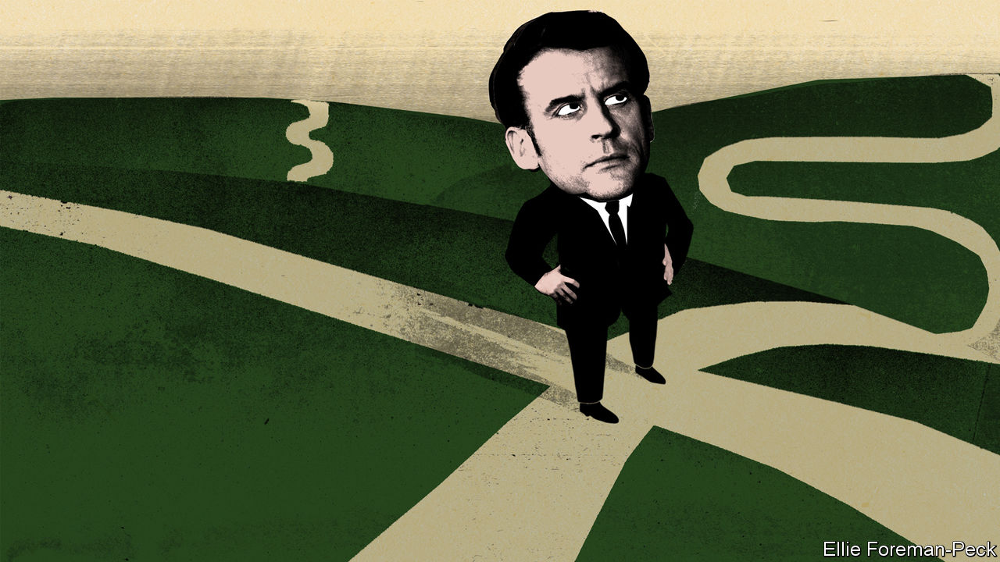
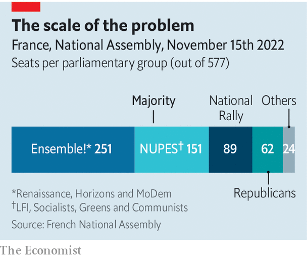

###### French politics

# Emmanuel Macron’s tricky second term 

##### The French president is struggling to impose a clear direction on his government 

 

> Nov 17th 2022 

HAD EMMANUEL MACRON faced six parliamentary attempts to topple his government in a fortnight during his first presidential term, it would have felt like a political insurrection. Yet this autumn, six months after the French president was re-elected and then lost his parliamentary majority, this is what has just happened. Of the six no-confidence motions, instigated by opposition parties between October 19th and November 2nd, none secured the 289 votes needed for the government to fall. But they point to the trouble Mr Macron is facing , as he tries to gain traction with policymaking in his second term.

The no-confidence votes were prompted by the government’s use of an emergency provision known as 49-3 (the number of the relevant article in the constitution). Since late October Elisabeth Borne, Mr Macron’s prime minister, has used this four times. Designed to avoid legislative deadlock, it enables the government to pass a law without the need for a parliamentary vote—so long as it wins any subsequent no-confidence motion. Only one of the six votes held so far has come close. On October 24th Marine Le Pen’s hard-right National Rally (RN) decided at the last minute to side with its arch-opponents, Jean-Luc Mélenchon’s hard-left alliance, NUPES. The combined effort was just 50 votes short of bringing down the government.

The opposition has cried foul, calling the use of 49-3 a “denial of democracy”. In fact its use is both legal, and constrained. When Michel Rocard, a Socialist prime minister, ran a minority government in 1988-91, he used it 28 times. In 2008 the rules were tightened to cover only the budget, and one other bill per parliamentary session. So far Ms Borne has used this provision to put two budget bills through two readings each. She could yet use it for a future piece of legislation, such as raising the retirement age from 62 to 64 or 65.

 


As one of Mr Macron’s legislators puts it, however, the use of 49-3 is “perfectly legal, but it is not normal”. It reflects not only the fragility of minority government, but also France’s lack of a parliamentary culture of compromise. The opposition is divided, broadly, into three squabbling blocs: the RN, the centre-right Republicans, and NUPES, made up of Socialists, Greens, Communists and Mr Mélenchon’s party, Unsubmissive France (LFI). Together, they could topple the government. Indeed Ms Le Pen’s decision to back a no-confidence motion tabled by NUPES was a first hint that they might join forces to do so. So far, each effort has failed because the opposition is split, and the Republicans have consistently abstained. 

Mr Macron has threatened to dissolve the National Assembly and call fresh legislative elections if he loses a no-confidence vote. This would be a big risk for his own party, now called Renaissance, which might lose seats. But it may be a bluffa way to put pressure on the Republicans, in order to keep them from forcing the government out. The centre-right party, whose candidate, Valérie Pécresse, came fifth in the presidential election, is as ill placed as Mr Macron to fight a campaign. 

The party best placed to gain seats is Ms Le Pen’s. . Up to a point, her strategy of “normalisation”, or preparing to govern, is working. She still rails against immigration, most recently at Mr Macron’s decision to let a migrant-rescue ship turned back by Italy dock in France. But she also makes dull policy speeches, laying into the high level of government debt or pleading for a tax on oil firms’ “superprofits”. On a recent weekday, fellow diners scarcely blinked as she lunched with her staff at a well-known nearby restaurant. 

On November 5th the RN elected Jordan Bardella, a 27-year-old Le Pen protégé, as the new party president, leaving her to focus on her job as parliamentary party leader. The limits of her clean-up, though, were exposed on November 4th, when the National Assembly suspended Grégoire de Fournas, an RN member, for 15 days after what appeared to have been a racist remark in parliament. 

Within Mr Macron’s centrist party, frustration at the obstructive parliamentary theatrics is acute. “We were elected to transform France, not to manage crises,” grumbles a deputy. It would be a mistake, however, to conclude that France has become ungovernable. Ms Borne, an engineer, has quietly emerged as a no-nonsense leader, securing legislative support for various policies. On November 4th cross-party backing was found in the Senate for a bill to enforce greater use of solar panels and other renewables, as part of Mr Macron’s green push. In October the lower house passed a bill to tighten the rules governing unemployment benefits, thanks to the Republicans. In August a cost-of-living bill passed—with Ms Le Pen’s support.

Moreover, the French economy is not faring too badly compared with its neighbours. French GDP is expected to grow in 2023, albeit by only 0.7%, while Germany’s economy is forecast to contract. Thanks to government limits on the rise in household energy bills, the French inflation rate in October, at 7.1%, was the lowest in the euro zone. The employment rate across all age groups has actually increased in France since before the pandemic.

The French seem in no mood to thank their president for any of this, though. Mr Macron’s poll rating in October, at 35%, had dropped to its lowest for nearly three years, according to Ifop, a polling group. The country remains on edge. Trade unionists recently blockaded oil refineries to press for wage increases. Although only 18% of the French supported this action, 49% said they were “outraged” by the economic situation, up from 40% a year ago.

As he jets about to global and European summits, brimming with ideas—a “green wall” in Africa, a new “political community” in Europe—Mr Macron has lost neither his energy nor inventiveness. He seems to be mulling over his legacy, too. “I am obsessed with one thing,” the president told a handful of reporters recently. “I believe that our duty towards our children is to leave them with the same freedom of choice as us. That means governing well. If your choices are limited tomorrow by those you make today, you have failed.” Yet at home the once-disruptive president seems unsure how to reform the country without dividing it. Six months into his second term, Mr Macron is still in search of that sense of direction and purpose that so distinctly marked the start of his first. ■

