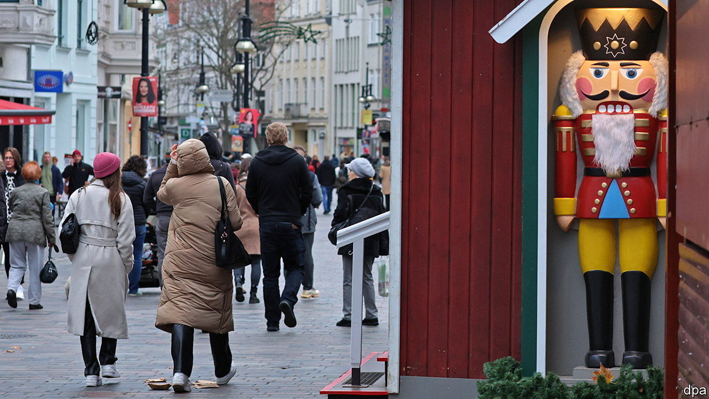
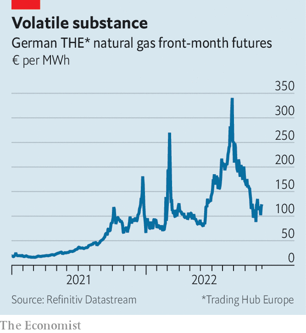

###### Not so nervous now

# Germans are less anxious than you might think 

##### Or so the polls show 

 

> Nov 17th 2022 

“ARE YOU also afraid of winter? Tell us your own personal story!” Thus did , a tabloid, invite readers last month to spook each other over spiralling heating bills. Other outlets warn that the famed , the cluster of strong, medium-sized firms that have long been the backbone of Europe’s biggest economy, will be driven to extinction by . The German press is not alone in dispensing gloom. Economists at Deutsche Bank, the country’s biggest, warn in a recent report not just of a coming recession but of “accelerated deindustrialisation”, as manufacturers flee to places blessed with lower-cost energy.

From greying autumn skies to the highest inflation recorded since 1951 and the biggest war in Europe since 1945, there are ample reasons to justify such a dark mood. But the reality is rather more nuanced. Not only does Germany’s economy appear to have been more resilient than might have been expected in the face of a tenfold surge in the price of electricity. A closer inspection of public opinion also suggests that the Germans are not as anxious as doomsayers might have you think.

 


Just-released numbers for industrial production in September, for instance, show an unexpectedly robust 2.6% rise over last year. More impressively, the jump was achieved despite a 14% drop in consumption of natural gas, a feedstock for heavy industries that used to be largely supplied from Russia. A recent study suggests that the making of just 300 products, many of which could be cheaply imported, accounts for some 90% of industrial use of natural gas. In any case the price of natural gas, which spiked in August, has now fallen back to merely double normal levels (see chart). Germany’s stores of the fuel are chock-full. Fears of imminent hardship are certainly not reflected in the DAX40 index of German blue chips. It has rallied by 16% since September, into pre-covid territory. 

With the government promise to “leave no man standing alone” backed, in early October, by a pledge of €200bn ($208bn) to shield consumers from energy prices, the German public is also finding the prospect of winter less daunting. Since 1992 R+V, a big insurance firm, has run detailed annual surveys to measure what Germans fear. Released in October, this year’s results do show a 17% jump from last year in worries over the cost of living. They also reveal a predictable surge in anxiety over Germany being drawn into a war. But other indicators show little change, and the survey’s overall anxiety index suggests that Germans are, in fact, less fretful than they have been in 22 of the past 30 years. 

“There never really was a bad mood, to be honest,” says Nico Lange, a defence analyst who has lately met hundreds of ordinary citizens in a series of meetings intended to explain the , or overhaul of German security policy, planned in response to Russia’s invasion of Ukraine. “What we find is not that people are negative about Ukraine policy, but that they have a lot of questions that they don’t feel the government is bothering to answer.”

Mr Lange says the impression of gloom may come from a media focus on certain disgruntled groups, particularly in former East Germany. A poll in November by ARD, a broadcaster, supports this view. Across a range of issues Germans in the east worry more: some 71% fear that the high cost of energy could lead to strife, compared with 58% in the west. More in the east also vote for fringe parties such as the anti-immigrant  (AfD). In the poor former East German state of Thuringia, for example, the AfD is the leading party in voting intentions, at 25%, compared with 14% nationally (though this is also up, from just 9% in June). 

Farther east in Schwedt, a town on the Polish border where the main employer, an oil refinery normally fed by Russian crude, is currently mothballed, a local bystander shrugs when asked what a straggling protest march is about. They are afraid of everything, she says: losing jobs, being unable to pay bills, facing another covid wave. 

Although R+V’s long-term polling shows that the east-west grumpiness gap persists, even this is diminishing. Germany’s angst-mongers delight in pointing to the grim approval ratings of the current government, which took power last year. But polls show that Germans, both east and west, have nearly always taken a dim view of whoever is in power. ■

