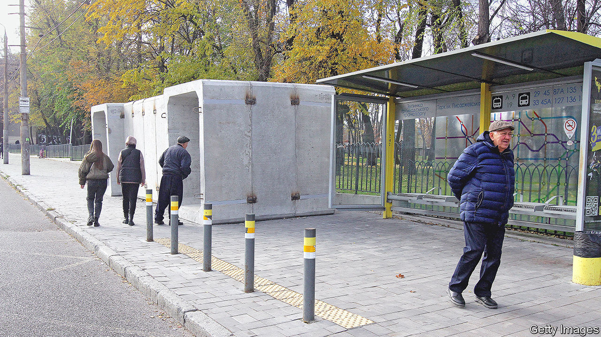

###### Shelter from the storm

# Ingenious ways of protecting civilians from Russian bombs 

##### Shelters have become a way of life 

 

> Nov 17th 2022 

In the central Ukrainian city of Dnipro they are installing mobile bomb shelters. In the past week they have erected nine; they plan a total of 28. Dnipro is following the example of cities like Kharkiv, Odessa and Mykolaiv that have also suffered regular Russian bombardment since the start of the invasion. “We understand nowhere is safe in Ukraine,” says Dmitro Volyk, the city’s chief architect. 

The shelters are made of modular sections of thick concrete, and were developed in 2014 to reinforce trenches on the Donbas front. Originally designed to be half-buried and covered over with earth and branches, they are now being deployed on Ukrainian city streets so that people can take shelter during the frequent air-raid alerts. The sandy soil along Dnipro’s river banks makes excavating bunkers a tricky proposition; these shelters can be lifted into position in hours. The thick concrete walls won’t withstand a direct hit, says Mr Volyk, but they will protect against blast waves, shrapnel and flying glass. “They are tested in battle conditions.”

There are already about 300 municipal shelters in Dnipro, many of them refurbished from the second world war. Others were built in the 1950s to withstand a nuclear blast and have sophisticated ventilation, filtration and water systems. The city council organises concerts in the metro, which is also used for shelter. “We used to laugh about the metro,” says Mr Volyk. Built in the 1980s and considered a bit of a Soviet folly, “it was never considered a very good way of getting around the city. But now it’s the safest place, we have found a more practical use for it.”

In July Ukraine’s parliament passed a law making access to a bomb shelter mandatory for every new residential building. As the threat of aerial bombardment continues (around 100 missiles were launched at several cities in Ukraine on November 15th, the day after President Volodymyr Zelensky appeared in newly liberated Kherson this week), schools and businesses all over Ukraine are building new and larger shelters. Hospitals have been busily renovating their basements.

Construction companies are advertising dual-purpose cellars, lined in reinforced concrete or 4mm-thick steel plates, that can be used for saunas, storing wine or sheltering from bombs. Several companies are manufacturing prefab shelters. One metallurgical company, which had been making highway barriers before the invasion, joined a construction company to invent the “Hobbit House”, a burrow made of 10cm-thick concrete walls with a 15cm reinforced-concrete dome designed—hence the name—to be partially buried and covered with grassy sod. Several dozen have been sold since April, mostly to schools, which are not allowed to open unless they have bomb-shelter provision.

Most people in Dnipro, says Mr Volyk, were reassured to see the new mobile shelters in place, although for some, he admitted, their appearance was a depressing indication that the war was going to continue for a long time. These days air-raid alerts are so common that most people ignore them. After the siren sounded on a recent Saturday afternoon, the new mobile bunker next to a bus stop beside a busy park remained empty. ■


