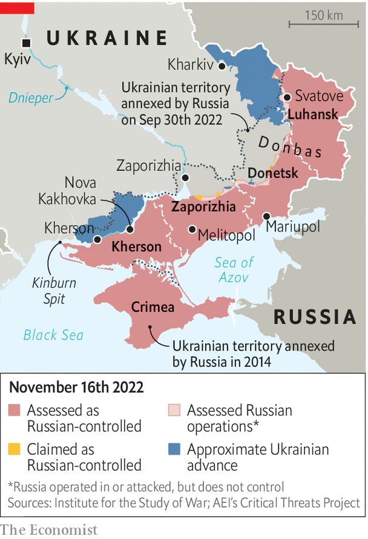

###### After Kherson

# Ukraine has momentum. What it needs now are munitions 

##### The western countries are ramping up 

 

> Nov 17th 2022 

The liberation of Kherson on November 11th was not the end of the war. Russia still occupies the 70% of Kherson province that is east of the Dnieper river, not to mention swathes of next-door Zaporizhia, and Donetsk and Luhansk in the east. But it was the “beginning of the end”, declared President Volodymyr Zelensky, delivering his Churchillian flourish as he walked the streets of Kherson on November 14th.

The front lines in the province are still in flux. Ukraine’s armed forces are fanning out across the west bank of the Dnieper, looking for any Russians trapped on the wrong side. There are tales that Ukraine has mounted raids across the river against Oleshky, opposite Kherson city, and towards Nova Kakhovka, the site of a key dam, as well as on the Kinburn Spit, a slender finger of land that stretches into the Black Sea. But there is no evidence that these swashbuckling operations are real.

 


The question is whether Kherson represents the last gasp of Ukraine’s spectacular offensives or, as Mr Zelensky suggests, just another milestone in the steady collapse of Russian lines. Broadly speaking, Ukraine now has three options.

One is to pursue Russia east over the Dnieper. That is relatively unlikely. Russia blew up the key bridges as it retreated. It still has some of its best troops and plenty of artillery in the area. The same geographical constraint that made life difficult for Russian commanders—an almost 2km-wide river—will bedevil Ukrainian ones. 

Another is to reinforce a promising attack under way in the east. In Luhansk province, Ukraine has been pressing Russia’s ragged lines around the town of Svatove, which sits atop vital supply lines to the south. Russian morale appears to be particularly low in this sector, with evidence of newly mobilised recruits facing extreme hardship and heavy casualties in the face of Ukrainian shelling. 

More ambitious still is the third option: a major attack south from Zaporizhia towards Melitopol and beyond to sever Russia’s so-called land bridge to Crimea, and possibly thence along the Sea of Azov coastline to Mariupol. Mr Zelensky had pressed for such an offensive in the summer, but was talked out of it by his own generals, after American and British wargaming showed how difficult and costly such a thrust would be. 

Russia evidently sees this as a possibility. It is churning out miniature concrete pyramids, known as dragon’s teeth, and probably laying them around Mariupol to block oncoming armour. Satellite images show excavators digging zig-zag trenches at the entrance to Crimea. These entrenchments and fortifications are “old-fashioned and static”, says a Western official, “but also fit for purpose”.

There is no doubt that Russia’s army is in poor shape. Ukrainian intelligence says that Russia has only around 120 Iskander ballistic missiles remaining in its arsenal. The situation with artillery ammunition is even worse. Western officials have told  that Russia has around a month’s worth of it left—one reason why it decided to abandon the Kherson front.

But Ukraine faces some of the same limitations. It is running short of many different types of ammunition, including the air-defence interceptors needed to parry Iranian-supplied drones and Russian missiles. It has been on the offensive since August. It has also taken heavy casualties. Mark Milley, the chairman of America’s joint chiefs of staff, said on November 9th that Ukraine, like Russia, had suffered approximately 100,000 casualties, either killed or wounded. 

Sceptics, including General Milley, argue that Ukraine’s main offensives are probably over for the winter. They argue that Ukraine’s ground offensives in Kherson were not much different from Russia’s in Donbas—slow, crude and relatively ineffective—and that the earlier breakthrough in Kharkiv occurred only because Russian lines were woefully undermanned, a condition that is unlikely to obtain elsewhere as mobilised recruits arrive in greater numbers and Russia redeploys more than 30,000 soldiers freed up from Kherson. 

Optimists point to Ukraine’s advantages. It has 200,000 to 300,000 combat-capable troops, against fewer than 100,000 Russians in the field. Morale among Ukrainian forces is sky-high, a key factor in winter warfare, in which soldiers must bear acute hardship. It also has the edge in precision firepower, thanks to gps-guided shells and rockets, such as Excalibur artillery rounds.

Ukraine’s success in Kherson ultimately offers reasons for both optimism and caution, says Michael Kofman of cna, a think-tank. It shows that Ukraine, if adequately supplied, can take back territory over time, but also that future offensives are more likely to be slow, attritional battles than Kharkiv-like Blitzkrieg. Ammunition, for artillery and air defence, is “the most decisive factor”, argues Mr Kofman. Ukrainian units on the attack will eat through more of it than Russian ones on the defence. They are already consuming a majority of America’s monthly production of gmlrs, the gps-guided rockets fired by himars, according to one source.

The good news is that America and its European allies are beginning to expand ammunition production. The bad news is that Ukraine may not feel the benefit until next summer. Mr Zelensky might note that after Churchill more modestly pronounced the end of the beginning after the second battle of El Alamein in 1942, the war still had three long years to run. ■


