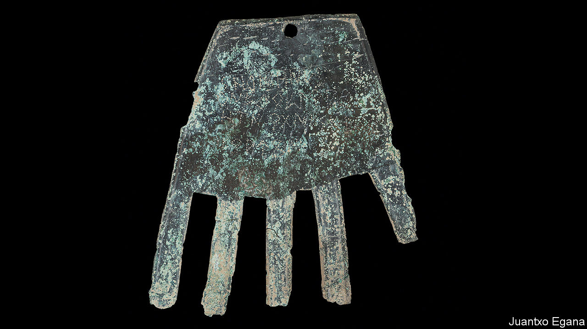

###### Basque in the spotlight

# Written Basque may be 1,000 years older than anyone thought 

##### So says the Hand of Irulegui 

 

> Nov 17th 2022 

Shards of pottery often tell historians useful things, but even the geekiest archaeologist would admit they are not very exciting to look at. Not so a discovery in Irulegui, in Spain’s Navarre region, last year: a life-size bronze cut-out of a hand, green with age, with a small hole indicating that it was meant to hang, perhaps over a door. It was found in a village destroyed in a war of the 1st century BC. Such striking hand-shaped designs are unknown in Spanish or neighbouring cultures.

Still more important is the short inscription, five words in an intriguing script. Experts recognised it as a version of the writing systems used for the now-extinct Iberian and Celtiberian languages, present on the peninsula before the Roman conquest. But this language was neither of those. The researchers were stunned to find that they could make out the first word—in Basque. “Sorioneku”, meaning “good fortune”, was staring the researchers in the face. A descendant of that word, , is used in the Basque “Happy Birthday” song today.

The findings are so significant because the Vascones, the predecessors of today’s Basques, who spoke an old form of their language, were not known to write. The previous oldest known writing in the language was in the Glosas Emilianenses, in which a monk translated snippets of Latin into early medieval Spanish and a couple of words of Basque. These jottings date from the 10th century; Basque writing proper does not really begin until the 16th century.

Basque has long fascinated linguists and historians, as it is completely unrelated to its neighbours, speakers of the vast group of Indo-European languages that includes almost every other tongue in Europe. But Basque history has also been wrangled over, in the context of a long-running independence movement. Being able to set back the date of the written language by an entire millennium will delight fans of one of Europe’s most distinctive cultures.■

