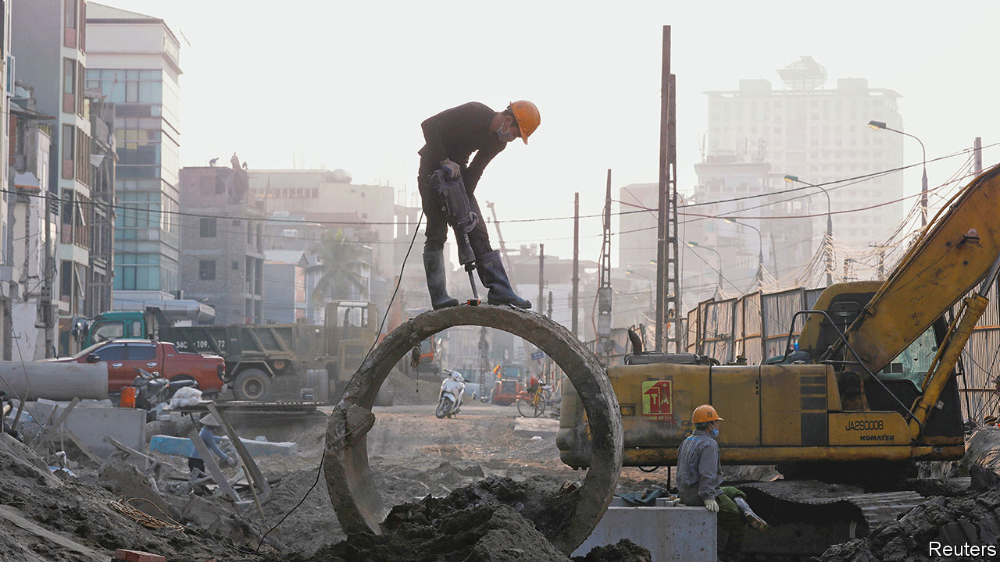
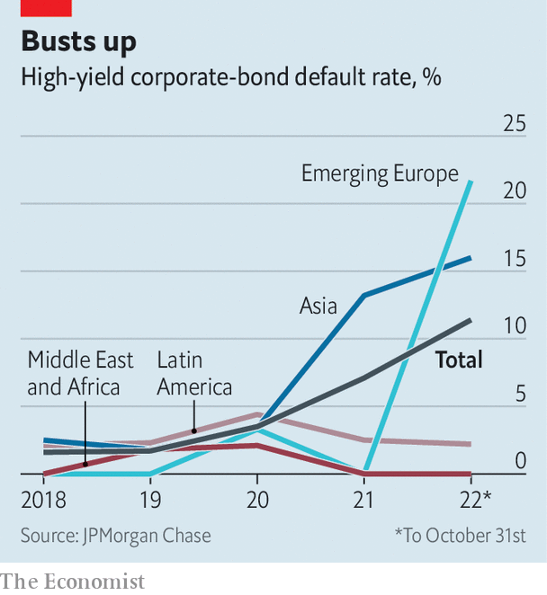

###### Crash watch

# Big emerging-market companies worry investors 

##### Are they where markets will “break” next? 

 

> Nov 17th 2022 

Since september, when a botched budget in Britain roiled markets enough to threaten giant pension funds, investors have been looking for other vulnerabilities that might cause markets to break. Emerging economies are a prime candidate. Historically, high American interest rates and a soaring dollar have triggered financial instability across the developing world. A few unlucky places, including Argentina and Sri Lanka, have stumbled into crisis this time round, but many emerging-market governments have deeper foreign-exchange reserves and less dollar-denominated debt than before, and thus look much sturdier than even a decade ago. 

Big firms in these countries are a different story. Debt issued by large companies has risen relentlessly since the turn of the millennium—from just over 60% of emerging-market gdp in 2000 to more than 90% on the eve of the covid-19 pandemic—as firms took advantage of low interest rates. Borrowing then jumped a further ten percentage points in 2020 alone. Much of this money is owed to foreigners. Although governments in emerging economies began to borrow in their own currencies after blow-ups in the 1990s, corporate debt is still mostly denominated in foreign currencies, meaning local-currency depreciation leads to a deterioration in companies’ balance-sheets. 

 


According to JPMorgan Chase, a bank, the default rate for emerging-market issuers of high-yield corporate debt has jumped to 11.4% this year, well above the 1.7% notched in 2019 and the long-term average of 3.7%. Higher rates and an expensive dollar are only partly to blame. Troubles have been concentrated in China, where property-market woes have kept default rates in the sector at double-digit levels for two consecutive years, as well as in Russia and Ukraine. Russian firms are expected to default on debt worth $28bn in 2023, equivalent to two-thirds of the remaining stock of debt. Nevertheless, markets have for the most part already priced in losses, reckons JPMorgan, so defaults are unlikely to spark a wider crisis.

It is problems elsewhere that look more troubling. Rising rates and slowing growth have taken a toll on property markets around the world, and this is now creating difficulties for firms outside China as well as within. A default, in late September, on short-term debt issued by the developer of Legoland Korea has thrown debt markets in South Korea into turmoil. Yields on short-term debt have shot up to the highest levels since the global financial crisis of 2007-09. In late October the government said it would buy around $35bn in corporate bonds in order to stabilise markets. 

In recent weeks, property troubles have also popped up in other emerging Asian economies. Liquidity has evaporated from Vietnamese corporate-bond markets, following an effort by officials to rein in corruption in the country’s property market. As prices for developers’ shares and bonds tumble, the central bank is weighing intervention to keep the market functioning. Indonesian developers face similar difficulties. Prices for the bonds of several large firms have fallen to distressed levels, amid credit-rating downgrades and fears that default risks are growing.

This spreading financial unease may seem reminiscent of past panics, including the devastating crisis that ripped across Asian economies in 1997 and 1998. There are, though, good reasons to hope trouble will be contained. Rising rates have hurt property markets, but most big firms pay fixed coupons on their bonds and have not issued much new debt over the past year. Governments across Asia have fiscal room to support their economies and hefty piles of foreign-exchange reserves.

Yet both Britain’s budget fiasco and the sudden collapse of ftx, a cryptocurrency-trading platform, demonstrate how quickly financial vulnerabilities can crystallise into problems. A few wobbles among emerging-market bonds could prove a few too many for comfort. ■


