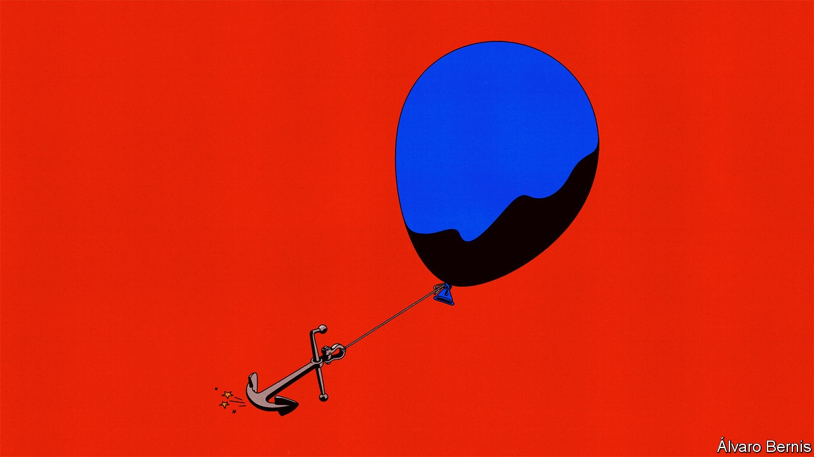
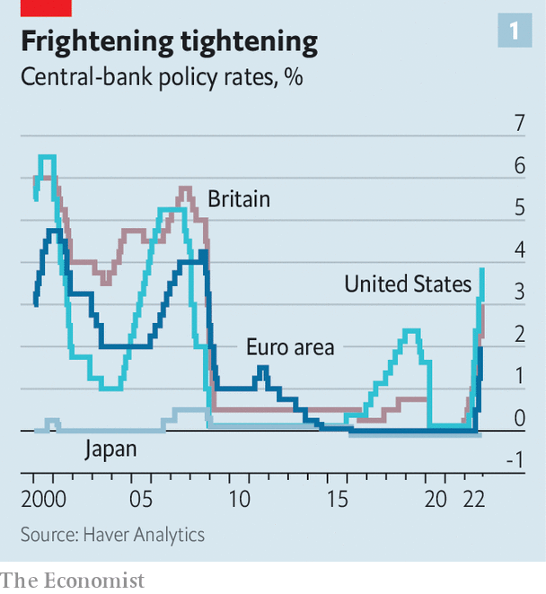
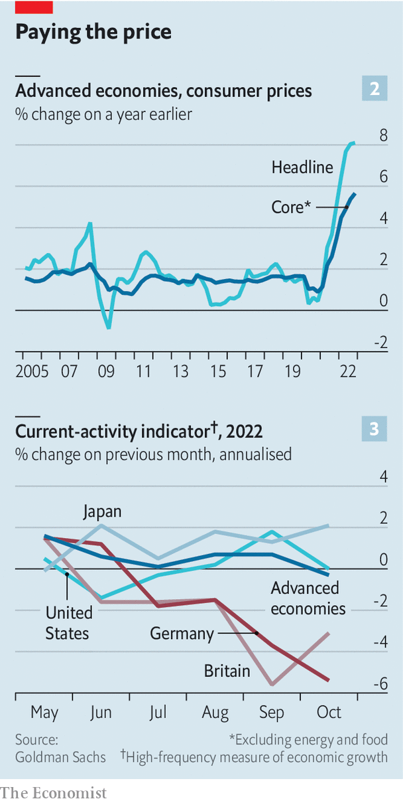
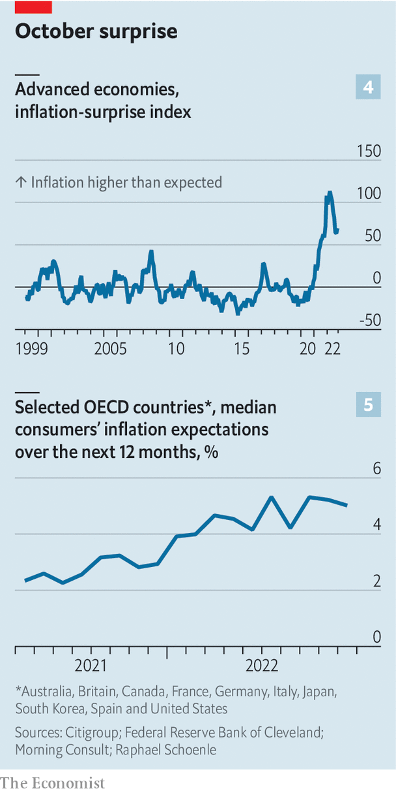

###### Persistent prices

# Even a global recession may not bring down inflation 

##### The world economy is slowing dangerously 

 

> Nov 15th 2022 

Investors have swooned at the good news. Since early October European shares have risen, with optimists declaring an end to the continent’s energy crisis in sight.  at recent talk that Xi Jinping will abandon his “zero-covid” policy, and as regulators have loosened their curbs on the property sector. On November 10th, on the news that America’s consumer-price inflation had come in slightly below economists’ expectations, the tech-heavy nasdaq index rose by 7%, one of the biggest ever daily moves, as investors priced in lower interest rates. 

 


But take a step back, and the outlook has in fact darkened in recent weeks. The global economy is slowing, perhaps into a recession, as central banks ramp up interest rates to battle a once-in-a-generation surge in prices (see chart 1). Even with one month of better-than-expected data for America, there is scant evidence that  (see chart 2). Indeed, in much of the world it is broadening out. 

For most of this year people have worried about a downturn. In June Google searches for “recession” neared a record high. For a long time, however, the gloomy rhetoric ran ahead of reality. Output in the median rich country increased by about 1.3% from the end of 2021 to the third quarter of this year—not spectacular, but not bad. In the year to September the average unemployment rate in the oecd, a club of mostly rich countries that accounts for about 60% of global gdp, fell by close to one percentage point. Joblessness in the euro area hit an all-time low. Consumer spending was strong, with hotels, planes and restaurants packed the world over. 

 


Now reality has caught up with the rhetoric. Higher borrowing costs are starting to bite. In many countries, including Canada and New Zealand,  as homebuyers face expensive mortgages. Housebuilders are cancelling projects, and homeowners are feeling less wealthy. Other companies are also reining in spending. In their latest monetary-policy report the Bank of England’s researchers note that costlier finance is “weighing on investment intentions”. The minutes of a recent Federal Reserve meeting observe that fixed investment by businesses has “already started to respond to the tightening of financial conditions”. 

Deteriorating economic conditions are beginning to show up in “real-time” data. Goldman Sachs, a bank, publishes a “current-activity indicator”, a month-by-month measure of economic strength. Last month, for the first time since the initial covid-19 lockdowns in 2020, rich-world economies appeared to shrink (see chart 3). Likewise, a global survey of purchasing managers indicates a contraction for the first time since June 2020. Since July a “nowcast” of global annualised gdp growth produced by JPMorgan Chase, another bank, has fallen by half. 

Optimists point to strong labour markets. America’s formidable jobs machine has slowed, but is still whirring, adding more than 250,000 positions in October. Elsewhere, though, signs of weakness are emerging. Claudia Sahm, an economist, has suggested that a recession is nigh when the average of the unemployment rate over the past three months rises by at least 0.5 percentage points relative to its low during the previous year. We find that eight out of 31 rich countries currently meet this criterion, including Denmark and the Netherlands. This is not a high proportion compared with, say, the beginning of the global financial crisis of 2007-09. But it does signal that a serious slowdown is now under way. 

The “Sahm rule” reveals another important truth: that different countries are moving at very different speeds. Aside from America, a number of places, including Australia and Spain, are still growing at a decent rate. Yet others are in trouble. Sweden, where high interest rates are hurting a particularly frothy housing market, is losing steam fast. Britain is now almost certainly in recession. In Germany sky-high energy prices are forcing industrial shutdowns. It may be faring the worst of all rich countries. 

How severe will the downturn be? Households in rich countries are still sitting on trillions of dollars of “excess savings”, which they accumulated in 2020-21 from stimulus cheques and other fiscal support. This money will allow them to continue spending, even in the face of falling real incomes. New research by Goldman Sachs finds that large private-sector saving surpluses are associated with less severe recessions. And healthy savings pots mean economic pain is less likely to translate into financial distress. Mortgage-delinquency rates are actually declining in America, and are extremely low in New Zealand and Canada. 

Marching orders

Labour markets are weakening, but a rise in unemployment like that seen after the financial crisis is unlikely. This is because demand for labour has a long way to fall before it matches supply. Early this year the two were seriously out of whack, with the number of unfilled vacancies across the oecd peaking at 30m, according to our calculations. Now as demand falls, vacancies rather than jobs seem once again to be taking the strain. We estimate that the number of unfilled positions has fallen by a tenth since the high, but the number of filled posts is static. 

Much depends on the path of inflation. Central banks are willing to induce a recession in order to lower it. Higher rates may bring “some softening of labour-market conditions”, as Jerome Powell, the chairman of the Fed, noted earlier this month. “We do think that [raising rates] is going to dampen demand, we’re not going to pretend this is pain-free,” warns Philip Lane, chief economist of the European Central Bank. Both economic theory and data over the past seven decades suggest that falling gdp is associated with a large decline in the speed of price rises. But the lags between tighter monetary policy and lower inflation are not well understood. Central banks may have to cause more pain than they anticipate.

 


In some countries lower energy and food prices are helping to drag down the headline rate of inflation. America’s recent figures for October were better than economists expected. In general, though, prices are not heading in the direction that central bankers would like. Inflation “surprises” across the rich world, when reported data come in higher than forecast, are still common (see chart 4). According to figures released on November 16th, inflation in Britain was 11.1% in October, well above economists’ expectations. On the same day, Canadian data showed no sign of waning inflation. Almost everywhere “core” inflation, which reflects underlying price pressure better, is rising. In three dimensions—breadth, wages and expectations—rich-world inflation is getting more, not less, entrenched. 

Begin with breadth. When the inflationary surge started last year, it was confined in most countries to a small number of goods and services. In America it was second-hand cars. In Japan it was food. In Europe it was energy. This provided false comfort to pundits, many of whom assumed that once the prices of these few components stopped rising, overall inflation would fizzle out. 

In fact, the inflation virus has spread. We analysed the consumer baskets of 36 mostly rich countries. In June 60% of prices in the median basket were rising by more than 4% year on year. Now 67% are. Even in Japan, the land of low inflation, the prices of a third of the basket are rising by more than 4%. This broadening out is in part due to an exceptionally strong dollar, which raises inflation by making imports more expensive. But it is more to do with what is happening in domestic economies.

This is where the second dimension—wages—comes in. Pay is a guide to the future path of inflation: when companies’ labour costs rise, they tend to pass them on to customers in the form of higher prices. Inflation optimists point to data from America, where there is some evidence of a pay slowdown, albeit from increases of 6% or more year on year. Growth in Britain also seems to have peaked at a high-but-no-longer-rising rate. 

Elsewhere, though, there is not much evidence of restraint. New research from Pawel Adrjan of Indeed, a jobs website, and Reamonn Lydon of the Central Bank of Ireland suggests that nominal pay in euro-zone job postings is rising by more than 5% year on year, and is still accelerating. French wage inflation “has further to go”, reckons JPMorgan. In Germany ig Metall, a big union for metals and engineering workers, is seeking a pay rise of up to 8%. In New Zealand, Norway and Sweden pay growth is still rising. This is not what you would expect at a time when the economic outlook is dire. 

The third dimension is expectations. Alternative Macro Signals, a consultancy, runs millions of news articles in several languages through a model to construct a “news inflation pressure index”. The index, which has proved to be a good predictor of official numbers, is still elevated. Similar evidence comes from Google-search data, which suggests that global interest in inflation has never been so high. 

Survey-based measures of expectations similarly provide no evidence of weakening inflation. Figures put together by the Cleveland Fed, Morning Consult, a data company, and Raphael Schoenle of Brandeis University gauge the public’s inflation expectations in various rich countries. According to the survey for October, in the median country the public reckons prices will rise by 5% over the next year, as it has in previous months (see chart 5). The inflation expectations of companies—the economic actors that actually set prices—are just as concerning. A survey by the Cleveland Fed, based on research by Bernardo Candia, Olivier Coibion and Yuriy Gorodnichenko, three economists, finds that American firms currently expect inflation of 7% over the next year, the highest level since the survey began in 2018. 

Painful ignorance

Everyone can agree on one thing about the past year. It has demonstrated just how poorly economists understand inflation, including both what causes it and what causes it to persist. It is likely, therefore, that economists will also struggle to predict when inflation will cool. Optimists hope that prices will once again take people by surprise, with their rise slowing sooner than expected. But it seems more likely that inflation will prove stubborn even as the economy slows. That will leave policymakers with a grim choice: to squeeze the economy tighter and tighter, or to let prices spiral. ■


