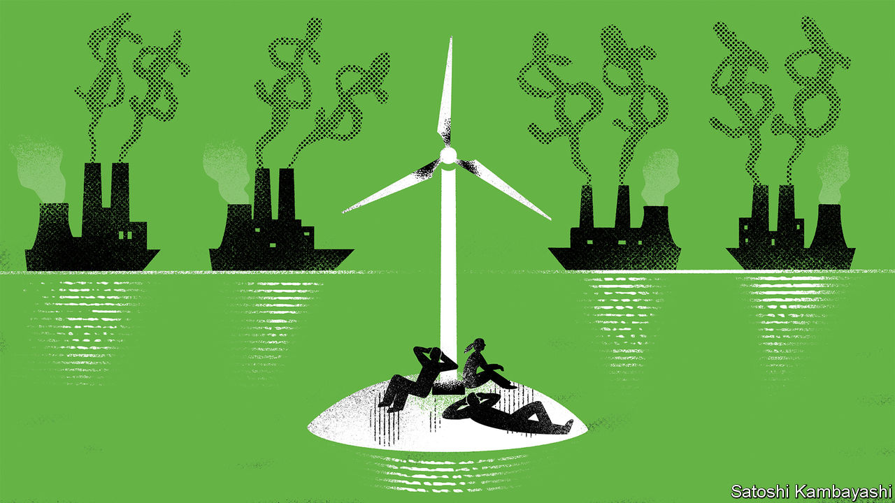

###### Buttonwood

# The tenacity of ESG investing 

##### A green-finance boom has not been followed by bust 

 

> Nov 16th 2022 

The standard story of 2021’s green-finance boom goes something like this: in a phenomenon that reached fever pitch a year ago at the cop26 convention in Glasgow, a lot of investors lost their heads. A potent cocktail of cheap money and sanctimony fuelled a boom in  (esg) investing, during which asset managers and bankers pitched themselves as . 

Nemesis followed hubris. Russia’s invasion of Ukraine, and subsequent elevated gas and oil prices, reminded the world just how much it needed fossil fuels, and how profitable investing in them could be. The cynicism of the asset managers and bankers was exposed as regulators cracked down on “greenwashing”. dws, Germany’s largest asset manager, was raided by the authorities following a whistleblower complaint; Britain’s advertising watchdog banned hsbc, a bank, from making “misleading” environmental claims. Far from saving the world, esg thus became mired in .

There is just one problem with this fable of financial greenery’s fall to earth: hard facts. True, appetite for esg investing has fallen. Net inflows are well below those of last year. But for all the talk of a backlash, sustainable-investment funds have been much more resilient than other funds during this year’s downturn. According to Morningstar, a data firm, $139bn had flowed into sustainable funds by the end of September, compared with $643bn of net outflows from the broader market. European funds have attracted the bulk of the money, receiving 89% of total inflows into sustainable funds, but even in America such funds have drawn more money than other investment vehicles.

Why have green funds remained attractive? It is certainly not because of juicy returns. These funds tend to invest heavily in technology stocks, which often achieve high esg ratings owing to some combination of progressive Californian values, asset-light business operations and sophisticated human-resources departments which do things like diversity monitoring as a matter of course. Such stocks have performed poorly this year. And while esg funds are overexposed to this year’s losers, they are underexposed to the big winners: fossil-fuel firms. The iShares esg Aware msci usa index, one of the biggest passive esg funds, is down by 18% this year, compared with a 16% fall in the spdr s&amp;p 500 etf, which tracks the s&amp;p 500 index of American stocks. 

Sustainable-fund managers point out that their investors are not overly bothered by short-term returns. People putting money into esg believe the energy transition is not something that will happen over a couple of years, but a long-term trend that will mean their investments inevitably pay off. Oil majors may have been a good investment this year, they admit, but that will cease as deadlines for hitting net-zero emissions near. Sustainably minded investors tend to be young and have decades-long investment horizons. They do not fret about a few years of poor performance. 

Social values give investors a non-pecuniary reason for allocating money and sticking with their choice, a rare advantage for funds in an industry where a competitive edge normally means lower fees. Indeed, Morningstar’s data show that the greener the fund, the more likely it is to have enticed investors to stick around. The eu’s Sustainable Finance Disclosure Regulation, a rule on climate-investment standards, splits funds into three categories. Those in the greener bucket, known as Article 9 funds, enjoyed the biggest net inflows in the third quarter of the year. Article 8 funds, sometimes called “light green” in the industry, have seen net outflows—but not as big as those from Article 6 funds, which have no sustainability focus at all. 

There are notably fewer bankers and asset managers at this year’s cop27 convention in Sharm el-Sheikh than there were in Glasgow. Perhaps that is because they have one eye on American politics, where Republicans are rallying against “woke capitalism”, none more volubly than , Florida’s governor and a potential presidential candidate. Allies of Mr DeSantis may have to grit their teeth, however. This year’s greenwashing scandals, and investors’ relaxed attitude towards them, have demonstrated an important truth: that there is money to be made from environmental investing. So long as that is true, businesses claiming to provide investors with the genuine, truly green article will not be going anywhere.■


