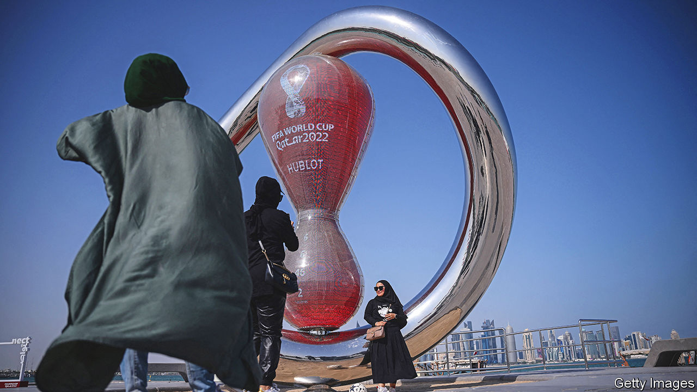
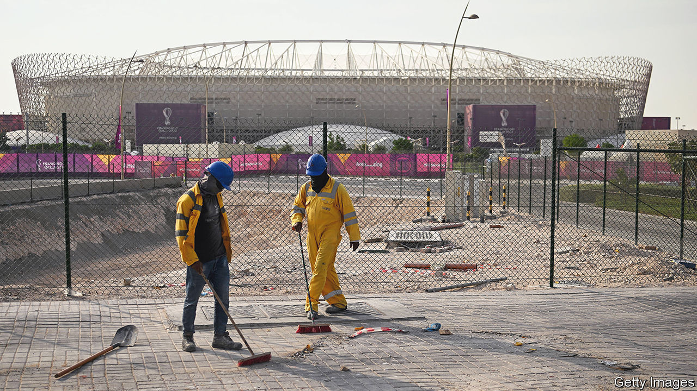

###### The future of football

# The Qatar World Cup shows how football is changing 

##### A tide of new money will drive big changes for the world’s favourite sport 

 

> Nov 17th 2022 

It was not the sort of pre-tournament publicity that the organisers would have hoped for. On November 20th Qatar’s footballers will take on Ecuador in the first match of the 2022 World Cup, the biggest event in the global sporting calendar. Yet just 13 days before, Sepp Blatter, a former president of FIFA, world football’s governing body, told a Swiss newspaper that, in his opinion, awarding the World Cup to Qatar had been a “mistake”. 

In 2010, when Mr Blatter pulled the card from the envelope and publicly announced Qatar’s victory—to general astonishment—he was forced, for the sake of diplomacy, to take a rather different line. Football, he announced, was going to “new lands”; the idea was to broaden the game’s appeal. Few other observers were willing to defend the deal. Accusations of corruption and bribery flew; though a report commissioned by FIFA and eventually published in 2014 gave Qatar’s bid its , with a few reservations. 

Elite sport is a notoriously murky business, and exactly what happened may never be fully known. Qatar’s rulers, and the 1.3m fans expected at the World Cup, will be hoping that, as the matches get under way, talk will turn to matters on the pitch rather than off it. Qatar has spent lavishly to ensure the tournament is a success, building seven stadiums, an expanded airport and dozens of hotels. But if so, it will be only a temporary reprieve. The decision to hold football’s biggest party in a tiny, autocratic petrostate with plenty of money but no particular footballing heritage is only the starkest example of how money and new ideas are shaking up the top levels of the world’s favourite sport. 

In the past few years corruption scandals have shaken football. Mr Blatter himself stepped down in 2015, during an  into FIFA, and was later banned from football administration by its ethics committee. The covid-19 pandemic has worsened the already fragile finances of many top-flight clubs, which are struggling to pay the enormous wages that star players can command. 

Last year saw the rise and temporary fall of a plan for a breakaway “European Super League” (ESL) of elite clubs, built on the closed, cartel-like model of American professional sports. Hedge funds and investors from America and the Middle East have invested in financially precarious European clubs: they are keen to squeeze yet more games into an already packed calendar. There is even talk among investors, and the sport’s administrators, of a rash of new super-tournaments, some of which are explicitly designed to compete with the World Cup itself. 

Money was one of Qatar’s chief attractions. Its team are Asian champions, but few consider them contenders. In fact, the national side has never qualified for a World Cup before (it is playing this time because the host country qualifies automatically). But it is a financial force, and keen to promote itself as a modern, developed country. Solid numbers are scarce, but the current World Cup is almost certainly the most expensive ever staged. The stadiums alone are said to have cost $6.5bn. Much of a broader $300bn economic development plan called Qatar 2030 has been written with the needs of the World Cup in mind (a gleaming new metro system, for instance, serves several of the new stadiums). 

Paying the price

That frenzy of construction has made many uncomfortable. Qatar’s large force of migrant labourers are often harshly treated under its  (“sponsorship”) system, unable to change jobs or leave the country without their employer’s consent. They were worked to the bone to get things ready; many have died on the job. The Danish team will play in a monochrome red shirt which hides the team crest and kitmaker’s logo. Hummel, the manufacturer in question, said it did not “wish to be visible” at the tournament. One of its other kits is black, “the colour of mourning”. In October the Australian team released a video criticising Qatar for alleged human-rights abuses. None of this seems likely to reverse a growing . 

Several players, including Bruno Fernandes of Manchester United and Nico Schlotterbeck of Borussia Dortmund, have complained about the timing of the tournament. The World Cup usually takes place in June or July. Rescheduling it to November was necessary to avoid the scorching Qatari summer. But it leaves the tournament sitting awkwardly in the middle of the lucrative European club season. Jürgen Klopp, Liverpool’s manager, summed up the mood for many: “I will watch the games anyway, but it’s different.” 

Money—both the lack of it now and the desire for more in future—was also behind the plans for the ESL. It was envisaged as an annual contest that would pit top European clubs against each other, much like the Champions League. A dozen elite clubs from across the continent, including Arsenal, Juventus and Real Madrid, announced the plan in April 2021. Amid a furious backlash from fans and politicians, they  a few days later—though their retreat was only temporary. In October Barcelona, Juventus and Real Madrid resurrected the idea, with a new management team and a public-relations offensive. The ESL’s backers also have a case before the European Court of Justice challenging UEFA’s monopoly on organising competitive continental football in Europe. A verdict is due early next year.

The ESL would have operated along the closed-shop lines familiar to fans of American sports. The 12 founder members of the ESL would have been guaranteed permanent places in the competition, no matter how badly they performed. That idea was anathema for many fans used to the cut-throat meritocracy of existing European football, where any club can, at least in theory, aspire to qualify for the Champions League, and where teams stuck in a rut can take years to get out of it. 

But it is less attractive for investors and the clubs themselves: they prefer rules that guarantee a return on their ever-increasing outlays. So many clubs in Spain’s top two domestic leagues were struggling after the pandemic that, in December 2021, they agreed to sell 8.2% of profits for the next 50 years to CVC, a Luxembourg-based private-equity firm. Over the summer FC Barcelona sold 25% of the media rights to its Spanish games to Sixth Street, another private-equity firm, until 2047. The club hopes to plug holes left by years of financial mismanagement. And in January several Spanish clubs will be back in the Middle East: Saudi Arabia has paid €240m ($254m) to host six editions of the Supercopa, an annual Spanish mini tournament. 

The backlash against the esl has not put off football’s governing bodies, which are keen to launch new formats of their own. FIFA and UEFA are enmeshed in bitter wrangling over the future of summer tournaments. Although FIFA governs the World Cup, which makes up 90% of its revenue, its bosses lament that UEFA makes far more money: $14bn during the last World Cup cycle between 2015 and 2018, compared with just $5.7bn for FIFA over the same period. That is mainly because of the Champions League. FIFA is desperate to diversify, including by creating other competitions. UEFA jealously guards its position. 

 


Cramming in more contests would raise more money, but would require administrators to find more space in a crowded calendar. International “friendlies,” or exhibition matches, have been all but scrapped, and qualifying paths for big tournaments shortened. From 2024 the “international breaks”, during which club players are diverted to international duties, are set to be fewer but longer, packing games in while reducing the time players spend travelling. The tournaments which determine continental champions, like the Euros and the African Cup of Nations, could all be scheduled for the same summer, instead of being spread across a four-year cycle. That would free up a month’s space for a new and lucrative tournament every second summer. “There is going to be a fight,” says Simon Kuper, one of the authors of “Soccernomics”, a book on the business side of the game.

Football, wall-to-wall

Three ideas are kicking about. The first is to stage the World Cup every two years rather than every four. The second, which FIFA’s governing council approved shortly before the pandemic, is to beef up an existing mid-season tournament named the Club World Cup, a worldwide equivalent to the Champions League. Eye-popping prize money was to be provided—in exchange for a 49% share—by a consortium led by SoftBank, a Japanese firm with a penchant for big, risky bets, and Saudi Arabia, which hoped to host the resulting tournament. 

The third, and the most likely to happen, is an expansion of the Nations League, a tournament introduced in 2018 by UEFA in place of friendlies. FIFA wants other continents to adopt the format, and for the best teams to stage a “Global Nations League” every four years under its purview. UEFA has responded by inviting South American countries to join the European Nations League from 2024, cutting FIFA out. Either plan would boost the Nations League as a direct rival to the World Cup. 

The World Cup itself is destined to carry on growing. The Qatar tournament features 32 teams, twice as many as played during the 1970s. The 2026 event, hosted by America, Canada and Mexico, will feature 48. That will mean more matches between no-hopers—but will also direct a larger share of the revenue to the world’s 211 national footballing federations. 

Meanwhile, bids for the 2030 World Cup are already being prepared. Saudi Arabia, a bitter geopolitical rival of Qatar’s, is keen to host a World Cup of its own. In theory, eligibility criteria should preclude another Middle Eastern country acting as host for the next two tournaments. But Saudi Arabia has hitched its bid to those of Greece and Egypt, in the hope that it will therefore count as European or African. The kingdom says it will pay to build stadiums in both countries. The decision is not due until March 2024. But one lesson of Qatar is that it would be bold to bet against another winter World Cup in an autocratic desert state in the not-too-distant future. In football, as in so much else, money talks. ■

