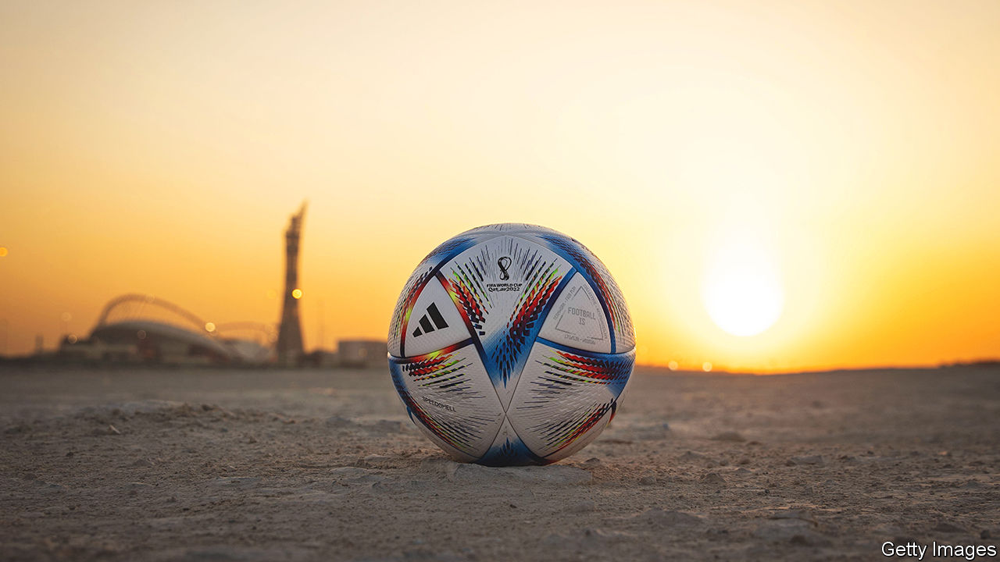

###### Don’t smear the emir

# In defence of Qatar’s hosting of the World Cup 

##### It is a worthier venue for a big sporting event than other recent hosts 

 

> Nov 17th 2022 

Migrant workers are often treated very badly. There is much less sexual freedom than in Western countries. It is not a democracy. These  are true of Qatar, where the month-long finals of the football  begin this weekend. They are also true of Russia, which hosted the previous World Cup, and China, which hosted the most recent Olympic games, last winter. In fact, Qatar is a much more suitable country to host a big sporting event than either of those two.

At best, Western criticism of the decision to award the games to  fails to distinguish between truly repugnant regimes and merely flawed ones. At worst, it smacks of blind prejudice. A lot of the indignant pundits sound as if they simply do not like Muslims or rich people.

Qatar may not be a democracy, but it is not the despicable despotate of cartoonish editorials. The previous emir, under no popular pressure at all, introduced elections of a sort. He also set up a news channel, Al Jazeera, that is more outspoken than its Arab rivals, even if it goes easy on Qatar itself. That is a far cry from Vladimir Putin’s Russia, where you get sent to prison for describing the war in Ukraine as a war, let alone denouncing it. And it is a world of difference from China, where no peep of political dissent is tolerated. The Argentine junta that hosted the World Cup in 1978 threw critics out of helicopters.

The world also looks at migrant workers in Qatar through a distorted lens. For one thing, the emirate is more open to foreign labour than America or any European country. Native Qataris make up only 12% of the population—a proportion supposedly more enlightened countries simply would not tolerate. Although these migrants are sometimes mistreated, the wages most earn are life-changing, which is why so many want to come in the first place. And whereas hosting the Olympics twice has not made China more democratic, the chance to stage the World Cup has led to an improvement in Qatar’s labour laws.

The claim that Qatar is a den of homophobia is also misleading. Gay sex is illegal, it is true, but so is all sex outside marriage. There are few prosecutions for violating these laws, however. And such conservative but seldom-enforced laws are common throughout much of the developing world, and in almost all Muslim countries. Qatar hardly stands out.

Then there are the claims that  bribed its way to World Cup glory. That may be true, although no clear proof has ever been made public. But if it is, it says more about fifa, the body governing international football, than it does about Qatar. The world is always going to have rich countries; it needs sporting authorities able to guard against undue influence.

The strongest argument against Qatar as a host is environmental. With the world overheating, it seems mad to fly in legions of players, fans and hangers-on to run about in new, air-conditioned stadiums on grass sustained by desalinated water. The hosts’ claim that the event will be carbon-neutral is dubious. But this is a vice of all big sporting events, to some degree. Thanks to clever engineering, cooling the stadiums is not as polluting as you might imagine. And the 3.6m tonnes of carbon dioxide that FIFA says the tournament will emit is just 0.01% of global emissions this year. 

Unless  wants the tournament to rotate among Finland, Norway and Sweden, it cannot always hold it in a blameless spot. The idea of bringing the World Cup to the world is only right. The Middle East is full of fans, but has never hosted the event before. Nor has any Muslim country. If the World Cup is ever to be held in such a place, Qatar is a perfectly good choice. ■

