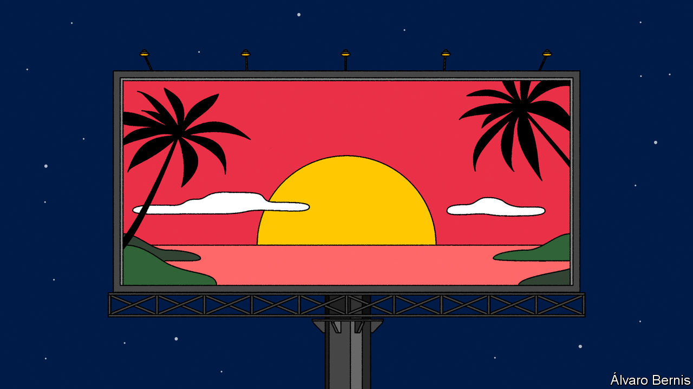

###### Is that light at the end of the tunnel

# Investors are becoming too optimistic about the world economy 

##### American inflation, Europe’s energy crisis and China’s zero-covid policy are still enormous problems 

 

> Nov 17th 2022 

A RARE surge of optimism is running through financial markets. For most of the year America’s high inflation has proved troublingly persistent, Europe’s energy crisis has threatened a deep recession and China’s economy has been plagued by covid-19 lockdowns and a property bust. Investors are now cheering developments on all three fronts. America’s annual inflation fell from 8.2% to 7.7% in October. Europe’s natural-gas prices are down by two-thirds from their peak in August. China has  some restrictions associated with its “zero-covid” policy and on November 11th unveiled measures to ease the financial pressure on embattled property developers. This flurry of news has  up by 13% since mid-October, as traders priced in fewer interest-rate rises by central banks and caused the dollar to fall.

Alas, investors are getting ahead of themselves. America’s inflation is coming down because pandemic-related disruptions to supply chains are dissipating. A year ago dozens of ships were anchored outside Los Angeles waiting to be unloaded, and semiconductors and second-hand cars were in short supply. Today the anchorage is empty, there is a glut of chips and car prices are falling. These improvements are likely to continue. And from March 2023 comparisons of prices with a year ago will also no longer look back to before Russia’s invasion of Ukraine, when oil was cheaper. That will cause headline inflation to fall further.

Yet as inflation subsides, it will get . American wages are growing at an annual rate above 5%, because the labour market is still exceedingly tight; there are nearly two vacancies for every unemployed worker. The Federal Reserve’s 2% inflation target is compatible with wage growth of only about 3-4% (reflecting inflation, productivity growth and perhaps a rebound in workers’ share of economic output). Although job growth has slowed, the Fed is therefore likely to keep raising interest rates until the labour market is much cooler. Some  might come easily today, but a return to 2% will almost certainly require a recession.

Europe’s energy crisis is going through a similarly illusory reprieve. Natural-gas prices have plunged because storage levels are high and the weather has been mild. Yet Europe’s economy is probably shrinking nonetheless—and it is only at the start of an energy crunch that will span at least two winters. Next year Europe could have to refill its storage without any piped Russian gas. The weather could be colder, and global liquefied-natural-gas prices could be higher. Worse, the inflation that has hitherto been caused by energy prices seems to be becoming entrenched. Britain’s annual inflation reached 11.1% in October; excluding food and energy, it was 6.5%. Across Europe wage growth is rising and inflation expectations are creeping higher, making it harder to balance fighting inflation with supporting the economy.

China’s economy has the biggest potential to spring a pleasant surprise in 2023, because it has been so damaged by zero-covid policy and a housing crash. The authorities have unveiled 20 tweaks to their covid rules and 16 measures to help property firms. Yet on both fronts the road ahead will be long and hard. Rising infections mean more lockdowns could be imminent. A managed end to zero covid would boost growth, but a chaotic “exit wave” of infections, in a population that has barely been exposed to the virus, could cause panic and further damage the economy. The property measures have helped developers and reduced the chance of a financial collapse, but demand for housing, and thus property’s contribution to growth, is likely to remain subdued. The world economy’s problems are still severe. It will not just shrug them off. ■

