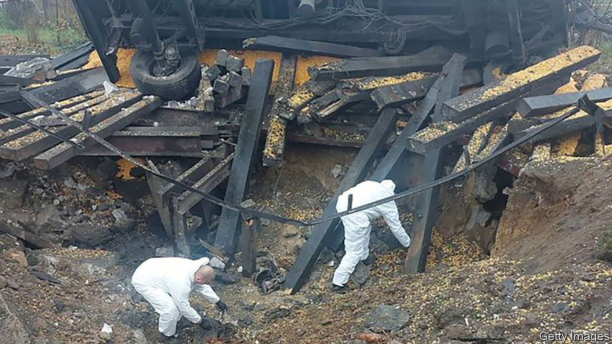

###### Keep calm and carry on

# Russia needs a respite, so the West must help Ukraine fight on 

##### The mishap in Poland should concentrate minds on tackling the cause of the conflict 

 

> Nov 16th 2022 

The rocket that landed in Poland on November 15th, killing two people, was mercifully not a missile from Russia. But the Ukrainian interceptor which fell to the ground would never have been launched were it not for Russia’s brutal aerial assault on Ukraine that day—its biggest barrage of missiles against  and infrastructure so far. Russia is escalating because it is . The West must keep its cool and intensify its support for Ukraine. This is a time for bold steps.

Poland and its allies deserve praise for their calm response. As Russia’s state media gloated over the death of Poles and accused its enemies of a “provocation”, nato governments collected evidence and avoided raising the temperature. Volodymyr Zelensky, Ukraine’s president, made a rare misstep in painting the accident as a Russian missile attack. But Russia’s behaviour courts disaster. In March it struck a base just 24km (15 miles) from the Polish border. The same month, a Soviet-era drone carrying explosives crashed in the Croatian capital, Zagreb. In September a Russian jet inadvertently fired an air-to-air missile close to a British spyplane in international airspace over the Black Sea. Russia does not want a war with nato. But it hopes that such danger will induce nato to back down.

That must not happen. Some American officials are showing signs of nerves. Mark Milley, America’s top general, has likened the conflict to the stalemate of the first world war. He has cast doubt on Ukraine’s ability to shift the front lines farther and suggested that it should consider negotiations with the Kremlin. His diagnosis and prescription are both flawed.

 is in dire shape and on the retreat. Its withdrawal from  earlier this month reflects a serious shortage of artillery ammunition. Precision munitions are running out, which is why Russian attacks on Ukraine’s energy grid rely on Iranian drones. And even as the seasons bring mud and bitter cold, Ukraine, well stocked with Western winter gear, will keep fighting. 

Russia needs a pause. It should not be given one. For Ukraine to press its advantage, it requires a steady supply of Western arms, ammunition and equipment.

Top of the list is air defence. As its Soviet-era systems run low on ammunition it needs additional Western launchers that can be replenished more easily—including longer-range Patriot batteries. Air defences can also spark a virtuous circle that would allow Ukraine to ramp up its own arms production without fear of having factories destroyed. Its army hopes to raise as many as a dozen new brigades for a future offensive. They will need a large fleet of armoured vehicles.

On November 15th the Biden administration asked Congress for over $37bn in emergency aid to Ukraine—more than the defence budgets of Australia, Canada or Italy. Europe must show the same sense of urgency. Russia’s air attacks should serve as the trigger for the dispatch of tanks, such as German Leopards. European allies should create a fund to support the provision of Sweden’s Gripen fighter jets, which are easy to maintain and well suited to Ukraine’s flexible operations. 

Jaw, jaw and war, war

This week’s incident, and the danger that setbacks on the battlefield will lead Russia’s president, Vladimir Putin, to escalate, including with nuclear weapons, show the importance of maintaining channels of communication with Russia. That is why Bill Burns, the director of the cia, was right to meet his Russian counterpart in Turkey on November 14th. The door to a future diplomatic settlement, when both Ukraine and Russia are ready for one, should be left open. But a ceasefire now would be deeply disadvantageous to Ukraine, halting its momentum and giving Russia breathing space to restock its arsenal and prepare a fresh army. This is not the moment to let up. ■


