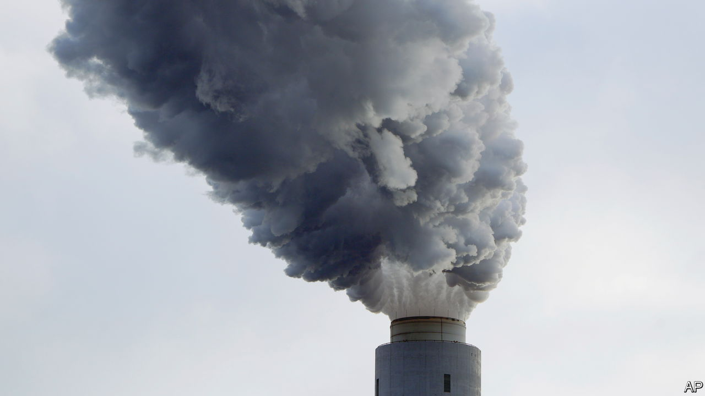

###### Splitting the climate bill

# There is a better way to help poor countries fight climate change 

##### Governments cannot pay for it all, but they can attract private capital 

 

> Nov 17th 2022 

From TONNES of carbon to degrees of global temperature rise, it is not unusual for un climate summits to revolve around numbers. At this year’s cop, held in the  resort of Sharm el-Sheikh, one set of figures is dominating the conversation above all else: the . At the Copenhagen summit in 2009 rich countries promised to supply annual climate financing of $100bn to  by 2020, to help them slow climate change and resist its effects. The most that has ever arrived is $83bn, in 2021. 

In fact, even $100bn would not be enough. A report commissioned by the un calculates that poor countries, excluding China, will need $2.4trn annually by 2030 to tackle global warming. Around half can be raised domestically, leaving an annual shortfall of more than $1trn. 

Public funding will never fill the gap. Rich countries are beset by covid-era debts, rising interest rates and soaring energy prices. Many poor ones are facing debt crises. Only two weeks before  arrived at the cop, Egypt devalued its currency and secured a bail-out from the imf. 

Who then should pay? John Kerry, America’s climate envoy, has announced a plan to encourage firms from the rich world with green aspirations to pay to shut polluting power plants in poor countries. In return, the firms would receive credits that would allow them to declare themselves “carbon neutral”. 

But corporate munificence (as opposed to the profit motive) is unlikely to suffice. The solution is to attract more private investment. Mia Mottley, the prime minister of Barbados, has proposed a scheme to that end involving the imf. Emmanuel Macron, the president of France, has voiced his support for it. The fund would issue $500bn in “special drawing rights” (sdrs)—a kind of low-cost sovereign overdraft—which would be commingled with funds raised from private investors, reducing the overall cost of capital. 

But issuing sdrs amounts to printing money—a worrying precedent when inflation is so high. What is more, the scheme would bypass scrutiny: America’s Treasury can authorise up to about $650bn without congressional approval. Governments must make and win the argument for climate finance, rather than sneaking it past voters.

A better idea is to use public money to “derisk” projects funded largely by private capital. Investors often demand much higher returns on ventures in the developing world, because they consider them so perilous. A solar farm in cloudy Germany needs to earn only 7% to win funding, according to the Climate Policy Initiative, a research institute, whereas a similar project in sunny Egypt requires a forbidding 28%.

Public investment can help reduce this risk premium. That is the logic behind Just Energy Transition Partnerships, pacts between a group of Western countries and individual poor ones, that aim to speed the . The first such deal was struck with South Africa last year. The second, with Indonesia, was announced this week. It hopes to mobilise $10bn of private funding to go with $10bn of public money. Such focused coalitions provide clarity for investors and so make borrowing cheaper.

Transfers from rich to poor countries are only fair, since the rich world is responsible for the majority of global emissions. They are also essential, since most of the current flow comes from poor and middle-income countries. But the focus should be less on how much rich governments give and more on how much poor countries get, thanks to private investment. That is the best way to keep the scary numbers at bay. ■


