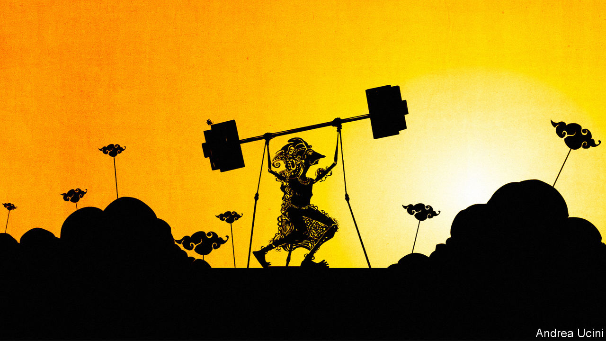

###### South-East Asia

# Why Indonesia matters 

##### Indonesia is back on the map. In the next decade it will only become more important 

 

> Nov 17th 2022 

This week’s  took place in Indonesia, the most important country that people routinely . The last time its economy and politics were in the global spotlight was during the mayhem of the 1990s when a crony-capitalist system collapsed amid the Asian financial crisis, causing the fall of the 32-year-long dictatorship of Suharto. 

A quarter of a century on, Indonesia  once again. It is the world’s largest Muslim-majority state, its third-biggest democracy and its fourth-most-populous country. With 276m people spread across thousands of islands that stretch from the Indian Ocean to the Pacific, it is caught up in the strategic contest between America and China. And like India and other emerging markets, it is adapting to a new world order in which globalisation and Western supremacy are in retreat.

Over the next quarter-century, the country’s clout could increase spectacularly. The economy is one reason. Indonesia is the sixth-biggest emerging market by gdp, and in the past decade has grown faster than any other $1trn-plus economy bar China and India. A source of dynamism is digital services, which are helping create a more integrated consumer market, with over 100m people collectively spending $80bn a year on everything from e-payments to apps for on-demand trucking.

Another economic catalyst is Indonesia-specific. With a fifth of global reserves of nickel, used in batteries, the country is a vital link in electric-vehicle (ev) supply chains. As the West, China and India increase subsidies to attract ev investment at home, Indonesia has spotted an opportunity. Rather than seeking to be the Saudi Arabia of the green-metal age, it is pursuing a policy of “downstreaming”, banning the export of raw materials to force global firms to build factories in Indonesia. This is unorthodox, but over  has been secured so far. Coal-fired power stations are being retired early, pushing these new industries to run on clean power.

The second reason for Indonesia’s strong prospects is that it has found a way to combine democracy with economic reform. Reflecting the traumas of the 1990s, a flawed but pluralist political system has developed that emphasises compromise and social harmony. , the deceptively laid-back president since 2014, rules through a sprawling coalition which has co-opted many of his opponents. You might think this would lead to lowest-common-denominator policies. But the public finances are tightly run. Incremental improvements include new infrastructure, the cleaning up of state firms and some modernisation of education and labour laws. Corruption is a problem, but the economy is more open than it was ten years ago.

The final reason for Indonesia’s growing clout is geopolitics. Its location, size and resources make it a key theatre in the superpower contest. Reflecting a tradition of non-alignment that goes back to the 1950s, it wants to be neutral. It solicits capital from both sides of the divide, and is an arena in which Chinese and American digital firms and investors compete directly. In batteries catl, the Chinese champion, is investing in a $6bn project, but Jokowi, as the president is known, is also wooing Tesla. In diplomacy he has sought to be a convener and peacemaker. Indonesia has criticised Western sanctions on Russia. Jokowi may be the only person to have met presidents Joe Biden, Xi Jinping, Vladimir Putin and Volodymyr Zelensky this year. 

If  stays on this path for the next decade, the country could become one of the world’s ten biggest economies. It would remain fairly resilient against shocks: its currency has outperformed several rich-world peers this year despite global financial turmoil. Living standards would rise: only 4% of people now live on $2.15 a day or less, three-quarters less than in 2012. Although Indonesia is unlikely to become a Chinese-style manufacturing miracle, a big middle class would emerge.

Inevitably, there are dangers. One is succession. Jokowi’s final term ends in 2024 and he has no obvious successor. Some supporters want him to fiddle the constitution to . The succession could become a competition to appeal to devout voters by espousing chauvinist Muslim policies. Alternatively, the business figures and political clans who form part of Jokowi’s coalition could win power and lead a slide back to oligarchic rule. He has built plenty of roads and airports, but Jokowi has not strengthened the institutions that can guarantee continuity after he has left office.

Protectionism is another risk. The country has a long history of prickly resource nationalism. Downstreaming may work in nickel, in which Indonesia has market power, but backfire in other industries. Indonesia has yet to attract Apple’s supply chain as it shifts from China to other parts of Asia, in part because its labour market is still too rigid. If Indonesia pushes too hard, ev firms will try to find substitutes for its green metals. 

The biggest danger is that geopolitics causes Indonesia to stumble. Even on its current path, it could drift into China’s orbit. For every dollar American firms have invested in Indonesia since 2020, Chinese firms have deployed nearly four. If tensions escalated, the costs would be high. A war over Taiwan could block the sea-lanes upon which Indonesia relies, while Western sanctions might strike Chinese firms that Indonesia depends on. Jokowi’s diplomacy is humoured by Mr Biden and Mr Xi but so far the world’s non-aligned countries, including most members of the asean South-East Asian group, are too diffuse to have much influence on the superpowers.

Growing up in a zero-sum world

India and Indonesia are the bright stars of Asia. Both must satisfy electorates at home and find a way to grow, even as globalisation is in retreat. India is opting for tech- and manufacturing-led development, fuelled by subsidies, chauvinistic politics and decoupling from China. Indonesia is relying on resources, surgical protectionism, big-tent politics and neutrality. Both are giant bets. The superpowers will be watching closely—as will many other countries that want to get richer but would prefer not to pick sides. If it succeeds, Indonesia will improve the lives of a quarter of a billion people and spur on a growth-starved world. It could even alter the global balance of power.■


