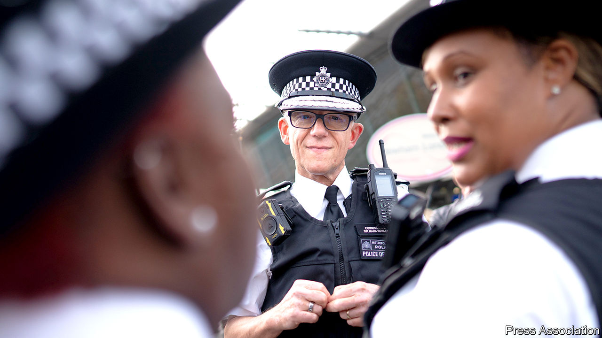
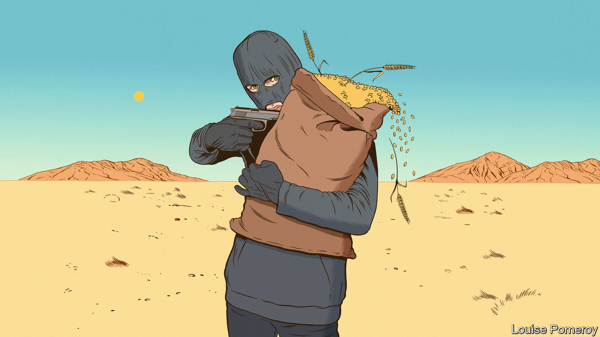

###### On Britain’s police, food as a weapon, inflation, innovation, abbreviations, Trumpery

# Letters to the editor 

##### A selection of correspondence 

 

> Nov 17th 2022 


Disciplining police officers

I read with interest and, frankly, concern your article regarding the new commissioner of London’s Metropolitan Police, Sir Mark Rowley (“”, November 5th). You asserted that the commissioner is “hamstrung by a requirement, introduced in 2015…that most misconduct hearings be led by an independent chair” and that he is seeking support from government “to make changes allowing the Met to do its own firing”.

Independent Legally Qualified Chairs (LQCs) were “introduced” into the police misconduct process following the Chapman report in 2014. Their introduction was not a knee-jerk reaction to that report, but followed extensive consultation on its recommendations. The report found that the existing system was too complex and often difficult for police forces to understand. More important, it found that, as the system was largely managed by the forces themselves, it lacked transparency and independence. It recommended that LQCs be brought in to ensure that decisions were objective and independent in order to deliver greater public confidence in the system. Putting it more succinctly, prior to this the public often considered proceedings to be a whitewash, and officers considered that their fate was already sealed before the proceedings began.

LQCs have serious concerns. Sir Mark was previously chief constable of Surrey Police and an assistant commissioner in the Met. Other chief officers, who are apparently calling for a return to the pre-LQC process, have also occupied senior positions for a number of years. The failure of police forces to properly tackle the issue of rogue officers has long preceded LQCs. 

In the circumstances, how can the public have confidence that today’s serious concerns, about getting to grips with issues such as violence against women and girls, misogyny and racism among police officers, will be resolved? Certainly not by returning the ultimate decision on whether to sack rogue police to the senior officers who, for years, have had the authority to tackle these issues, but have failed to do so.

John Bassett

President

National Association of Legally Qualified Chairs


 


Don’t use food as a weapon

Subjecting civilian populations to extreme hunger and death is barbaric in a world with enough food to feed everyone on the planet many times over (“”, November 5th). The un Security Council resolution 2417 (2018) provides a framework to implement the prohibition on this tactic of war. It must be used to bring the armed men who perpetrate this crime to account and put an end to the weaponisation of food once and for all. The use of starvation as a method of war must be relegated to the history books. 

Brian Lander

Deputy director

Emergencies Division

UN World Food Programme


 


A history of inflation

You grouped together eight countries that were among the first to raise interest rates (“”, October 29th). You then proposed three explanations for the large increases to inflation that these countries nevertheless experienced, despite those rate rises. All three are plausible and your third proposal, that high inflation can generate self-perpetuating mechanisms, is particularly troubling.

However, there is a fourth possibility: that Hikelandia countries are unusually vulnerable to inflation spikes. Your list includes countries with a history of high inflation (Brazil, Hungary, Peru) and small open economies that are particularly at risk from external shocks (New Zealand, South Korea). If this is also plausible, it is a somewhat more benign explanation for why, anticipating fast-rising inflation, those central banks moved quickly to increase interest rates. 

Pedro Franco de Campos Pinto

Assistant professor

Musashi University


It has been so long since we faced the inflationary effects of the oil crisis in the 1970s that I wonder if Friedmanite monetarist assumptions are now so instinctive in thinking about inflation that the economics professionals are getting it wrong this time. Those assumptions may be preventing the current problems of supply-side disruption caused by the pandemic, China’s lockdowns, the retrenchment of global trade and immigration and an oil market affected by the Ukraine war from receiving the primacy of attention they deserve. 

It would seem reasonable to expect that it will take some years for the private sector to rebalance our economies with targeted government help and for central banks to play a secondary role this time. The “excess” pandemic spending of recent years may be the only thing keeping many afloat as the world adjusts.

Richard Smith


 


Anything goes in innovation

“” (October 29th) described the contemporary well-intentioned, but flawed process of recognising and encouraging innovation. Innovation is concerned with change, but committees are more comfortable in funding confirmation, rather than something new and different (that is, investing in risky research).

Human nature may be constant, but serendipity is alive and well. A chance meeting between Katalin Kariko and Drew Weissman around a photocopying machine at the University of Pennsylvania resulted in the birth and development of mRNA vaccines for covid-19. One may even say that the lack of funding for such vaccines facilitated this outcome. The natural history of this pandemic would have been catastrophic if vaccines were not available.

It may be time to move away from Karl Popper, and towards Paul Feyerabend’s concept that a lack of rules allows science to progress: “anything goes.” As long as the methodology is sound, proposals that are both different and aim high should be seriously considered. The current system is designed to filter out innovation, and it shows.

Michael Fernandes


Capital idea

“” (October 22nd) abbreviated life expectancy as LE. This is an example of today’s trend towards too much abbreviation (TMA). This makes it harder to read (HTR) than if you were to spell everything out (SEO). Please get off the TMA bandwagon and just SEO to make your writing ETR. TYVM.

RICHARD TAYLOR


Either way

Your mention of “Trumpery” caused me some head scratching (“Now for the hard part”, November 5th). I wondered whether your were using it as an eponym, a reference to a certain former American president. Or whether you were using the definition of “trumpery” from Dr Johnson’s dictionary of 1755: “…something of less value than it seems; falsehood, empty talk; something of no value, trifles.” 

Atilla Ilkson


