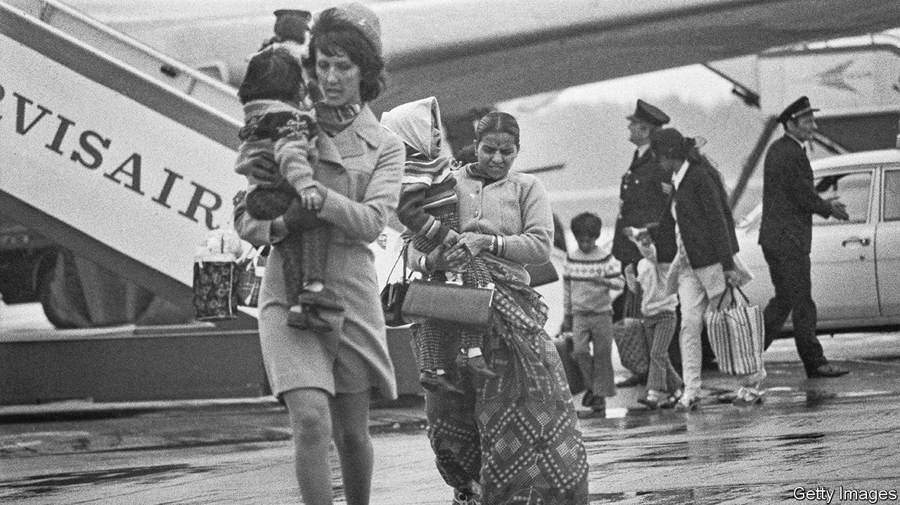

###### Back in business

# Fifty years after expulsion, Asians are thriving again in Uganda 

##### But insecurities still linger 

 

> Nov 17th 2022 

The Fairway Hotel in Kampala, the capital, is a good place to ponder the changing fortunes of Uganda’s south Asians. It began life as the home of Bandali Jaffer, an Indian cotton trader. His son, a member of the first Ugandan parliament, turned it into a hotel to host a visiting pope. Then, in 1972, the  expelled the country’s 55,000 people of Indian descent and confiscated their property. The Fairway became an army base.

The expulsion, which took place over three months and culminated 50 years ago this month, was a traumatic chapter, but not the final one. Today the hotel is back in the family, managed by Mr Jaffer’s Canadian-born great-grandson Azhar. “I never thought I would end up here,” he says, but now “this is home.” 

On one recent evening the Fairway thronged with Indian businessmen: spaghetti-dealers and biscuit-bakers, pipe-traders and detergent-makers. Most were newcomers with no memory of the old days. The Amin era was like “a bad dream”, says Mohan Reddy from Andhra Pradesh in south India, who is busy organising an Afro-Indian investment summit: “When you wake up, you have to forget about it.” 

But the “insecurities of expulsion” linger, to borrow the title of a forthcoming book by Anneeth Kaur Hundle, an anthropologist at the University of California, Irvine. Amin’s decree was popular with many Ugandans, who saw it as a move to “Africanise” the economy. For the small traders who had organised boycotts of Asian shops, it was a Pyrrhic victory: the businesses of expelled Asians were dished out to soldiers and officials, who ran the country into the ground. Still, memories of the expulsion are much more ambivalent within Uganda than abroad.

The outsiders inside

When south Asians returned in the 1980s and 1990s, it was at the invitation of a new government, which was trying to rebuild the country through free markets and foreign capital. Their place in Uganda is tied to their economic identity as “investor-citizens”, argues Ms Hundle. “The government has really perfected ways to reincorporate Ugandan Asians and welcome new south Asians…but still maintain them as racial outsiders,” she says.

The most prominent of the south Asians expelled in 1972 had been rich industrialists, who returned as soon as they could to reclaim their estates. But most were middling traders and shopkeepers—the —who went on to find  and Canada. Only a few thousand returned. Their niche has been filled by newcomers from all corners of India, not just the old heartlands of Gujarat, who make up most of the 35,000 south Asians in Uganda today. Some put down roots in Uganda; others see it as a stepping stone to the West.

Asians run hotels, refine sugar, shape steel, fillet fish, import foodstuffs, and much else besides. They claim to contribute 60-65% of tax revenues. Most attribute their success to hard work and thrift: an Indian will always carry a packed lunch rather than eat out, explains Singh Katongole, a prominent Asian leader. They also benefit from transnational ties, which link them to foreign credit. Some big-shots profited from political connections. Others cashed in during the return of expropriated properties in the 1990s, gathering up the assets of those who stayed abroad.

The typecasting of Asians as “investors” eased their return, but it is an unstable basis for belonging. Most new migrants are professional workers or small traders, not captains of industry. In August the authorities deported more than a hundred foreigners, including Indians, Pakistanis and Chinese. Officials said the deportees had promised to build and run factories, but were instead running electronics shops.

Meanwhile, big Asian business is the most visible face of local capitalism—and of its inequities. Small farmers accuse south Asian-owned firms of grabbing land for sugar and palm-oil plantations. Workers complain about domineering bosses. 

A new history of Ugandan Asians by Samwiri Lwanga Lunyiigo, a Ugandan historian, paints south Asians as junior partners in British colonialism who today remain “the real masters in Uganda”. That is reckless hyperbole, but a milder sense of resentment is widely felt by Ugandans. The government needs to create “a fair ring for all the players” or “people will demand for a second Amin to come,” reckons Tony Galiwango, who trades car parts in Kampala. In 2007 an Indian trader was killed by a mob, though incidents of overt racial hostility are thankfully rare.

Minding their own business

There are no Ugandan Indians in parliament. “We’re essentially apolitical,” argues a member of one notable family. “Our interests are as businessmen.” Like most investors, south Asian magnates tend to think those interests are best served by backing Yoweri Museveni, the authoritarian president since 1986. 

“For government they are a resource because they have no political base in the country,” says Mahmood Mamdani, a Ugandan Asian intellectual at Columbia University. “All governments since independence have used this business community as a counter to local business communities, to play one off against the other.”

The outsider status of Uganda’s Asians is preserved by the constitution, which views citizenship through an ethnic lens. It lists 65 “indigenous communities” whose children are considered citizens by birth. Some Asian leaders are pushing for the Bahindi (“Indians”) to be added. Legal nuances matter less than a feeling in the bones. “Because of the expulsion there’s always a little bit of anxiety,” says Mr Jaffer of the Fairway Hotel.

Yet there is also a sense of communities rubbing along, despite the troubles of the past. Younger generations are building bridges: one Asian man has 3.3m likes for his TikTok videos of himself speaking Ugandan languages. And valued traditions remain. During the festival of Navratri a group of old-timers chat at the Patidar Samaj, one of many Indian community associations. They reminisce about their bachelor days in the 1990s, when they came to seek their fortunes, sometimes sleeping in the office behind the temple. Outside hundreds of people dance in a joyous circle, arms twirling beneath a canopy of lights. “It is like you are in India,” says one, as the band steps up the beat. ■

