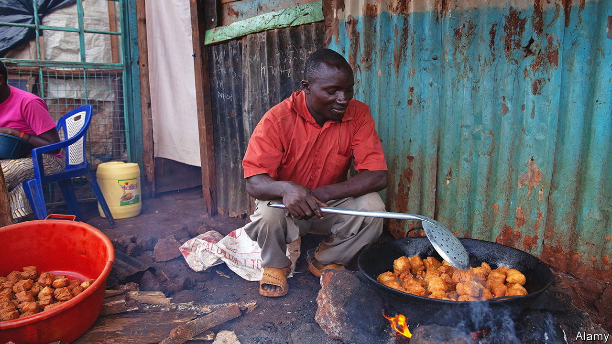

###### The parable of the African doughnut

# Food inflation in Africa is shrinking portions 

##### Cash-strapped consumers cannot pay more, so get less instead 

 

> Nov 17th 2022 

At his stall in Kisumu, western Kenya, Walter Otieno plops balls of dough into a fizzing pan. After a minute or two the encrusted orbs, known as mandazi, are ready for sale. But his customers may not feel as full as they once did. Mr Otieno has halved the size of his “African doughnuts”, as the snack is also called, which he sells for ten Kenyan shillings (about eight US cents) each. 

“I’m forced to do it to break even,” he explains. The . A ten-litre jug of cooking oil goes for 3,000 shillings, up from 2,000 in January; flour is two-thirds dearer than a few months ago. In October Kenya’s food-price inflation reached an annual rate of 16%, the highest rate on record. The knock-on effects of Russia’s invasion of Ukraine have compounded the impact of . 

Elsewhere in the market there are other examples. A milk-seller holds up two plastic bottles. Two years ago 40 shillings bought a litre. Today he fills a half-litre bottle for the same price. All sorts of fruit are sold in smaller bunches, say traders.

The cost of staple foods across sub-Saharan Africa has risen by almost a quarter since 2020, reckons the IMF. The prices of food that is grown locally have also shot up. In Ghana, for instance, the cost of cassava has gone up by almost 80%. Shrinkflation is on the rise, too. In South Africa sticks of biltong (dried meat) are not as thick. In Uganda street sellers have shrunk the “Rolex” (“rolled eggs”), which is more or less a vegetable omelette rolled inside a chapati. 

Shrinkflation is often seen through the eyes of Western consumers irked by suspiciously capacious crisp packets. But African consumers, many of whom lack the cash, credit or space to buy in bulk, have long bought goods in small quantities. In Nigeria companies have learned to flog small sachets of shampoo and washing powder to cash-strapped customers. As the economy has stagnated, manufacturers have shrunk ever more products. Today Nigerians can buy “smallie” Domino’s pizzas and wash them down with sachets of Baileys, a creamy tipple. 

Poor consumers mean that retailers often see shrinking products as a better option than raising prices. Add to that the fierce competition in many marketplaces, where dozens of vendors sell the same goods. “Raise prices?” exclaims Mr Otieno. “I cannot dare do that because customers will run away.” ■

