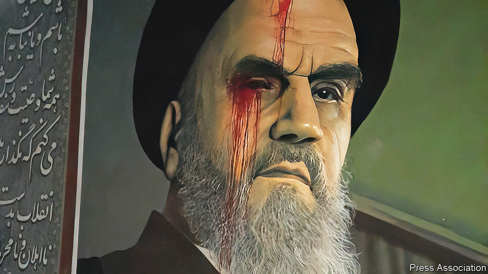

###### Artful dodgers

# Iran’s protesters are painting for freedom 

##### Ingenious graffiti artists are changing the visual landscape 

 

> Nov 17th 2022 

At first they tried performance art. Across Iran, young women and men crouched down, heads hanging in submission, arms cuffed to trees or lampposts. When the police began rounding them up, protesters padlocked mannequins bent double to street signs. In sports matches players adopted similar poses when they scored, re-enacting the fate of Khoda Nour, a protester the mullahs’ men tied to a flagpole without food or drink, a glass of water placed before him, just out of reach.

Then they switched from theatre to visual art. Two months after the death of a Kurdish woman, Mahsa Amini, arrested for showing her hair beneath her mandatory veil, protest art is changing cityscapes. Stencils of Amini and other women killed in the uprising plaster walls, rivalling the state’s ubiquitous murals glorifying martyrdom. Public fountains spew red dye, prompting the authorities to drain them. Stickers cover old street signs with new names. Ekbatan, a western suburb of Tehran, the capital, has been dubbed Arman after a young man shot dead in the protests. Demonstrators brandish the black flag of Islam mockingly cut into slivers like wavy hair. Girls in middle-class north Tehran sport a new style of handbag, with red splashes mimicking bullet wounds.

Graffiti artists have to work fast; some have been shot dead. “It’s hard to create when the workspace is so hostile,” explains one of them. It takes seconds to spray-paint stencils and tie paper leaves with fallen protesters’ names to trees. 

Iconoclasm is often quickest. Red paint spilt from rooftops streaks through the portraits of the supreme leader, Ayatollah Ali Khamenei, that routinely cover the sides of housing blocks. Fading images of the regime’s founder, Ruhollah Khomeini, bleed from the eyes (see above). Traffic noise is changing too. Drivers honk horns to the rhythm of “Death to the Dictator”, as women wave veils out of car windows.

Many artists retreat online for safety. Some fashion medieval images of armies with spears surrounding a woman waving her headscarf. Others go for pop art, showing scissors cutting the Mona Lisa’s hair. 

Still, they are struggling to coin a logo for their revolt that spans Iran’s ethnic, religious, economic and gender divisions. Some recycle the visuals of the revolution of 1979, with Soviet-style clenched fists and broken chains. Some female artists worry about men trying to intrude on their realm. “They say we’re all part of the patriarchy,” complains a male artist, struggling to circulate one of his posters. ■

