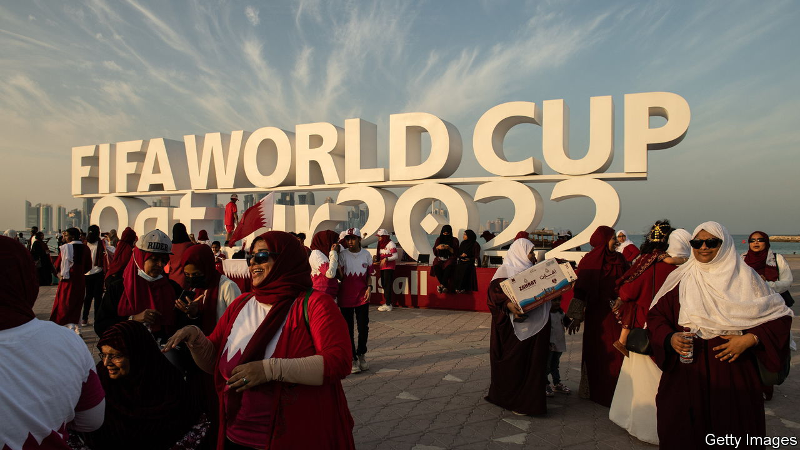

###### The cup runneth over

# Qatar’s neighbours hope for a World Cup tourism boom 

##### Tens of thousands of fans will commute to the tournament from nearby countries 

 

> Nov 17th 2022 

Drive around this glittering Gulf metropolis, and excitement for the World Cup is palpable. Hotels, pubs and tourist spots are putting the last touches to fan zones that will accommodate up to 10,000 people. One of the national airlines has increased its schedule tenfold to handle the influx of visitors. A transport authority is laying on 700 taxis, dozens of buses and two ferries to move fans around town. But this is not in Qatar, the tournament’s host. It is in Dubai, the commercial capital of the United Arab Emirates (UAE), some 450km (280 miles) away.

An estimated 1.2m fans are expected to visit Qatar for the show, which begins on November 20th. Not all of them will stay in Qatar, though. Some could not find affordable places to sleep (or any places at all). Others were put off by crowds or restrictions on alcohol. So several neighbouring countries stand to benefit from the cup—neighbours that still had Qatar under a blockade just two years ago.

The biggest winner will be Dubai, the Gulf’s most popular destination. Even at the last minute it still has plenty of rooms available. Alcohol flows in its hotels and restaurants. Tourists may also buy their own tipples at off-licences, whereas Qatar’s sole liquor store is open only to residents who have an official permit.

In normal times Flydubai, the emirate’s budget carrier, operates three daily flights to Doha, Qatar’s capital. That will jump to around 30 on match days during the group stage, with Qatar Airways offering another 15 flights. Airlines in Abu Dhabi, the UAE’s capital, and Sharjah, an emirate nearby, are also planning hundreds of extra services.

The UAE is not the only country expecting a tourism boom. Saudi Arabia, which began welcoming tourists only in 2019, plans to receive tens of thousands of foreign fans. Ticket-holders will get free two-month visas to the kingdom. Ahmed al-Khateeb, the tourism minister, says there will be 240 weekly flights between Saudi Arabia and Qatar during the tournament, versus the usual six. Even sleepy Oman, which shuns mass-market tourism, expects its hotels to be busy.

Saudi Arabia’s team has qualified to play in the cup, and its citizens have bought more tickets than any other nationality bar Qataris and Americans. Many plan to stay in the kingdom’s eastern province, near the border with Qatar, and drive across for matches. Qatari officials say they have expanded the crossing at Abu Samra to process 4,000 travellers an hour.

This would have been impossible a few years ago. In 2017 Bahrain, Saudi Arabia and the UAE (along with Egypt) imposed an embargo on Qatar, severing travel and trade links. They demanded that Qatar cut its ties with Islamist groups, downgrade relations with Iran and generally trim the independence of its foreign policy. Qatar refused to bow. The embargo was abruptly ended last year, in part because the blockading states realised it was futile. 

Though Qatar is the host, many fans will experience the cup as a pan-Gulf event. Some Qataris wonder, quietly, if it would have been better to bid for a shared tournament, akin to the one in 2026, when America, Canada and Mexico will be joint hosts. By some estimates, Qatar has spent more than $200bn in preparation. Its neighbours will spend only a tiny fraction of that, yet enjoy an immediate boom.

Not all of them, though. Bahrain is the nearest to Qatar, just a flight of 140km away. Yet its rulers have organised no shuttle flights or fan zones. Deep family ties link many Qataris and Bahrainis, but their governments are quarrelling over politics and territorial disputes, which sometimes trump sport—and self-interest. ■

