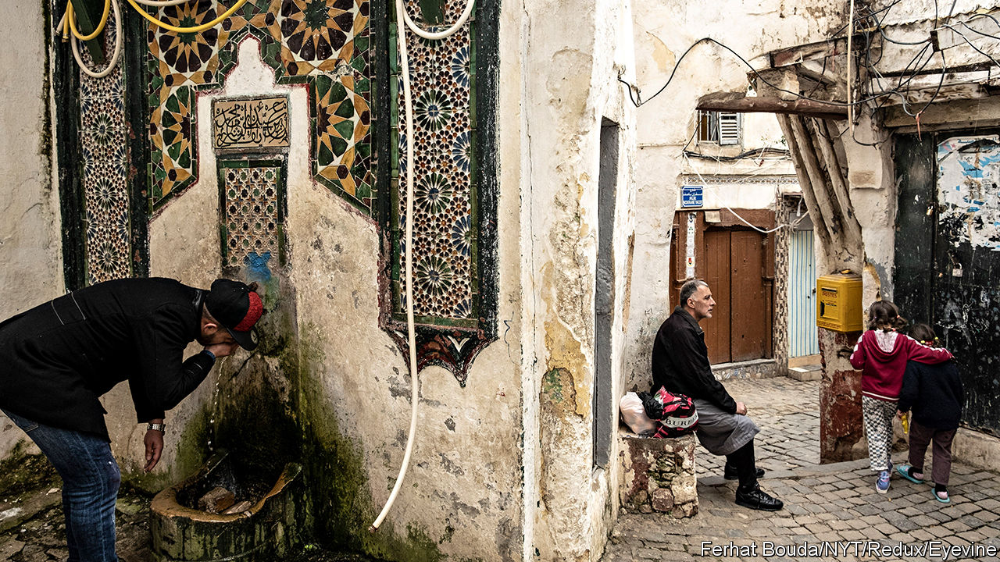

###### Saved by gas

# Why Algeria’s rotten regime has been lucky 

##### When energy prices fall again, it will wobble 

 

> Nov 17th 2022 

Two words in the local lexicon encapsulate Algeria’s malaise: and . The first encompasses a range of gloomy feelings that affect Algerians: a sense of humiliation and oppression, a denial of dignity. This leads to the second increasingly common word, literally meaning “those who burn”. It is applied to the growing number of Algerians wanting to emigrate illegally to get a better life abroad, involving the burning of identity papers. So far this year some 13,000 have reached Spain in rickety boats. 

A recent article in , a French newspaper, headed “”, explained why leading human-rights campaigners feel impelled to emigrate. “I had to flee to stay alive,” said Aïssa Rahmoune, a lawyer. Algerians with enough money or connections to leave legally often head for Europe, America or the Gulf. Of those who get visas to study abroad, “90% don’t come back home,” says a seasoned Western business visitor. (Like all foreigners and resident Algerians interviewed for this article, he requested anonymity, a telling reflection on the regime.)

For the moment, three factors stifle the disgruntlement. One is the high price of gas and oil, which account for 90% of foreign-currency earnings. Europe is thirsting especially for . The second is the social contract whereby the basics of life—staple foods, electricity, cooking oil, petrol and housing—are massively subsidised. This puts Algeria a shade ahead of its north African peers in the UN’s human-development index. “No one goes hungry,” concedes a critic of. 

The third is the lurking memory of dreadful bouts of nationwide violence, including the so-called dark decade. This began in 1992, when the military regime cancelled the second round of an election that Islamists were poised to win, prompting a civil war in which Algerians killed perhaps 150,000-200,000 of their compatriots. Though many people loathe the stagnation under the current set-up, and resent and fear the military-cum-security apparatus behind it, many prefer it to the chaos and bloodshed they think might ensue if the lid of repression were lifted. 

Aside from gas and oil, the economy is dismal. The biggest company is Sonatrach, a badly run behemoth that dominates the energy sector. Economic growth has often lagged behind the soaring population, now around 45m. And the rising domestic consumption of gas limits the scope for exporting more of it. Unemployment is around 15%, and far higher for the young. 

A law passed in 2019 was supposed to open investment to foreigners, dropping a previous requirement that Algerian firms, generally state-run, must own more than half of any company. But Western banks and the IMF, regarded with suspicion in official Algerian circles, remain wary of entanglement. Bureaucratic obstacles, gross incompetence and a hostile attitude to foreign capital, especially French and American, still deter foreigners, though Occidental, an American oil giant, France’s TotalEnergies and Italy’s Eni signed a production-sharing deal with Sonatrach in July. 

Most foreign business people remain flummoxed by the new laws and their small print. It is still unclear how or whether profits may be repatriated. Other constant complaints are the seemingly random imposition of tariffs on imports (“They slap them on whenever they like,” says a Western investor); the reluctance to let in imports of any item that is also made in Algeria, however poor the local product’s quality; the non-convertibility of the Algerian dinar, which is discounted by a third on the widely used black market; and the routine need to bribe state officials to clinch a deal. Businessmen who fall foul of the authorities or of well-connected rivals often get accused of corruption or tax avoidance—and end up in jail.

The requirement for ministers or senior officials to sign off on virtually any deal, plus the lethargy and incompetence of officialdom, make business extraordinarily tricky. One foreign resident reckons that 40% of requests to state bodies are never answered. Middle-ranking people “are petrified of stepping out of line”, says another Westerner. “You have to take it all the way to the top, otherwise things just languish for ever. Laws can change, but again and again things just never happen.” 

This stultifying business environment reflects the nature of Algeria’s politics. In early 2019 peaceful street protests erupted after the ailing , who had been president for 20 years, said he would run for a fifth term. Known as the , or Movement, the protests, which sometimes drew crowds of a million onto the streets, forced Bouteflika to step down, along with his inner circle of crooks and security men. Scores of bigwigs, including Bouteflika’s brother, past heads of the security service, two former prime ministers and a string of ministers and generals, were put in jail. Most are still there.

But it soon became clear that the new regime of , a dreary former long-serving minister under Bouteflika, was much the same as its predecessor. It has been saved only by the onset of covid-19 in 2020, which caused the to fizzle out, and by the rocketing price of gas and oil after Russia invaded Ukraine. 

Could a genuinely reforming, liberalising figure  Gorbachev emerge from within “Le Pouvoir” (“The Power”), as the murky circle of figures still pulling the strings is known? Emmanuel Macron, France’s president, offended Mr Tebboune a year ago by aptly describing him as “trapped” in “a military-political system”. Many insiders think he is little more than a figurehead. Afflicted by covid, in 2020 he disappeared from view for more than a month in Germany. Diplomats and businessmen often sigh that “nobody really knows who’s in charge.”

Repression has again increased. Human Rights Watch counts more than 280 political prisoners; a local group puts the figure at 320. A leading rights body, the Youth Action Rally, was dissolved a year ago. Foreign NGOs are virtually banned. Independent political figures and journalists are harassed and jailed, often falsely accused of conniving with one of two groups, Rachad and the Movement for the Autonomy of Kabylia (the main Berber region). The first is associated with Islamist extremism, the second with separatism; both of these frighten many Algerians. 

The official media are pathetically sycophantic. The Western press, especially the French, is regarded as hostile. No major French newspaper has a resident French correspondent; Agence France Presse’s bureau had to close down. A history professor claims with a straight face that the opposition media and the were infiltrated by Mossad, the Israeli intelligence service, and were often bribed by Morocco.

Official pronouncements tend to be infused with a mixture of boastfulness and paranoia. Candid assessments, particularly in the French press, are furiously dismissed as racist or driven by a hate-filled desire to destabilise the country—Africa’s largest in area. Official media are also obsessively virulent towards neighbouring Morocco, especially as the diplomatic tide may be turning against Algeria in its campaign to win independence for Western Sahara from Morocco’s occupation. 

The truth is that Algeria’s economy and politics are both sclerotic, its leadership repressive yet feeble, its role in Africa and the Arab world self-regarding but unappreciated; it still poses as a champion of the global non-aligned movement. Many of its people, especially the young, are unhappy, frustrated and fearful of authority. prevails; the  look for a way out. The masses who backed the have not disappeared. If the price of gas and oil were to fall precipitously, it is hard to see how this opaque yet rotten regime could survive. ■

