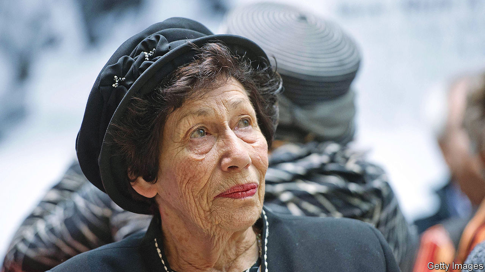

###### From friendship to haunting

# For Hannah Pick-Goslar, paths crossed in an extraordinary way 

##### The close friend and champion of Anne Frank died on October 28th, aged 93 

 

> Nov 17th 2022 

Late IN THE summer of 1942, Hannah Goslar’s mother began to think of making strawberry jam. Hannah, then 13, was sent round to the Franks’ house, two doors away in Amsterdam, to borrow the scales and perhaps to get some cast-off packets of pectin. Otto Frank was in the pectin-and-spices business, and Hannah and his daughter Anne were firm best friends. 

Hannah rang the bell, but nobody answered. She rang it again, and Mr Goudsmit the lodger came to the door, irritable and jumpy, obviously thinking it might be the occupying Germans hunting for Jews. Why was she here? he snapped. Didn’t she know that the Franks, to avoid the same fate, had gone to stay with Otto’s mother in Switzerland?

No, she hadn’t known. But she was not alarmed. Anne was always doing extraordinary things: showing all her friends how she could dislocate her shoulders, k-nock, k-nock, making everyone go “Wow!”; getting the idea, when she and Hannah were playing together in Otto’s office on Sundays, of throwing water down on people in the street; writing crazy essays, tossing her black hair, the centre of everyone’s attention. She might well disappear off the face of the Earth, and say nothing. 

Hannah was eight months older, and taller; but she often felt younger, and was far shyer. Her family was also sterner and more religious than the liberal Franks, whose food she could not eat because it wasn’t kosher. With Anne, life was seldom dull. And so it continued, even after Anne’s death in 1945, when the discovery of her diary made her the most famous child victim of the second world war. Hannah then found herself sought out too, simply for being her friend. From 1947 she had embarked on a new life in Palestine, then in Israel, becoming a paediatric nurse, marrying an army colonel, having three children and, eventually, 31 great-grandchildren—her answer to Hitler, she often said. But she also became Anne’s ambassador, taking her presence with her into classrooms and lecture halls the world over, making sure she was as famous as she had always wanted to be. 

The attraction had been instant. On their first day in kindergarten, two tiny refugees from Germany, they flew into each other’s arms. They played together constantly: hopscotch, ping-pong, skipping. When Jewish pupils were expelled from Christian schools they stormed the Jewish Lyceum together, although they both found it a struggle to pass in mathematics. 

Yet Anne also had a disconcerting, unknowable, secret side. During school breaks she would sit scribbling in notebooks, rebuffing anyone who pried. When the celebrated diary, with its red-and-white-check cover, was given to her on her 13th birthday, Hannah was at the party. She little knew how shocked she would be when, a few years later, she read the published version.

In the very first pages, Anne claimed she had never had a real friend. Going round the girls in her class, Hannah was only the eighth she noticed: “a bit on the strange side”, “always blabbing to her mother”, therefore not a friend to confide in. The Goslar household was chaos, with a younger sister screaming while Hannah tried to help a bit, though she was “all thumbs”. The diary showed Hannah an Anne who was deep-thinking, keenly perceptive, even more boy-crazy; in fact, someone she hadn’t known. 

When she went on her jam-making errand, they were already no longer first-best friends. And now Anne and her family had gone into hiding, though still in Amsterdam; Switzerland was a cover story. Yet the girls went on haunting each other. Hannah supposed that Anne was cosily in the Alps, sipping hot chocolate with a handsome boy. In November 1943 Anne dreamed in a frighteningly different vein: that Hanneli had come to her, thin, in rags, with huge eyes, pleading to be rescued from “this hell”. For at least a year, Anne hadn’t thought about her; now she felt sure Hannah was in a death camp. The entry went on with desperate prayers that God would save her friend, and the cry: “Why have I been chosen to live, when she’s probably going to die?”

In reality, the reverse occurred. In June 1943, some months after Hannah’s mother had died in childbirth, the Goslars were rounded up and sent first to a transit camp at Westerbork, then to Bergen-Belsen. They were spared the worst indignities because they had papers allowing them to be sent to Palestine in exchange for German prisoners-of-war: they were not shaved or tattooed, and could keep the things they had brought with them. In both camps Hannah worked and looked after her younger sister, already dreaming of life as a nurse from the book on Florence Nightingale she had managed to pack. 

In the last winter of the war, Bergen-Belsen suddenly took in hundreds of prisoners from Auschwitz. Existing prisoners were made to sleep two to a bed, and the camp was divided into two sections by a barbed-wire fence stuffed with rushes and reeds. The two sides could not see each other, and were forbidden to talk; Hannah registered the new arrivals mostly by noticing the lice that moved in with them, carrying typhoid. 

But up close to the fence, at night, people pressed and whispered across the divide; and she learned then that, astonishingly, Anne was among the newcomers. The Franks’ hiding place had been discovered, and they had been taken to the worst camp of all. At the fence, the two girls whispered and cried. Anne’s lovely black hair had been shaved off; she was starving and she was cold. Over the next days Hannah did what she could, scraping together , prunes and socks from a Red Cross package and throwing them across. The first packet was snatched by someone else; Anne caught the second. They could not make contact again. 

In later years, the shelves in Hannah’s sun-filled flat in Jerusalem were weighed down with books on Anne in many languages. At the fence, all she had seen was a shadow through the rushes and the dark. There, however, they had confided in each other—perhaps known each other—more closely than at any other point. In those snatched minutes, they were true best friends. ■

