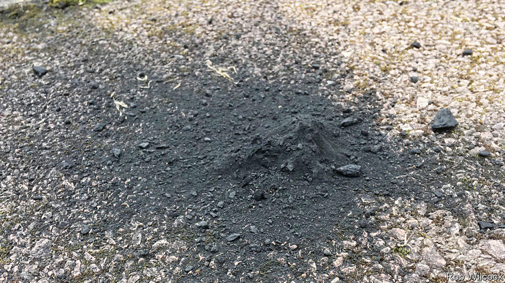

###### Astronomy

# A meteorite in the Cotswolds 

##### A find from an English country garden speaks of the solar system’s first days 

 

> Nov 16th 2022 

Winchcombe, a rural English town, is not a place where much happens. But, on February 28th 2021, something did. At six minutes to ten that evening, Winchcombe was hit by a meteorite.

The first piece of this bolide was found the following day by the Wilcocks, a local family, shattered on their driveway (see picture). Once they realised what it was, they donned rubber gloves, scooped the remains into freezer bags, and alerted the UK Meteor Observation Network, a group of amateurs who study incoming space debris. Other bits turned up elsewhere, later.

Aficionados were excited by the fall for two reasons. One was that the fragments’ rapid recovery had left little time for them to be contaminated by terrestrial chemistry. The other, that the bolide’s descent was captured in numerous photographs, both official (in the form of 16 dedicated ) and unofficial (in the form of numerous vehicle-dashboard and doorbell cameras). These allowed its orbit before its encounter with Earth to be calculated with precision. A group of those aficionados (124 of them, to be exact, including the three Wilcocks) have just published a paper on the matter in .

The stone was of a type called a carbonaceous chondrite. These, as the mess on the Wilcocks’ drive showed, are loose agglomerations of stuff—and that stuff is not much altered from the primordial cosmic dust that turned into the solar system. 

Tracing the Winchcombe meteorite’s path from the pictures taken of its arrival showed its orbital aphelion (the point in that orbit farthest from the Sun) to be just inside the orbit of Jupiter. It came, in other words, from the outer part of the main asteroid belt. Its chemistry, pristine because of the Wilcocks’ swift action, showed that the water in it nevertheless had the same isotopic composition as water on Earth. This supports the idea that Earth’s ocean was a cosmic afterthought , subsequent to its formation, by hydrated material from space. 

Analysis of the meteorite’s exposure to cosmic rays (revealed by the presence of particular isotopes of neon and aluminium), suggested, meanwhile, that it had until recently (perhaps as little as 300,000 years ago), been below the surface of something bigger. Presumably, it was liberated by a cosmic collision and thereby set on the course that eventually brought it to the Wilcocks’ front garden. ■


