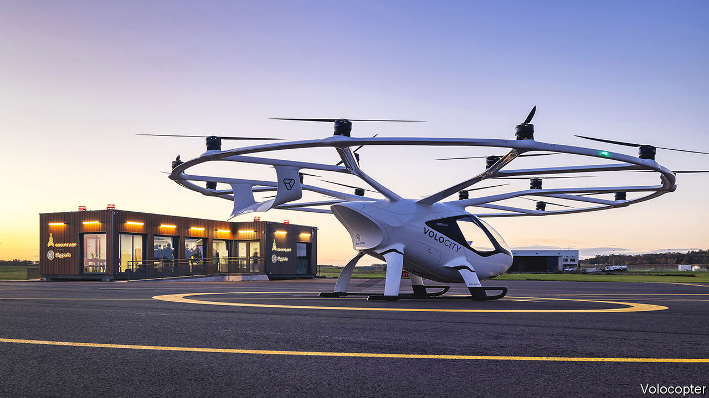

###### Welcome to the vertiport

# A new type of air terminal opens for flying taxis 

##### Urban air-travel takes a step closer 

 

> Nov 16th 2022 

As the morning mist slowly clears over Pontoise-Cormeilles, a regional airport 40km north-west of central Paris, it is time to check in at the vertiport. This is the name the aviation industry has adopted to describe a new type of air terminal. Vertiports will be used by eVTOLs, or  as they are sometimes called. As the name indicates, these aircraft take off and land vertically, like helicopters. But instead of being powered by jet turbines they rely on sets of electrically driven rotors, much like hovering drones. 

Pontoise-Cormeilles’ vertiport, which opened on November 10th, so far serves only as a prototype—for, being the first of its kind in Europe, it has no matching facility to act as a destination. But Groupe ADP, which manages Paris’s airports, including Pontoise-Cormeilles, hopes that will soon change. The Paris Olympics open in July 2024. By then the firm plans for at least two routes to be operating in the region, with a total of ten air taxis, each flying two or three trips an hour. These would link the Olympic Village with conventional airports and also with the Paris heliport at Issy-les-Moulineaux, on the southern side of the city near an emergency medical centre. 

Quick exit

The terminal building itself is compact—about as big as a medium-sized apartment. The idea is that, having bought a ticket using a mobile-phone app, a passenger can check in rapidly and paperlessly. A facial-recognition scan confirms identity and a floor sensor measures weight. This lets the craft, sitting on a pad just outside, calculate its load so that it knows how much power will be needed for the journey, and thus when its batteries will require topping up. There should be barely enough time to grab a cup of coffee before the less-than-20-minute hop downtown, avoiding the snarling rush-hour traffic below. 

If a passenger spends more than ten or 15 minutes in the terminal then something has gone wrong, says Duncan Walker, boss of Skyports, the British firm that built the facility. The eVTOL flying around outside it is made by Volocopter, a German company. Skyports has opened a similar vertiport in Marina, California, which is being used by Joby Aviation, an American outfit that is also developing a flying taxi, and is planning others in places that include London and Singapore. 

In a dense urban environment, a vertiport needs to take up as little space as possible, which is why people will not be encouraged to linger. And there is another difference from either a conventional airport or a heliport: silence. As the eVTOL flies overhead it is strikingly quieter than a helicopter that landed near the main airport building a little earlier. “That’s your licence to operate in city centres,” says Mr Walker. Not only are flying taxis less noisy than helicopters, but if recharged from a renewable source of electricity they are greener and, being mechanically simpler, a lot cheaper to run. 

Operating costs should fall even further, for eVTOLs are readily adaptable to autonomous flight. That frees up the pilot’s seat for an extra passenger. At first, however, regulators are expected to grant  only to flying taxis with pilots on board. This will allow experience to be gained and the reliability of the craft to be tested before they are permitted to do without the pilot. 

To get airborne quickly, most putative operators are therefore starting with piloted versions of their offerings. Volocopter appears to be in the lead. Its craft, VoloCity, has room for just a single passenger. Hot on its heels are Joby, which is flight-testing a five-seater, and AutoFlight, a company based in Shanghai, which is flying a four-seater. Airbus, Europe’s biggest aircraft-maker, is also developing a four-seat flying taxi that will, initially, be piloted. 

Two exceptions to the general rule are Boeing, America’s biggest aircraft-maker, which has teamed up with Wisk Aero, a Californian firm, to produce a four-seater, and a two-seater being tested by Ehang, another Chinese firm. Both of these projects aim for autonomy from the beginning. 

Getting an airworthiness certificate is, however, only part of the process needed to begin commercial services. An airline-style operator’s licence is also needed. The idea is that the first vertiports will help with this by demonstrating that flights are reliable, safe and can be integrated into existing air-traffic-control systems.

Prêt à transporter

In theory, eVTOLs should show a good level of safety, for they have high levels of what engineers call redundancy—that is, duplication of critical systems. This comes about principally from their multiple rotors, which allow a craft to continue flying if one or more of its motors fails. A rotor failure in a helicopter means the pilot has to make an emergency landing by gliding to the ground using a technique called . If one of the 18 rotors on a VoloCity failed it would, by contrast, hardly be noticed, says Paul Stone, Volocopter’s test pilot. 

Mr Stone, who has flown more than 200 types of aircraft, including vertical-take-off jets, also observes that the computerised flight controls on a VoloCity make it “much simpler to fly, and therefore easier to learn”. At first, the pilots will be people with backgrounds flying either fixed-wing aircraft or helicopters, who will be trained to handle eVTOLs, too. Eventually, though, he expects a separate eVTOL licence will be created, letting people learn to fly them from scratch. And even when autonomy arrives, piloting jobs will still be available. The plan is that qualified individuals sitting in control centres on the ground will monitor several flights each, as already happens with military drones, and will thus be available to take manual command in an emergency.

As technologies improve, eVTOLs’ capabilities will grow. Much of that progress will come from developments in battery technology for electric cars, says Dirk Hoke, who recently took over as Volocopter’s chief executive, having previously run Airbus’s defence and space division. A bigger, faster version of VoloCity, using a new type of battery, is already on the way, he adds. But he would not go into details. By the end of the decade, though, it is not only Paris’s notorious traffic that could be bypassed from above with the convenience of using a ride-hailing app, but the jammed roads of several other cities, too. ■


