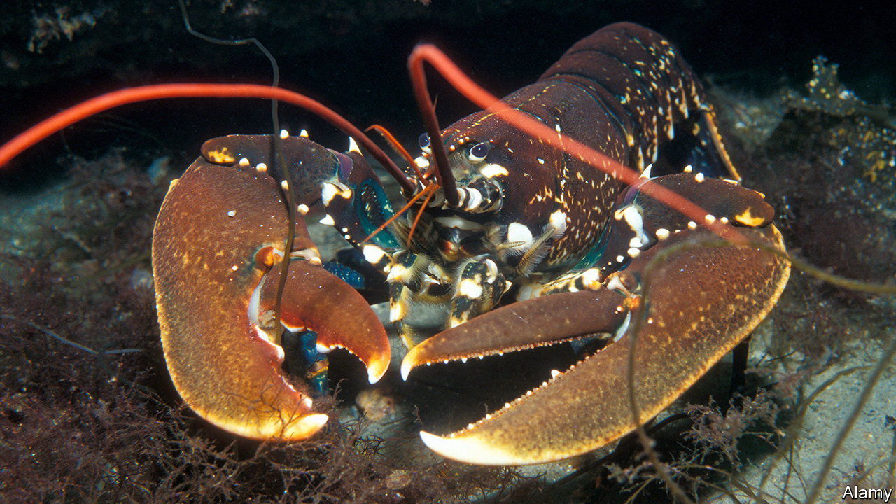

###### Lobsters

# Protected areas affect lobster evolution 

##### They grow both bolder and bigger—which helps fisherfolk 

 

> Nov 16th 2022 

Create a place of safety in which marine life can multiply, and the overspill into nearby unprotected areas will provide more quarry for fisherfolk than if no such zone existed. That is the theory, anyway. And practice suggests it works. However, the advantage may be more than a mere increase in numbers. A study of lobsters suggests that, for these creatures at least,  (MPAs), as they are known formally, also reverse an evolutionary trend towards smaller individuals which fishing imposes, thus benefiting the men and women in the boats twice over.

The research in question was conducted by Tonje Sordalen of the University of Agder, in Norway, and is published this week in the . Dr Sordalen started from the fact that for several species, lobsters included, growth rates and boldness of behaviour seem to go hand in hand, suggesting they are promoted by the same genes. Why, is not clear. One hypothesis is that faster-growing individuals need to spend more time and effort searching for food.

Unfortunately from a lobster’s point of view, such boldness may include a tendency to explore lobsterpots. Certainly, that is true for their freshwater cousins, crayfish, where big, adventurous individuals are more likely to end up in traps. And that, in turn, creates a selective pressure for timidity, to avoid getting trapped—with small body size coming along for the ride.

Moreover, in Norway at least, the law may exacerbate this trend. Lobsters less than 250mm long cannot be harvested. If caught, they must be returned to the sea. Females carrying eggs must be released too, regardless of size. The first rule clearly generates selection pressure against growing big—and Dr Sordalen suspected that the second has a similar effect, since females do not moult when carrying eggs, and a lobster which is not moulting cannot grow beyond the size that its carapace will permit. So, since carrying eggs stops females being harvested, she guessed that there would be a pressure for them to carry eggs more frequently, thus moulting less often and growing more slowly. 

Putting all this together, she theorised that decades of trapping off Norway’s coast would have caused the lobsters there to be both meek and slow growing. And the catch of lobsters large enough to be retained has indeed dropped in recent years. But, following her theory’s logic, the lobsters in MPAs should be different. 

To find out if that is correct, she worked with the Norwegian Institute of Marine Research to monitor the growth of lobsters in three such areas off the country’s southern coast and in three unprotected areas in the same region. During four consecutive days each year between 2006 (when the reserves were established) and 2020, she and her colleagues collected a total of 2,303 lobsters from these sites. They measured them, sexed them and tagged them, and also studied them for evidence of moulting, before releasing them. 

The effect of MPAs on lobsters’ growth rates was, they found, significant—but only for females. In protected areas, an average female skipped moulting to produce eggs about once in four years. Those in unprotected areas did so once in three. Also, when females in protected areas did moult, they grew by 9% more afterwards than did those in unprotected areas. In essence, then, females grew faster and larger in the protected areas than they did in places where they were being caught in traps. 

Intriguingly, Dr Sordalen saw no increase in post-moulting growth in males. Even if only one sex is responding, though, that is still consistent with her hypothesis, and confirms another benefit of MPAs besides population growth. 

Her theory may apply, too, beyond crustaceans. Several fish also exhibit a link between growth rate and boldness, and some studies show that faster-growing individuals are caught more often. It is true, as well, that the size of some commercial species has shrunk over the decades. Dr Sordalen may thus have hit on something applicable to fisheries management way beyond her chosen species. ■


