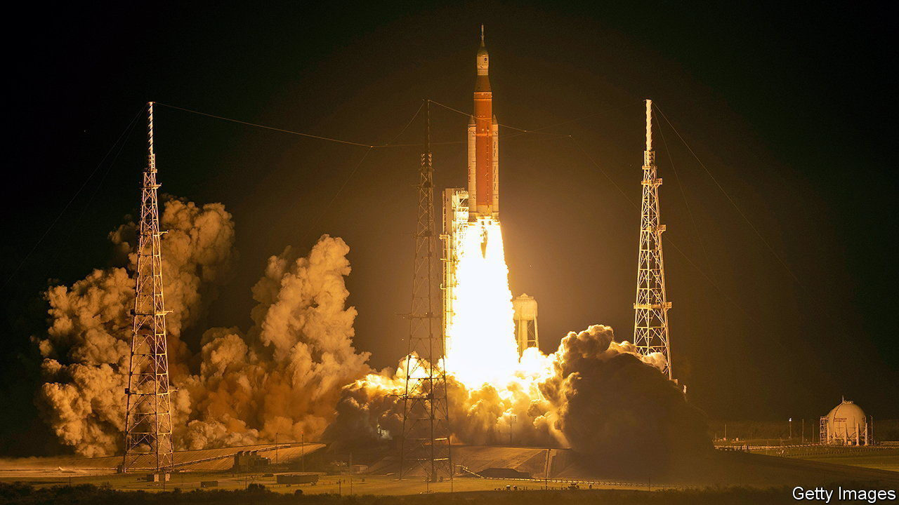

###### A white elephant flies

# The world’s most pointless rocket has been launched at last 

##### America will return to the Moon. But it will not be cheap 

 

> Nov 16th 2022 

The world’s largest rocket got there in the end. NASA, America’s space agency, has been trying to fly the  (SLS) since August 29th, but technical problems (and later a hurricane) have meant repeated delays. However, on November 16th, at a little before two o’clock in the morning, Florida time, it actually managed to blast off. This nocturnal launch, dictated by the vagaries of celestial mechanics, gave rocket-watchers a rare treat, as the vehicle’s white-hot exhaust lit up the countryside for miles around. 

The SLS’s destination (or, rather, the destination of Orion, the capsule it carries) is the Moon—almost, for it will not land. This version of Orion is uncrewed. But others will, if all goes to plan, return astronauts to the lunar surface half a century after the end of the Apollo programme. That project, called Artemis, after Apollo’s twin sister (who was the Ancient Greek goddess of the Moon, and thus, in any case, a more appropriate moniker than Apollo, the god of the Sun), will use the SLS as its launch vehicle. But Artemis 1, as the mission which has just begun is formally dubbed, will restrict itself to dropping off a few hitchhikers in the form of so-called cubesats that will carry out scientific studies of variable worth, and then making some complicated loops around the Moon before returning home on December 11th.

If all goes to plan, it will be followed by a crewed flypast of the Moon in 2024 and a landing in 2025. But few think that schedule will be met. Delay is the sls’s middle name. Its first launch was once supposed to happen in 2016. If America does return to the Moon, the end of the decade looks more realistic.

Delay is not the only source of grumbling. Much of the sls, including the boosters strapped to its side and the orange fuel tank that makes up its body, consists of tweaked,, which made its final flight in 2011. The official reason for using technology from the 1980s is that it is tried-and-tested. But politicians are also keen to preserve existing, well-paid manufacturing jobs. This may help account for why, despite being built from well-understood technology, the sls has cost $23bn to develop so far, and each launch is projected to cost $2bn.

Cheaper alternatives exist. NASA already relies on  to ferry astronauts to the International Space Station. And SpaceX is working on its own giant rocket, . If this goes to plan it might cost as little as $10m per launch. Starship’s first orbital flight will happen soon. If that works, Starship will swiftly make the sls look pretty pointless. 

That is unlikely to stop more launches. When Jim Bridenstine, then NASA’s boss, suggested in 2019 that SpaceX’s existing  rocket might offer a cheaper, quicker route back to the Moon, he was slapped down by pro-sls politicians. America will return to the Moon. But it will not be cheap. ■


