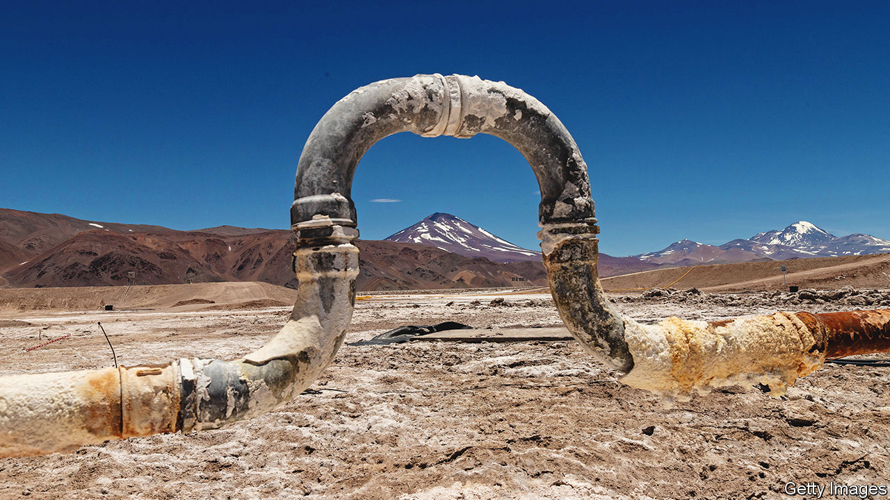
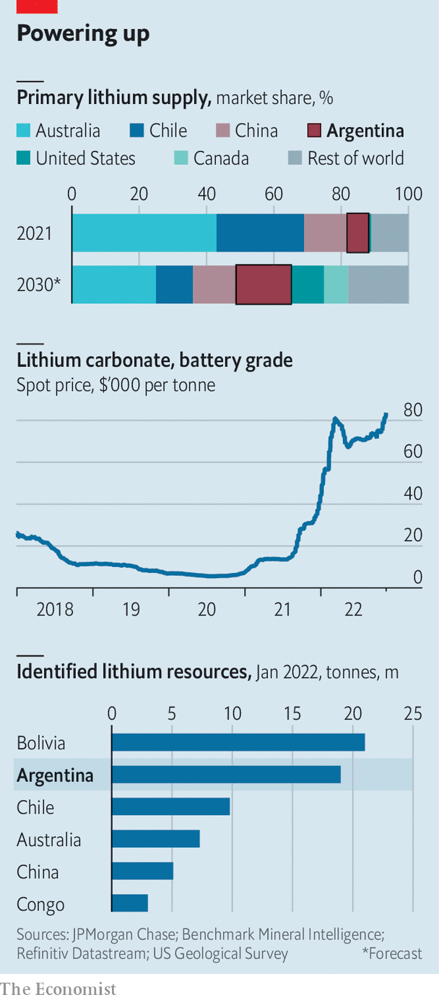

###### Another pot of white gold

# Argentina could help the world by becoming a big lithium exporter 

##### But can exports of the metal help sort out the country’s economic woes? 

 

> Nov 15th 2022 

Picture a country in South America that is pro-business, is attractive to foreign capital and offers political stability for long-term investment. Most people would think of Chile. But when it comes to mining lithium, a light, salt-like metal used for batteries in electric vehicles and mobile phones, the country in question is its , Argentina. Better known for triple-digit inflation and railing against the IMF, Argentine officials have gone on a charm offensive from Washington to London with a boosterish message: the mining sector is open for business. 

The transition to green energy has made lithium one of the world’s most sought-after metals. The price of lithium carbonate (LCE), the raw material used in lithium-ion batteries, soared this year from a five-year average of around $14,000 per tonne to over $80,000. According to Benchmark Mineral Intelligence, a consultancy, as sales of electric vehicles grow, demand for LCE is set to increase to 2.4m tonnes in 2030, compared with around 600,000 tonnes this year. Although lithium is plentiful, supply is struggling to keep up. Worldwide ten working mines can produce battery-grade lithium, says Daisy Jennings-Gray of Benchmark. A global scramble to find cheap deposits and to build mines to meet the increase in demand has started. Argentina could benefit. 

Almost two-thirds of the world’s lithium can be found in the Andean plains that straddle Argentina, Chile and Bolivia—collectively known as the “lithium triangle”. Bolivia has the , but it has failed to get production going. The state owns all lithium deposits and companies can exploit it only if they strike a deal with the public firm, Yacimientos de Litio Bolivianos. Political volatility and a lack of technical know-how have not helped. In 2016 the deputy interior minister was bludgeoned to death by miners. 

Chile used to be the world’s lithium powerhouse. In 2017 it was overtaken by Australia, which became the top supplier globally. Chile now accounts for 26% of total supply. There, too, lithium deposits are owned by the state, which doles out contracts to private companies. Two firms, Albemarle and SQM, dominate the industry. In 2016 and 2018 the government renegotiated their contracts and introduced new rules that force companies to sell up to 25% of the metal at below-market prices at home in order to encourage local industry. In addition, royalties were linked to global prices, which can be volatile. Mining companies also agreed to give a portion of their earnings to development projects in the communities where they operate, in order to dampen protests by local activists and potentially create jobs. Although this is reasonable, it may have caused some investors to look across the Andes. 

 


By contrast lithium is not considered a strategic resource in Argentina. The state plays a small role. Instead, the constitution grants the country’s 23 provinces the right to administer minerals on their land and grant concessions to firms. A law from 1993 gives tax breaks for mining firms and establishes that their ventures cannot face new taxes for a period of 30 years from the date they present a feasibility study to the federal government. Royalties are capped at 3%, compared with 7-40% in Chile. 

All this has attracted capital. Some 40 lithium projects are currently in different stages of exploration, more than in any other country. JPMorgan Chase, a bank, expects Argentina to overtake Chile as the world’s second-largest producer by 2027. By 2030 Argentina could supply 16% of the world’s lithium, up from 6% in 2021 (see chart). Rio Tinto, an Anglo-Australian mining giant, acquired a lithium mine in March for $825m. POSCO, a South Korean firm, is investing $4bn in a lithium project.

Chinese firms are especially keen. In July Ganfeng Lithium, a Chinese mega-producer, announced plans to buy a plant for almost $1bn. Argentina’s macroeconomic mismanagement—the country has around a dozen different exchange rates and inflation is nearing 100%—puts many Western companies off. For Chinese companies, however, “the point is less financial and more strategic,” says Carlos Freytes of Fundar, an Argentine think-tank. “It’s about a geopolitical ambition. They want to guarantee supply.” Of the nine projects closest to production in Argentina, six involve Chinese companies, according to data compiled by Fundar. 

Argentina’s mining laws were passed during a brief window of free-market reforms. They are difficult to change because the constitution devolves power to the provinces, which control the Senate. The governors of the three north-western provinces that host Argentina’s lithium—Salta, Catamarca, and Jujuy—are not afraid to push back against the government. When the foreign ministry said in October that it was in talks with Bolivia and Chile to create a “lithium OPEC” to set regional prices for the metal, the governors complained and the proposal stalled. They hope that foreign investment can help their provinces grow. The World Bank estimates that, in a best-case scenario, lithium production and processing could increase the GDP and fiscal revenue of those provinces by 10%.

Yet problems remain. Conflicts with indigenous communities who live on the land where lithium is extracted could grow. These have set back projects in Bolivia and Chile, and have shut down other mines in Argentina. A study from 2019 in Chile found that lithium mining worsened droughts in surrounding areas, which in turn angered locals. Argentina’s low royalty rates could mean that most of the profits end up in foreign pockets rather than state coffers, which might provoke a political backlash. “This is plunder, plain and simple,” says Enrique Viale, an environmental lawyer in Buenos Aires. On November 10th a law was discussed in the lower house of Congress that, if passed, could impose stricter environmental checks on wetlands, including the land on which lithium mines are built. The law was proposed a decade ago but foundered because of opposition by provinces and mining lobbies. 

And Argentina’s politicians could dampen investors’ enthusiasm. The state oil company has recently branched out into lithium; the federal government could try to give it privileged access over private companies. Stricter export controls could halt production. “There is no single sector that can rescue Argentina from its morass,” points out Benjamin Gedan of the Wilson Centre, a think-tank. But in an economically dysfunctional country lithium remains, for now, a rare point of hope. ■

