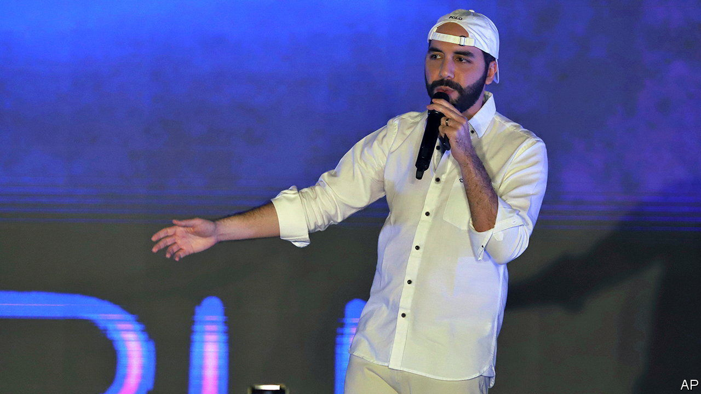
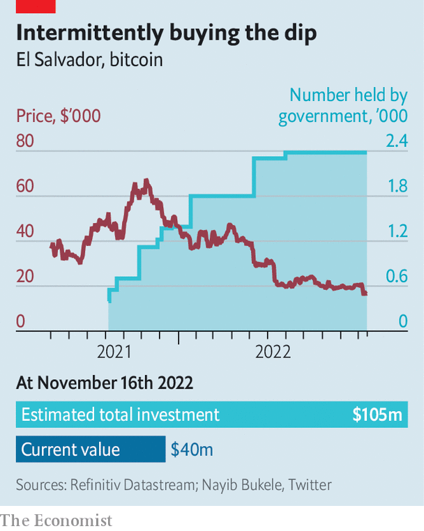

###### Deep down in the crypto-dip

# El Salvador’s bitcoin experiment is not paying off 

##### The value of the country’s cryptocurrency has fallen by two-thirds 

 

> Nov 17th 2022 

Will the fall in the price of bitcoin following the , a cryptocurrency exchange, cause El Salvador’s bitcoin-backing president, Nayib Bukele, to reconsider  with the country’s finances? So far Mr Bukele, who made  in September 2021, appears defiant. On November 17th he tweeted that his government will buy one bitcoin a day, after not having bought any in almost six months (see chart). He has also brushed off any criticism of his decision to buy it using public money. “Stop drinking the elites’ Kool-Aid and take a look at the facts,” he wrote two months ago. 

 


Sadly the facts are dire, at least for El Salvador’s 6.5m people. The country has lost $65m, or two-thirds, of the $105m the social-media obsessed leader has shelled out on the cryptocurrency. (This assumes Mr Bukele can be taken at his word; purchases are tracked using his tweets.) Mr Bukele has claimed these are not really losses, since he has not sold any of the coins—apeing the bitcoin bros who cry that one bitcoin is worth one bitcoin whenever it slumps in price. He also claims that the fall is no big deal as it represents 0.2% of GDP. He reckons that bitcoin boosts tourism.

Even so, the government is cash-strapped. And the losses from Mr Bukele’s bitcoin binge have cost the country in other ways. Analysts and creditors fret that El Salvador will be unable to service its debt, including around $667m due in January. In order to reassure markets that it would avoid a default, the government bought back $565m of its sovereign bonds in September. But that month Fitch, a ratings agency, downgraded the country. El Salvador may turn to China to buy its foreign debt, if a potential free-trade deal is struck. 

Salvadoreans have not caught the bitcoin bug. Less than a quarter of those surveyed in September had paid for something using it. Some of those may have done so only to use up the $30 of bitcoin the government gave to people who downloaded a digital wallet. Fully 77% thought the government should stop buying it. This makes crypto Mr Bukele’s weakness. The self-proclaimed “world’s coolest dictator” has an approval rating of 86%, mostly because of a crackdown on crime. Since March over 50,000 suspected gang members have been locked up. But having one unpopular policy may be a cost he is willing to absorb, like the bitcoin losses. For now, at least. ■

