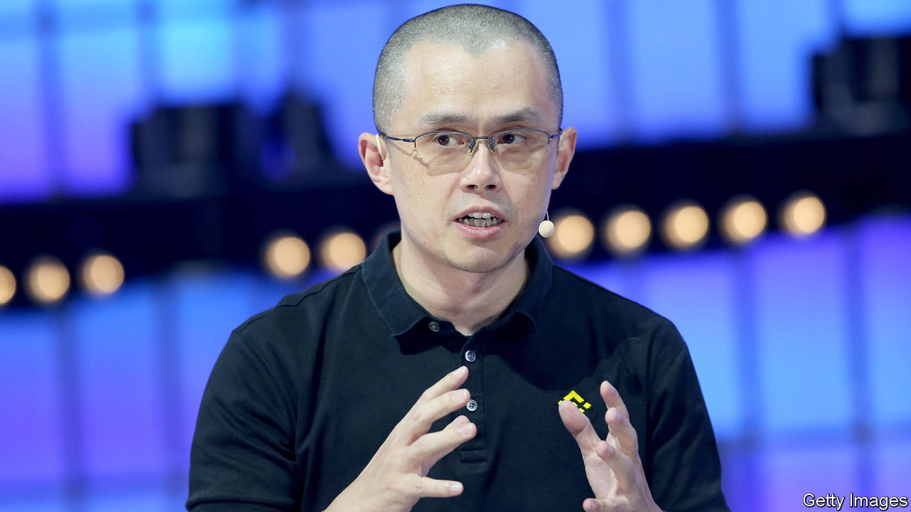

###### The Economist explains

# Who is Changpeng Zhao, the chief executive of Binance? 

##### The qualities that have made crypto’s Teflon Man a success could soon land him in trouble 

 

> Nov 16th 2022 

THE IMPLOSION of , a crypto exchange once valued at $32bn, has left plenty of people with egg on their faces. But one crypto giant, and the man who runs it, is emerging stronger—at least for now. Binance has cemented its status as the world’s largest cryptocurrency exchange, making it the dominant middleman of a $1trn market. And , its 45-year-old co-founder and boss, has triumphed over a younger, more charismatic rival in Sam Bankman-Fried, the fallen head of FTX. Even after the crypto crash, Mr Zhao’s fortune is estimated at $17bn. Who is crypto’s Teflon Man?

Mr Zhao was born in China; his family fled repression when he was 12, after his father was accused of being pro-bourgeois, and moved to Canada. At secondary school he was ranked tenth in Canada’s national maths competition, and later studied computer science at McGill University. In 2015, convinced that bitcoin “would do to finance what the internet did to information”, he launched Bijie Tech, which offered software to crypto exchanges in Shanghai. Four years later, China shut down all exchanges based in the country. Bijie Tech folded soon after. 

Undeterred, Mr Zhao launched Binance in July 2017. Many of his staff continued to work from Shanghai, despite the ban on crypto exchanges. To avoid government scrutiny they declared Binance a “remote” organisation, without fixed headquarters. When China’s crackdown grew fiercer Mr Zhao moved: he has since based himself variously in Hong Kong, Singapore and most recently, Dubai. Meanwhile Binance has evolved into a constellation of global entities—some launched from scratch, others acquired—that makes it hard to get to grips with, even for insiders. What is clear is that it moves a great deal of money: dozens of billions of dollars’ worth of assets change hands on the platform each day. Binance usually takes a 0.1% fee for its trouble.

Binance has thrived in large part thanks to Mr Zhao’s ruthless decision-making. At the height of the 2017 Initial Coin Offering boom, when many exchanges proved slow to list the flurry of new cryptocurrencies, Binance rushed to do so. When crypto “derivatives” made it possible for punters to borrow heavily to place outsize, uber-risky bets on coin-price movements, Binance vied with FTX to offer the biggest loans. When rumours of trouble emerged at FTX on November 6th, Mr Zhao said Binance would sell $600m worth of FTT, a token issued by Mr Bankman-Fried’s firm. That precipitated FTX’s cash crunch. Next Mr Zhao offered to buy FTX, then rescinded his offer. Now he says he wants to launch an “industry recovery fund” to defend crypto projects affected by FTX’s collapse.

That self-interested largesse could expose Binance to huge losses if crypto prices continue to slide. A complete crash would probably obliterate Mr Zhao’s wealth, given that most of it, he told  last year, is held in digital assets. And Binance could face other problems. Critics of Mr Zhao say his taste for “controlled chaos”, his reliance on a small inner circle and his ravenous appetite for growth have gone hand in hand with corner-cutting. The exchange’s five-year history is peppered with damaging hacks and allegations of money-laundering. It has been the target of investigations by a pack of global financial watchdogs, including almost every relevant American regulator (it is already banned from offering some of its products in Britain, Japan and several other countries). The FTX debacle will no doubt lead to even fiercer scrutiny. This week Mr Zhao promised more transparency and said Binance would provide proof that it has enough liquid assets to face any crisis. Yet as the crypto crash worsens, prompting a regulatory backlash, the digital Teflon Man may not prove resistant to corrosion forever. ■

