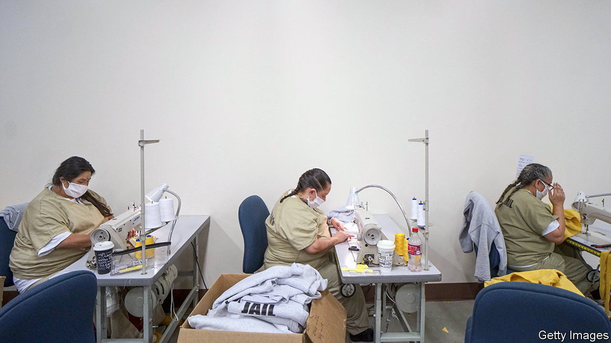

###### The Economist explains

# Why is America debating prison labour? 

##### Campaigners want to raise inmates’ pay and improve their working conditions 

 

> Nov 11th 2022 

On November 8th, as Americans picked their senators and congressmen, voters in five states confronted an altogether weightier question: whether to abolish slavery without exception. They said yes in Alabama, Oregon, Tennessee and Vermont; Louisiana’s ballot proposal failed. Campaigners against prison labour had agitated for the referendums: America’s constitutional prohibition of slavery does not cover convicted criminals, and the ballot measures end that exception. Similar proposals passed in Colorado in 2018, and in Nebraska and Utah in 2020. On what terms are America’s prisoners  and how might they change?

Passed at the end of the civil war, the 13th Amendment to the constitution abolished slavery except for people convicted of crimes. Sixteen states still have copycat language in their state constitutions. Such exceptions legitimised a long tradition of penal labour—the practice, dating back to the late 18th century, of rehabilitating inmates to cover the cost of their imprisonment. (Constant labour, wrote Benjamin Rush, a proponent of the early penitentiary, “would discipline the body, teach new habits and lead to a recovery of lost virtue”.)

Today, of America’s state and federal prison population of 1.2m adults, 800,000 work: fighting fires in California, picking watermelons in Arizona and answering telephones for the Department of Motor Vehicles in Oregon. Most do maintenance jobs: cleaning floors, stocking shelves, washing sheets. About 7% make goods or perform services for the state, such as staffing government call centres, sewing uniforms or stamping car-licence plates. Less than 1% work for private firms, which must pay a prevailing wage—though up to 80% of it can be taken by prisons.

Inmates produce more than $2bn-worth of goods and $9bn-worth of services a year. But they do it for a pittance: in 2017 median pay in state prisons was 20 cents an hour. Seven states pay prisoners nothing for the vast majority of their work, including Alabama, which just ended the exception. Since prisoners are not classified as employees under the law, they do not qualify for minimum wage, sick pay or workers’ compensation. There are no job-training or workplace-safety standards. Refusal to work can result in lost privileges, or even solitary confinement. 

Campaigners are keen to improve these conditions rather than end the practice of prison labour altogether. “Inmates want to be productive, because the monotony of sitting in a cell and staring at four walls would drive them crazy,” says Curtis Davis, who spent 26 years in Louisiana’s largest state penitentiary and helped put the (failed) referendum on the ballot there. Yet they should not be made to climb tall scaffoldings without a harness or defecate outside if working in fields, he says. Campaigners also want prisoners to have a say in the type of work they do, to better prepare them for employment after release.

The ballot initiatives alone will not enact those reforms, but they could open the door for state prisoners to seek legal redress. Even then they face uncertain odds: in August judges in Colorado ruled that an aggrieved inmate had not been subject to involuntary servitude since he faced no physical restraint or injury for refusing to work. In March, however, Colorado’s legislature mandated that prisoners within two years of release who work off-site in day-release programmes be paid the state minimum wage of $12.56 an hour. The law’s sponsor signalled that all prisoners might one day qualify. Other states will balk at that: in June Californian lawmakers refused to put an involuntary-servitude referendum on the ballot after state officials said it could cost $1.5bn in prisoners’ wages. ■

