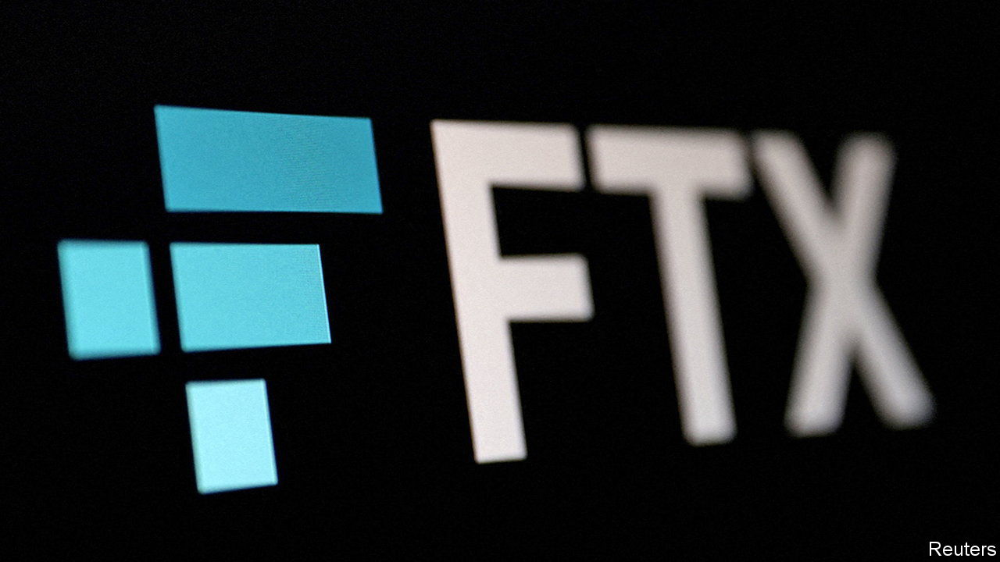
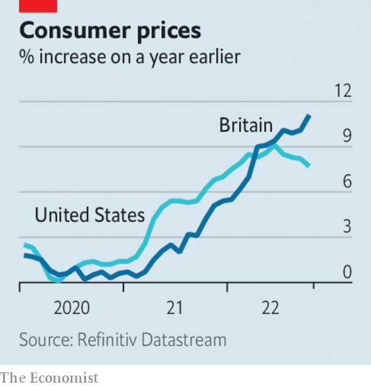

###### The world this week

# Business 

#####  

 

> Nov 17th 2022 

Regulators around the world opened investigations into , after the crypto exchange and its sprawling network of affiliated firms filed for bankruptcy protection. Traders withdrew $6bn from the platform in just 72 hours amid claims that it had mishandled customers’ investments. FTX could owe money to as many as 1m people. Its spectacular collapse has prompted calls for tougher rules to regulate markets in digital assets. After it declared bankruptcy in America a hacker, possibly an insider, stole around $470m from the exchange.

Diverging economies

 


Stockmarkets staged their biggest rally in more than two years on November 10th, after figures for American consumer prices were published. Annual slowed to 7.7% in October, its lowest level since January. The S&amp;P 500 surged by 5.5%, the NASDAQ by 7.4% and the Dow Jones Industrial Average by 3.7%. There were other signs of cooling inflation in America. A measure of wholesale prices rose by 8%, the smallest increase since July 2021. 

In  inflation headed in the other direction, accelerating to a 41-year high of 11.1%. Food prices rose by 16%, the most in 45 years. The cost of gas and electricity was also up sharply again. The British economy contracted in the third quarter, by 0.2% over the previous three months, on cue for the start of a long recession that the Bank of England has forecast. All food for thought for the British government, as it unveiled its plan to plug a fiscal hole in the public purse. 

 also shrank in the third quarter, by 0.3%. A weak yen has pushed up the price of imports, curtailing consumption by households and businesses. Even so the contraction was a surprise; most economists were expecting modest growth in the quarter. 

China announced a set of measures to boost liquidity in the troubled , such as extending deadlines for loans to developers. The package is seen as the most significant attempt yet by the Chinese authorities to bail out the sector, which is burdened by debt and falling sales. The prices of stocks and bonds of Chinese property companies rose sharply in response. 

Germany nationalised a company that imports and which was owned by Russia’s Gazprom until April. It is the second time an energy company has been nationalised in recent months in order to secure gas supplies. Poland made a similar move this week, taking control of a section of a pipeline operated by Gazprom. With colder weather on the horizon, the price of natural gas has started to rise again in Europe, after falling for three months. 

 said it would carry out a “thorough review” into the conduct of its chief financial officer, John Randal Tyson, who was recently arrested for being drunk, entering a woman’s house and falling asleep in her bed. Mr Tyson is the son of the meat-processor’s chairman, John H. Tyson. Given the circumstances, investors may have preferred the review to be overseen by an independent expert, rather than the board. 

America’s biggest retailers reported a mixed bag of earnings.  sales in the third quarter were stronger than expected and it raised its outlook for the year. Low-income shoppers are dipping into their savings to fund their spending, according to the company.  profit fell. It described consumers as “stressed”, cutting back on everything. It now expects sales in the Christmas quarter to be lower than in the same three months last year. 

 share price struggled to recover from the hammering it took after reporting another huge quarterly investment loss at its two Vision Funds, this time of ¥1.38trn ($9.8bn). The Japanese conglomerate did manage to make an overall net profit, in part by selling off a large chunk of its stake in Alibaba. 

There was more bad news for employees at tech firms, which are culling staff numbers after a period of expansion during the pandemic. One large hedge-fund investor in  called on it to reduce its staff count and cut the salaries it pays to non-engineers. Alphabet hired 36,000 people over the past 12 months, increasing its workforce by 25%.  was preparing to lay off 10,000 people, mainly in corporate jobs. 

None but the brave

, Twitter’s new boss, told staff that they would have to commit to working longer hours if they wanted to remain at the company, giving them a deadline of a few days to do so or face the sack. Around half the staff have already been laid off in the two weeks since his takeover. Mr Musk faced questions about his own working practices at a court hearing into his $56bn pay package at Tesla, which has upset a shareholder. The carmaker’s chairman said Mr Musk needed such vast sums to fuel his ambitions for “interplanetary travel”. 

