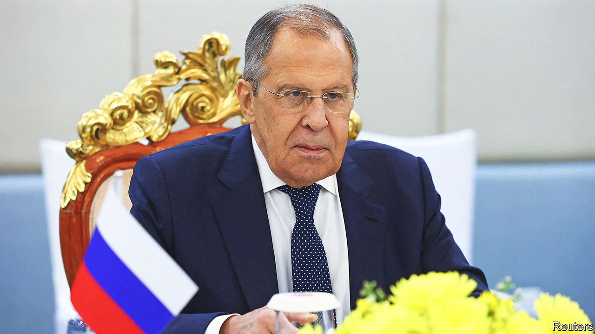
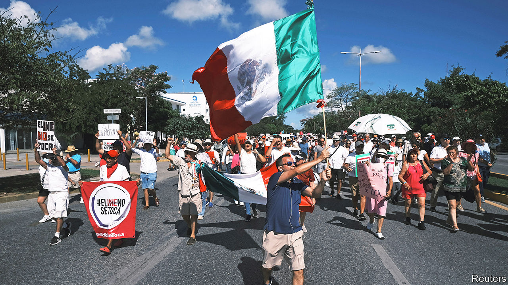

###### The world this week

# Politics 

#####  

 

> Nov 17th 2022 

The   in Bali concluded with a strongly worded statement condemning Russia’s invasion of Ukraine and demanding its immediate withdrawal. Russia managed to insert the phrase that there are “other views and different assessments of the situation” into the document. The Kremlin did, however, publish the statement in full, including the references to war and invasion. Sergei Lavrov, Russia’s foreign minister (pictured above), attended the gathering, and criticised it for being too politicised. 

A day before the summit, . After months of tension, they pledged to resume high-level dialogue on issues such as food security and economic affairs. But when it came to more divisive topics, such as Taiwan, there was little agreement.

A missile struck a farm in Poland, close to the border with , killing two men and sparking fears of an escalation of the war. But NATO reacted cautiously. It now seems likely that the missile was not fired by Russia, but was probably Ukrainian, meant to intercept part of an attack by Russia involving around 100 missiles that was a response to Ukraine’s liberation of Kherson.

Britain and France signed a new agreement that will increase the number of migration officers in northern France in the hope of reducing the flow of illegal  crossing the English Channel. “Irregular entries” have become a problem across the EU again. Over 280,000 were recorded in the first ten months of 2022, up by 77% compared with 2021. The western Balkans saw the biggest influx of illegal migrants, but the Mediterranean routes also recorded large increases. 

The Turkish police said a woman they arrested on suspicion of planting a bomb in a busy street in  is a Syrian national working for Kurdish militants. The explosion killed six people. 

 relaxed some of its covid-related restrictions. Quarantine requirements for close contacts and international travellers were reduced, and some cities curtailed mass testing. The changes were made despite a recent surge in cases. An outbreak in the metropolis of Guangzhou led to fears of a city-wide lockdown and a bout of unrest, as people expressed their anger over restrictions.

A cleaner future

 and nine rich countries announced an agreement designed to curb the archipelago country’s dependence on coal. The Just Energy Transition Partnership, brokered by America and Japan, promises to provide Indonesia with $20bn in public and private finance to help it retire its fleet of coal-fired power stations and shift to renewable energy. Given Indonesia’s enormous reliance on coal—it is the world’s third-biggest producer—the deal has potentially enormous climate significance.

In  the Taliban ordered judges to impose strict interpretations of sharia law in cases such as stealing and kidnapping, which could lead to public amputations and executions. The regime is becoming ever more repressive; it recently banned women from entering parks. 

 ruling junta is releasing almost 6,000 political prisoners to mark a national holiday, according to state media. Around 15,000 people have been arrested since the coup in February 2021. Kubota Toru, a Japanese documentary maker who was detained in July for filming a protest, was said to be among those being set free. 

Ariel Henry, the prime minister of , dismissed the justice minister, interior minister and the government commissioner. He gave no reason for the dismissals. They come a month after America announced that it was imposing sanctions on two separate officials and that it would pull the visas of those it thinks are involved with gangs. 

 


Huge protests took place in  against proposed changes to the country’s electoral authority by President Andrés Manuel López Obrador. He downplayed the demonstrations, saying that 50,000 people took to the streets “in favour of corruption”. The organisers claim 200,000 people turned out, making them the largest demonstrations against the president.

For the first time since mass protests began in two months ago, a court sentenced a protester to death, for setting fire to government property. And 227 members of Iran’s parliament signed a letter calling for protesters to be executed. Human-rights groups reckon that 15,000 protesters have been detained.

Binyamin Netanyahu, whose Likud party won the most seats in an election on November 1st, was asked by  president to form a government. He was said to be reluctant to give leaders of the far-right all the senior posts they are now demanding as the price for joining a coalition, including the ministry of defence. 

Fans began to arrive in Qatar for the football , due to kick off on November 20th, amid controversy over the emirate’s human-rights record. Local authorities have been accused of mistreating immigrant labourers and of persecuting homosexuals. 

The first humanitarian-aid deliveries since August have been allowed into Tigray. Hundreds of thousands of people are starving in the northern region of , which has been blockaded by government forces. 

The Democrats retained control of the , after late results from  gave them victory in Arizona and Nevada. The Republicans won control of the , but with a tiny majority, far short of expectations. Recriminations began against the Republican leadership. The party in the House nominated Kevin McCarthy for speaker, though 31 colleagues voted against him. 

Four more years?

Much of the Republican finger-pointing about what went wrong was aimed at . The twice-impeached former president deflected the criticisms when he formally announced that he will run again for the White House. His long-winded speech was a rehash of previous campaign rallies, and also mentioned the criminal investigations into him. 

NASA at last launched the first rocket in its  project, propelling an unmanned capsule to orbit the Moon for three weeks before it splashes back down to Earth. NASA hopes a successful test will eventually lead to the first manned mission to the Moon since 1972. 

