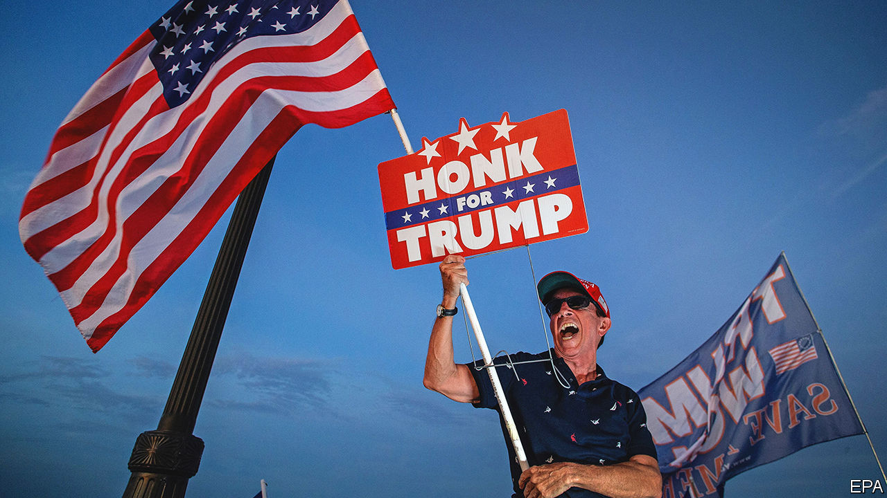
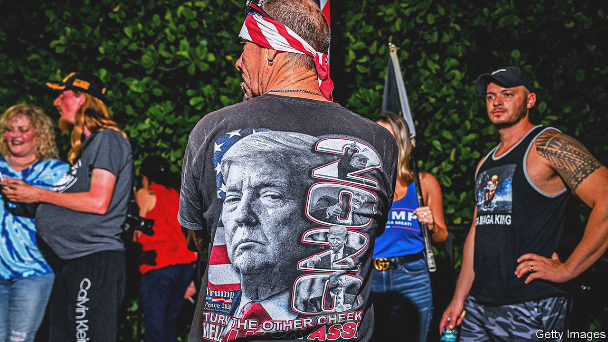

###### Series reboot

# Donald Trump declares that he will make America great again, again 

##### Regrettably he should not be underestimated 

 

> Nov 16th 2022 

You could tell something was afoot on the swampy, sweltering evening of November 15th in Palm Beach. The bridge to Mar-a-Lago, the opulent resort where Donald Trump resides, was thronged with fans who draped themselves, despite the humidity, in “Make America Great Again” flags—ambling, praying, tailgating. Inside the former president’s palace something extraordinary was indeed happening, in front of a swankier crowd—an assemblage of suits with red baseball caps and evening dresses with pearls. Mr Trump was there to announce formally a decision that he had already hinted at over the past year: that he would be embarking on a revenge bid to take back the presidency in 2024.

Ever since he left the White House, shortly after the attempted insurrection at the Capitol on January 6th, Mr Trump has been plotting a comeback. He managed to keep a tight leash on the party throughout the midterm elections, meddling in primaries to pick candidates who most fervently endorsed the lie that Democrats had stolen the presidential election. Having restored himself to the helm of the party, the former president was preparing to crow after November 8th when Republicans expected to sweep back to power.

That didn’t happen, however. The Senate remained in Democratic control, while Republicans scraped together the barest majority in the House of Representatives. The sycophants who ran in key races in the swing states of Arizona and Pennsylvania came up with naught. The performance was so sub-par that his advisers reportedly tried counselling him to delay the announcement. But contrition and humility are not Mr Trump’s thing. He simply took credit for the House flipping and blamed the bad results on other Republicans.

There was little new in the speech, which was largely a rehashing of the hour-long stemwinders he has been delivering at political rallies for the better part of the year. He took his usual delight in claiming that “now we are a nation in decline” and “a failing nation”, recapitulating the theme of “American carnage” from his inaugural address by describing “blood-soaked streets” in cities that are “cesspools of violent crimes” and the invasion of fentanyl-toting illegal immigrants. His policy recommendations remained the same, with some updates for new culture-war battles over critical race theory and transgender children, though in addition to old proposals he now wants to execute drug-dealers. Once again, only he alone could fix it.

But the fighting words were delivered with less verve. Perhaps the weight of the midterms embarrassment pressed down, or the mountain of legal inquiries, or the prospect of a two-year-long campaign. The light behind the eyes had dimmed. “I’m a victim, I will tell you,” he said in the most heartfelt portion of the speech.

Mr Trump’s haste to re-enter the fray can be explained by two things. First, the Department of Justice is investigating whether or not he improperly took classified materials from the White House; the congressional January 6th committee has spent more than a year unravelling the effort to overturn the election result; prosecutors in Georgia are examining his exhortation to election officials to “find” enough votes for him to secure victory. Prosecuting a former president for this was already fraught and unprecedented, presenting difficult paths to trial and conviction. That he is also an active presidential candidate—with a good chance at winning his party’s nomination again, and, Democrats must admit, the general election, too—makes prosecution even harder.

But, more important, his tight hold over the party is starting to be questioned, with elites searching for a way out that does not endanger their chance of maintaining power. Previous periods of questioning have usually been prompted by some whopping scandal—the revelation of the “Access Hollywood” tape in the closing days of the 2016 election, the praising of white supremacists who rallied in Charlottesville, Virginia, in 2017, or the campaign to delegitimise elections that ended in the sacking of the Capitol. In all cases, these doubts eventually subsided because Republicans reasoned that the man won them elections, and they could not work out a way to do so without him.

The midterms have called that into question. Mr Trump lost Republicans the House in his own midterm elections in 2018; he lost the presidential election in 2020; he almost single-handedly lost Republicans the Senate in the Georgia run-off elections held in 2021; and in 2022 he arguably kept the Senate in Democratic hands by boosting the campaigns of novice candidates. A morally compromised winner Republicans could live with; a morally compromised loser is less enticing.

 


By declaring early Mr Trump hopes to freeze out his potential rivals to lead the party, such as Ron DeSantis, the governor of Florida, and Glenn Youngkin, the governor of Virginia—both of whom the former president has already taken to sniping at. At his announcement speech at Mar-a-Lago, Mr Trump had the grace to refrain from reiterating his criticisms of them (he had branded one “Ron DeSanctimonious” and criticised the other for having a Chinese-sounding surname). Perhaps that is why the former president did not appear to be having much fun. He has always relished the personality-bashing aspects of politics, and much less to the dull business of making federal policy.

He also avoided repeating his claims that the presidential election was stolen, save one passing insinuation that the Chinese government had interfered to defeat him. If his advisers and speechwriters managed to keep him in check for one evening, they should not expect to do so over the two-year campaign for the presidency that now awaits them. 

Away from the presidential struggle, the midterm fallout is being felt in other ways. Kevin McCarthy, the Republican congressman who expected to be easily made Speaker of the House, secured such a small majority of seats that the truculent Freedom Caucus will be able to exact big concessions by threatening his removal.

In the Senate Mitch McConnell, the party’s minority leader, faced an unsuccessful challenge from Rick Scott, the senator from Florida. Although Mr Scott chaired the party committee in charge of ensuring a Senate majority, he blames Mr McConnell for the lacklustre result because he had expressed some displeasure at the Trumpian slate of candidates. Ronna McDaniel, the chairwoman of the party since 2017, is also facing down a possible insurrection of her own. Even if all are ultimately unsuccessful, they reflect the anxieties of a party that must once again decide if the pact with Mr Trump is worth it.

Time and time again, the elected Republicans have balked when presented with opportunities to distance themselves from Mr Trump. The next few months will offer another one. At the moment, other contenders, including Trump administration officials like the former vice-president Mike Pence, who just released a memoir somewhat critical of his boss, are jostling for position but are unlikely to immediately declare their candidacies. Mr DeSantis would probably wait until after the Florida legislative session ends in May. Being the only major declared candidate might give Mr Trump the opportunity to consolidate slipping support within the party. It might also leave him the one most exposed to attacks from within. “The journey ahead of us will not be easy,” Mr Trump warned in his speech. “Anyone who truly seeks to take on this rigged and corrupt system will be faced with a storm of fire that only a few could understand.” This sense of apocalyptic anxiety is widely shared.■

