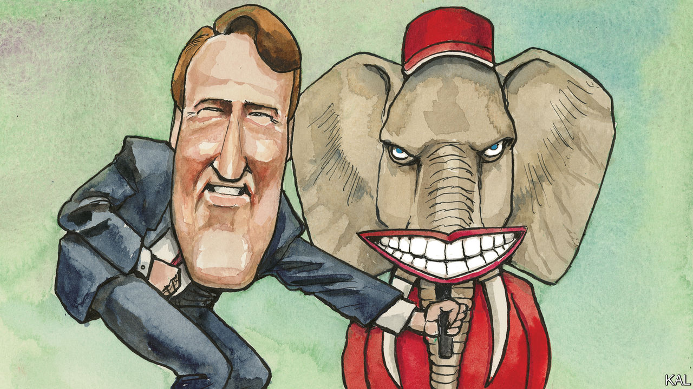

###### Lexington

# Glenn Youngkin is a kinder, gentler Trumpist 

##### Virginia’s governor has a unique approach to adapting Donald Trump’s politics 

 

> Nov 17th 2022 

In the anxious race to develop a Trumpism without Trump, the Republican governor of Virginia, Glenn Youngkin, is at work on a formula that is peculiar, even radical. He wants not just to substitute for the man but to replace the key binding ingredient—anger—with affability. Ron DeSantis, the governor of Florida, has mastered the Trumpian scowl, which the likes of Ted Cruz, a senator from Texas, are doubtless still practising in the bathroom mirror. But the gangly, even goofy Mr Youngkin seems incapable of being less than ebullient, even at eight o’clock on a recent morning as he bundled his six-foot-seven-inch frame into the back seat of a Chevrolet Suburban, and, discovering Lexington, began joyfully recounting tales of the six years he lived in London. 

Just a year has passed since Mr Youngkin, a former private-equity executive, upended conventional wisdom by winning the governorship of a state that went for Joe Biden in 2020 by ten points. He won by keeping enough distance from Donald Trump to avoid alienating suburbanites, while criticising lockdowns and lefty school curriculums that worried both them and more conservative rural voters. “We brought together Forever Trumpers and Never Trumpers,” he says proudly, and accurately. “Brought together the Tea Party folks and libertarians, tons and tons of independent voters…and we had Democrats walk across the aisle.” 

Ever yearning for the next Ronald Reagan, some Republicans thought they caught glimpses of his sunniness and uplifting politics in Mr Youngkin’s campaign. A college basketball star who was not good enough to turn pro but too tall to fulfil his dream of being an astronaut, Mr Youngkin went to Harvard Business School and spent 25 years at the Carlyle Group, eventually becoming its co-CEO and making a fortune. Now 55, he was much in demand from Republican candidates this autumn, and appeared at rallies from Maine to Nevada. Mr Trump has taken note of Mr Youngkin’s rise and, with typically blunt force, tried to squash him. (“Young Kin”, the former president mused recently on his social-media site, Truth Social. “Sounds Chinese, doesn’t it?”) 

Party elites long for a hero to free them from Mr Trump. On matters of policy, Mr DeSantis and Mr Youngkin reach similar conclusions: that progressive ideology is tainting public education; that, in Mr Youngkin’s words, Democrats pursued “the systematic dismantling of the culture of law enforcement”; that covid jabs ought not to be mandated and that “every state is a border state now” because of fentanyl trafficking. 

But Mr DeSantis is a fiery culture warrior and thus the more obviously Trumpy option. A pessimist—or realist—might argue that his pugilism better suits a conservative movement whose intellectual centre has shifted from journals of ideas to Fox News. Indeed, rough calculations show that over the past year Mr DeSantis has been mentioned on Fox at triple the rate of Mr Youngkin. 

But though Mr DeSantis easily won re-election in Florida, the midterm elections suggested Americans nationally are weary not just of Mr Trump but of political belligerence. The unavoidable subtext of Mr DeSantis’s declarations is that his opponents must be wicked, stupid or sick. For Mr Youngkin, the length of an enemies list is not a point of pride. Whereas Mr DeSantis is mirthless and even misanthropic, Mr Youngkin relishes working a diner. 

The son of a nurse and a father who was often out of work, Mr Youngkin as a teenager washed dishes at a Virginia Beach restaurant to help pay bills. On the day Lexington spent with him, just before the midterms, he stopped at the Dixie Restaurant, a diner in Petersburg. He moved easily from shaking hands with patrons in the front to joking with the staff in the dishpit and kitchen, as his unsmiling security detail eyed the long knives and open flames. 

Mr Trump’s divisiveness made him a minoritarian president. More successful presidents have managed to mean more things to more voters, without appearing to be frauds. You see signs of that gift in Mr Youngkin. Conservatives were overjoyed with his email tipline for reporting violations of his ban on teaching concepts such as critical race theory. Moderates may take heart from the 10% pay increase he gave to teachers, from his efforts to revive blighted areas and even from Virginia’s new history curriculums, which do not present a whitewashed version of America. Mr Youngkin says teachers should tell the tale in full. “We have to,” he says, with an arm-touch for emphasis, as his car speeds between events. “There have been some just horrifically awful periods in the nation’s history and, by the way, Virginia’s history.” 

His dark material

Yet among the candidates Mr Youngkin stumped for this autumn were extremists such as Kari Lake, who ran for governor of Arizona pledging to avenge Mr Trump’s “stolen” election. Asked how he could countenance such a stance, Mr Youngkin hems and haws. “There’s a lot of people across the country who feel a real lack of faith in the election process,” he says. “And by the way it’s not just Republicans. We saw it in 2016, some Democrats said that the election had been stolen.” They did, but it is also true, and surely more significant, that they did not storm the Capitol and try to make denying reality central to their agenda.

Mr Youngkin ended his day with an evening rally for Yesli Vega, a doctrinaire conservative fighting (unsuccessfully, it proved) to unseat a Democratic congresswoman in northern Virginia. He traded his suit jacket for a red sleeveless vest, a signature look aped by his staff. His message changed a bit, too, the affability giving way to something harder. “The spirit of Virginia is alive and well,” he told the crowd, assembled on a dark field. “And, of course, what we’ve seen is the left-liberal Democrats are trying to squeeze it out. That’s what they’re trying to do across the whole country.” It will be a stretch for any candidate who hopes to be a broadly unifying figure to also appeal to Mr Trump’s splenetic loyalists. But at least, as he recounted “left-liberal” sins, he was smiling. ■


