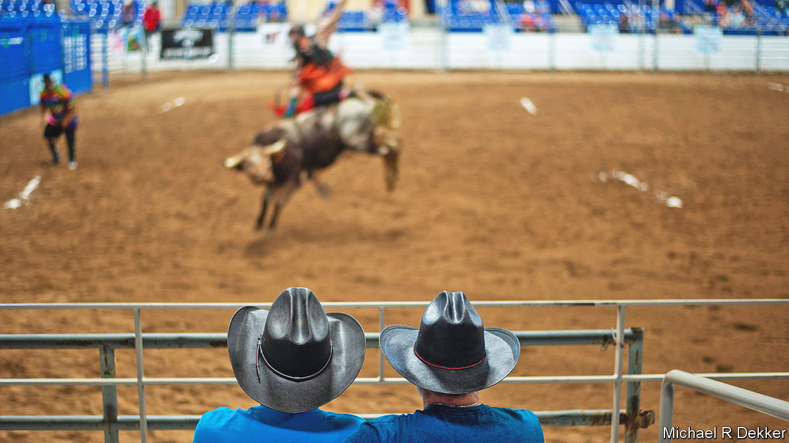

###### Bucking the trend

# Oklahoma’s gay rodeo illustrates an important social phenomenon 

##### We’re just not quite sure what it is yet 

 

> Nov 17th 2022 

Dubbed “the puppy” by the eldest of his three “husbands” Ryan Knop looks anything but timid wrestling a 200 kilo steer to the dirt at the World Gay Rodeo Finals in El Reno, Oklahoma. After leaving his Mormon hometown, Mr Knop met the trio—who six months later invited him to join their relationship—at a Santa Fe contest. Gay rodeo became a haven for the foursome. “You may be burly or you may be pretty but here we wear cowboy on our hearts,” he says.

Off a dusty two-lane road and nestled between fields of winter wheat, the arena fills up with men in flannel shirts and fishnet stockings. A woman with a tight drawl plates up pulled-pork baked potatoes and jalapeño brisket nachos doused in cheese the colour of apricots. A Budweiser banner advertises cold beer with the tagline “Thanks for coming out”. The rodeo kicks off with a prayer and the national anthem. Most events are classic—riders cling to bucking bulls and ropers on horseback snare calves. But some are spicier. A team of two dash towards a tethered goat. One grabs its legs while the other tries to yank a pair of tighty whities onto its hind quarters. 

Since the competition’s inception in 1976 (this counter-culture is well into middle age) gay rodeo contestants have gathered from rural regions across America and Canada. A young trans man, whose New Mexico youth rodeo days were stunted when his horse’s ankle was shattered by angry teenagers, revels in the glitz and glamour of it all. Others are more reserved. One of the few contestants good enough to compete in professional rodeo—a rugged man as big as a linebacker—goes by a pseudonym for fear of being blackballed. “Being gay is the furthest thing from my dna,” he asserts. “It is a piece of who I am, but the western lifestyle is my identity.” 

Some take a hit for participating. Pickup man Rick McKay, whose job it is to grab contestants off bucking beasts before they get hurt, is ridiculed when people at straight contests find out that he works gay rodeo. “It is a struggle every time,” he mutters. “But I’d like to know how the steer knows if he’s got a gay man or a straight man on his back.”

Spectators cheer as the many-husbanded Mr Knop gets his steer to the ground in the chute-dogging finals. Cowgirls in scuffed-up jeans reminisce about competing bareback as youngsters. Some unconventional family reunions occur. Wesley Givens, a theatrically mustachioed contestant from Little Rock (and a plaintiff in Arkansas’ marriage-equality case), donates sperm to cowgirl couples to start families. Three of his biological children are at this year’s rodeo. To them he is “Uncle Wes”. ■


