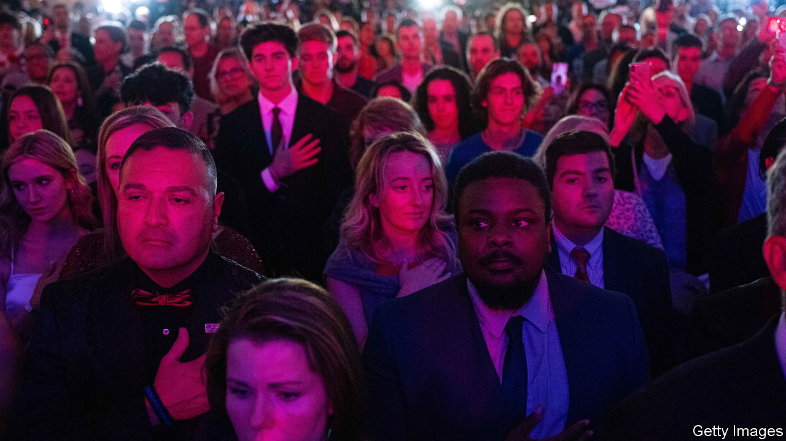
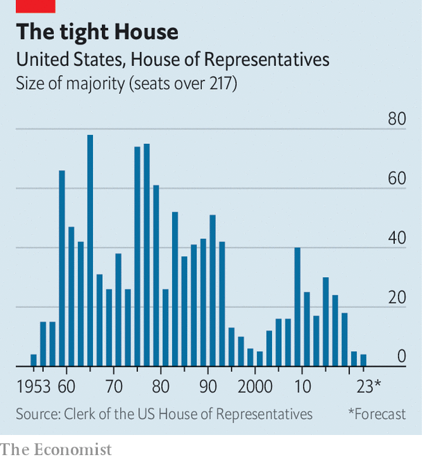

###### Triumph of the normies

# Quantifying the Trump effect 

##### How Democrats held the Republicans to historically small midterms gains 

 

> Nov 17th 2022 


Facing off against an unpopular president, decades-high inflation and an ideological lurch to the left in public policy, America’s Republicans have managed to score a most impressive triumph: the worst performance in midterm elections in recent history. Since 1934, the party in control of the White House has lost 28 seats on average in the House of Representatives; as  went to press, the Republican Party looked likely to gain only eight. In the Senate, the opposition usually gains four seats; Republicans have lost one. When all the votes are tallied the party will win the House popular vote by only about 2 points, a swing of 4 since the 2020 election. That is half the swing in the popular vote for every midterm this century.

That Republicans lagged behind expectations will not have surprised this newspaper’s most devoted readers. Our forecasting model for the midterms changed little between its launch date in early September and election day. And when we ran it post hoc for earlier dates, it foresaw the underperformance as early as July.

 


Various factors explain the party’s disappointing showing. One is the Supreme Court’s decision in June to overturn the right to an abortion, which had more impact than expected. Exit polls in Pennsylvania’s Senate race, for instance, show a plurality of voters rated abortion as their top issue. Of those, 78% voted for John Fetterman, the Democratic candidate who carried the state by 4.5 points. The issue eclipsed inflation, crime, gun control and immigration (and those last three issues combined). That contrasts with the many polls ahead of the election which found the economy to be a much bigger deal.

Another factor is geography. According to an analysis by  of election results in 2022 and the 2020 presidential race, Republicans’ gains came disproportionately in right-leaning districts that they already held. The party faltered in would-be pickups. Compared with Donald Trump’s vote-margin in the 2020 election, Republican candidates this year gained an average of 7.5 percentage points in competitive seats that went for Mr Trump last time, but only 4 points in competitive seats won by Mr Biden. That has produced a map where Republicans are hurt by geography, countering their usual structural advantage in the lower chamber. Whereas 213 House seats gave Mr Biden a greater vote-margin than his performance in the national popular vote in 2020—a statistic implying the party would lose the majority of seats if they won the popular vote—Democrats are on track to beat their margin in the popular vote in 220 seats this year. In other words, if the election had been tied, we would have expected them to win.

Finally, there are factors specific to the candidates themselves. Take the results in Colorado’s 3rd district. There Lauren Boebert, who was both endorsed by Mr Trump and a devotee of his election conspiracies, has won re-election by a razor-thin margin of just 0.3 percentage points. That is despite the fact her seat went for Mr Trump by over eight points in 2020. But in the state’s more heavily rural 4th district, the incumbent Republican Ken Buck, who was neither endorsed by Mr Trump nor embraced his election-denialism, won his seat with nearly a six-point swing.

A similar pattern emerged nationwide. This paper’s modelling of results finds Republican candidates who were endorsed by Mr Trump in their primary did about 5 percentage points worse in their district than they would have if they had not received the endorsement. Election deniers suffered an additional one-point decrease in their margin, after controlling for factors such as the voting history of the seat and whether an incumbent was running. These findings suggest if every Republican candidate had refused Mr Trump’s endorsement and affirmed the results of the election, the party would have won an additional five seats in the House this year. 

Of course, elections take place in reality, not simulations of it (at least we think so). On November 15th, Mr Trump announced that he will run for president again in 2024. This year’s midterm elections show how much better off the party would selecting a different nominee.■


