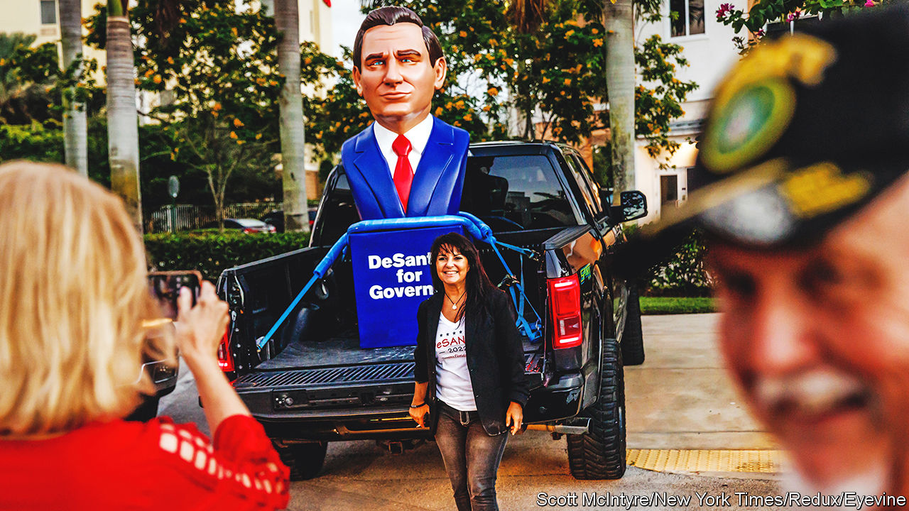

###### Do do run Ron

# Ron DeSantis may be Republicans’ best chance to prevent Donald Trump’s return 

##### How different is he? 

 

> Nov 17th 2022 

AND ON the eighth day, God created Ron DeSantis. At least according to his campaign, that is. A few days before being re-elected as Florida’s governor on November 8th by a hefty 19-point margin, Mr DeSantis’s wife, Casey, tweeted out a campaign advertisement, in which Mr DeSantis appears as the “fighter” whom God chose to protect his “planned paradise”.

This was borderline blasphemous, but the timing was good. In light of his outperformance in Florida while Republicans elsewhere foundered in the midterm elections, some donors now view Mr DeSantis as a potential saviour for the Republican Party, as it tries to move beyond Donald Trump. The 2024 election is still years away, and Mr DeSantis has yet to announce his candidacy, but support for him is growing. He managed to raise more than $200m for his campaign for governor, a national record. According to a poll by YouGov for , 46% of Republicans and Republican-leaning independents prefer Mr DeSantis as the 2024 nominee, compared with 40% who prefer Mr Trump.

At just 44, Mr DeSantis represents a new generation of populist conservatism, mirroring Mr Trump but without all the broken glass. Some like to compare him to another Ronald (Reagan) for his conservative stances on social issues, but in his public appearances and recent victory speech, Mr DeSantis is trying to portray himself as a Republican version of John F. Kennedy, with a glamorous wife and young family. The presidential comparisons are still premature. There are many questions about what Mr DeSantis stands for rather than against. But he is worth watching, because of the attention he is receiving and what he shows about how the Republican Party may eventually look after Mr Trump, whenever that day comes.

One way to think of Mr DeSantis is as a halfway house for Republicans who want to escape Trumpworld but see that the boundaries of the old territory have moved. Mr DeSantis has mimicked Mr Trump’s mannerisms and presented himself as the enemy of the left’s “woke” agenda. Like his fellow Florida resident, he attacks the media and revels in the subsequent media coverage, as happened when he chartered a plane to send migrants from San Antonio to Martha’s Vineyard in Massachusetts. He has not publicly taken Mr Trump’s position that the 2020 election was stolen, but he has alluded to improprieties. This year, one of his legislative priorities was to set up a special police force to investigate election fraud.

Despite their similarities, Mr DeSantis is a “more committed conservative than Trump”, says Aubrey Jewett of the University of Central Florida. After graduating from Yale and Harvard Law School, Mr DeSantis served in the armed forces, deploying to Iraq as a legal adviser with the Navy. In 2011 he self-published a book called “Dreams from Our Founding Fathers”, a play on Barack Obama’s memoir. In it, he combines his reverence for the “Federalist Papers” and constitution with his disdain for big government and Mr Obama. (“Some have claimed Obama to have been a Muslim as a child, but until he joined Reverend Jeremiah Wright’s Trinity United Church… Obama showed little regard for any religion,” Mr DeSantis wrote sneeringly.)

His animosity towardsMr Obama’s agenda, which he described as “the type of political programme that the constitution was designed to prevent”, continued in Congress. Mr DeSantis spent five years there, under Mr Obama as an opponent of the Affordable Care Act and founding member of the government-shrinking Freedom Caucus and then, when Mr Trump was elected, opposing Robert Mueller’s investigation into Russian collusion. On foreign policy Mr DeSantis largely defined his positions in opposition to Mr Obama’s. He is fiercely pro-Israel and opposed military intervention in Syria, a nuclear deal with Iran and cultivating relations with Cuba (a winning position with Cuban-American voters in Florida).

He ran for governor in 2018 as more of a moderate. Other than being pro-environment and raising teachers’ pay, he was light on state policy. At one point he cancelled a meeting with the  to give him more time to flesh out his governing platform. With the benefit of Mr Trump’s endorsement he unexpectedly beat the favoured Republican candidate. Mr DeSantis won the general election by 0.4%, or about 32,000 votes.

Mr DeSantis’s libertarian worldview helped him to surf two waves. First, he was early to lift lockdown restrictions during covid-19, correctly anticipating popular anger and frustration from people who wanted to see Florida reopen. Second, he anticipated scepticism of left-liberal overreach, including parents’ unease about school curriculums and issues of gender identity and sexuality. (The latter led to a very public row with Disney over the so-called “Don’t Say Gay” law that restricts discussions of sex and sexuality in public-school classrooms.) This year he endorsed dozens of candidates for local school boards, becoming the first sitting governor to get involved in such a way. 

His record in Florida combines an attention to voters’ concerns, such as the environment, and a desire to be seen as a strongman. “He’s done more on climate resiliency and the Everglades than any governor in history,” says Steve Schale, a Democratic strategist in Tallahassee. He has been happy to increase government spending, taking advantage of federal largesse (which he opposed) and using it to increase the salaries of teachers and police officers. But unlike some other states with Republican governors, Florida has not expanded Medicaid, another policy subsidised by the federal government. He has also revealed himself to be a fierce partisan willing to break with convention. Earlier this year he became the first governor in Florida’s history to propose his own maps during redistricting, which eliminated two black districts. The legislature pushed back at first but ultimately gave Mr DeSantis his way.

Bob McClure of the James Madison Institute, a conservative think-tank in Tallahassee, sees Mr DeSantis as deciding to promote “a robust federalism”. But besides being in favour of “freedom” and Florida staying open for business, it is unclear what his economic policies would be during more normal times. “For people who want answers to big questions on DeSantis, there is still a lot we do not know,” says Marc Sumerlin of Evenflow Macro, an economic consulting firm. Even Mr DeSantis’s donors say they do not know what he is in favour of, though they understand well enough what he is against.

I met him on a Monday

While he is pro-business, Mr DeSantis is not as reliably cosy with big companies as Republicans of yore. His spat with Disney helped attract the attention of national donors and voters. (Some expect the legislature to find a way to smooth things over during the legislative session next year, so that Disney is not actually stripped of its “special privileges” in Florida.) According to one donor, one way to interpret the large cheques that Mr DeSantis has received from billionaire business folk and financiers is that they are trying to keep Mr DeSantis onside, because they are “panicked” about whether he will stay friendly to business or turn populist.

With a Republican supermajority in the state legislature, Mr DeSantis is likely to use the next legislative session, which begins in January, to score more victories on divisive social issues ahead of announcing his run for president. Such an announcement would probably come next May, after the legislative session concludes.

Right now, Mr DeSantis has momentum on his side. But his political career also has points of friction. He can be aloof and socially unaware. He “mansplains” to donors without asking questions. His success in small-talk primaries like Iowa and New Hampshire is far from guaranteed. And of course there is the problem of the man who made him. Mr DeSantis may be developing an expertise in belittling his political opponents, but it will be another thing when Mr Trump, who perfected that playbook, unleashes it on him. ■


