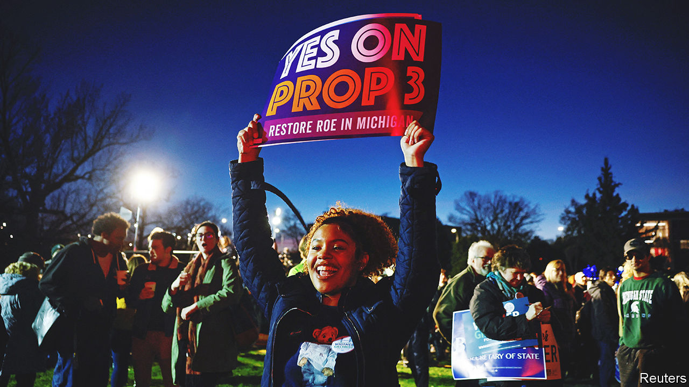

###### More in common

# Where abortion was on the ballot, Americans voted to protect it 

##### Reproductive rights faced the biggest test since the overturning of Roe 

 

> Nov 11th 2022 

Spare a thought for the voters of Michigan, who on top of all the other choices on election day navigated three ballot initiatives in their booths. The most controversial sought to write a “new individual right to reproductive freedom” into the state’s constitution. The long, woolly text left plenty of room for fearmongering. Vote yes and Michigan becomes the country’s abortion capital and children could be sterilised without parental consent, claimed opponents. Vote no and judges will decide on abortion and providers could go to prison, claimed proponents.

In the end, 57% voted in favour of a constitutional right to abortion. This makes Michigan one of three states—along with California and Vermont, which voted similarly—to explicitly protect reproductive rights in its constitution. This is a first. Some state supreme courts have previously interpreted their laws as including such a protection, “but adding it explicitly is a big deal”, says Elizabeth Nash of the Guttmacher Institute, a pro-choice think-tank. 

The backdrop to this is the US Supreme Court’s decision in June to overturn . That removed the constitutional right to terminate a pregnancy and left states scrambling with their newfound freedom to either protect or restrict abortion access. In response, five states used these midterms to ask their citizens directly. All five voted either in favour of greater protections or against further restrictions. 

Montanans rejected the most confusing bill of all, a “born-alive infant” law which would have required medics to try to save the life of any baby born alive, regardless of viability. Kentuckians were asked whether to amend their constitution by adding a clause that explicitly said abortion was not protected. Remarkably, in a state with some of the most conservative views on abortion, 52% rejected this. Only two years ago such an amendment was passed in Louisiana, where views on abortion are similar. The main difference seems to be that  was overturned in the meantime. Six weeks after that ruling voters in Kansas rejected a similar clause, in what now no longer looks like a fluke. 

The outcomes of the latest votes point to three bigger trends. First, Republican voters are more likely than their representatives to support some access to abortion. Second, that this support is not enough to drive them away from their party. And third, that in the post- world, ballot initiatives may well be a tool that primarily benefits those pushing for abortion rights. 

Most Americans favour some access to abortion and few want absolute bans. Six in ten believe abortion should be legal in most cases; only 8% believe it should always be illegal, according to PRRI’s American Values Survey. Over the past two years, the share of Republicans who believe abortion should be illegal in all circumstances has fallen by more than half, from 23% in 2020 to just 11% in 2022. The sharpest drop came just after  was overturned.

This is not to say America has suddenly become pro-choice. Four in ten Americans believe abortion is morally wrong, according to Gallup, a pollster. But the votes suggested that, for many, the outright bans that in some states followed the overturning of  were a bridge too far. Kentucky, where due to a “trigger law” abortion became illegal overnight in almost all cases, including rape and incest, is a case in point. “The old -world was likely more permissive than what the typical Kentuckian would like,” says Stephen Voss of the University of Kentucky. “But today the circumstances where abortions are allowed are likely stricter than what the typical Kentuckian would like.”

States—or citizens—wishing instead to protect access may feel emboldened by Michigan’s outcome. The vast majority of the 48 abortion ballot initiatives since 1970 have been put forward by the “pro-life” side. This could now change; “pro-choice” campaigners are actively plotting where to focus their attention next. Missouri, Ohio and Oklahoma are all potential candidates.

The immediate effects of these five referendums are limited, particularly in California and Vermont, where they are mostly an insurance policy. In Michigan, though, the new protection will make it much easier to throw out a contentious 1931 trigger law currently held up in court (the one that campaigners warned could land providers in prison). And in Kentucky, the result leaves the door open for legal challenges to regain some access to abortion.

Anti-abortion activists will be scratching their heads. Most people do not think the decision about an abortion is between a woman, her doctor and a local politician, says Laura Lindberg of Rutgers University. “That framing failed.” States that wish to further curtail access may conclude it is better not to ask people at all, and just implement bans. Those with existing bans may try to tighten them further, potentially even going after people who travel out of state for an abortion or order abortion pills online. Most state legislatures with ambitions to roll out more extensive bans have not even been in session since the  decision, notes Mary Ziegler of the University of California, Davis: “We are just at the beginning of this thing.”■


