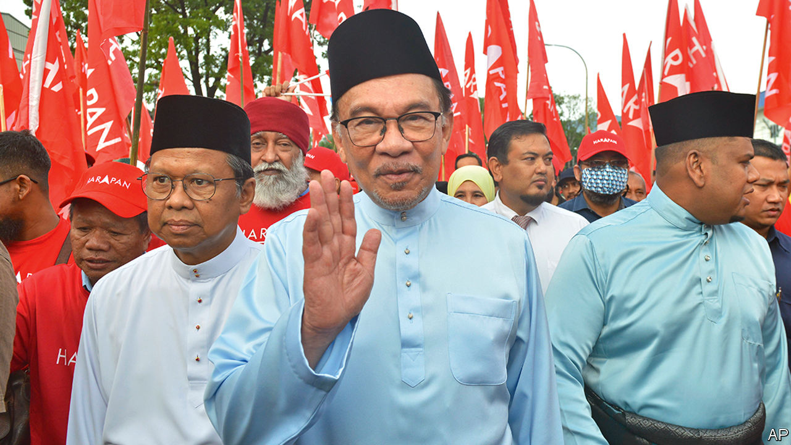

###### Political Malays

# Anwar Ibrahim becomes Malaysia’s prime minister 

##### An election designed to extinguish political uncertainty adds to it 

 

> Nov 24th 2022 

For six decades Malaysia was a rare monarchy in that its parliament was more stable than its palace. Each of the country’s six prime ministers between 1957 and 2018 outlasted the king who had appointed him. That is because the country’s throne is shared by nine regional monarchs, who take turns on it in rotating five-year stints. Yet the country’s civilian leaders are now in even greater flux. The current king, Sultan Abdullah, has seen three prime ministers come and go since his coronation in 2019. As  went to press on November 24th he seemed to have appointed a fourth: Anwar Ibrahim, a former deputy prime minister and longtime nearly man of Malaysian politics.

It was a messy business, Malaysian voters having on November 19th delivered the country’s first-ever hung parliament. Mr Ibrahim’s reform-minded Pakatan Harapan (ph) coalition won 81 seats. The Perikatan Nasional (pn) alliance of Muhyiddin Yassin won 73. With neither group close to a parliamentary majority, Mr Anwar and Mr Yassin both struggled to convince the king that they could nonetheless muster the support of the requisite 112 MPs. Thus, the elections completed a decade-long transformation of South-East Asia’s third-biggest economy from a restless one-party state to a fractured political mess.

Backing from local parties on the island of Borneo initially looked to give the advantage to Mr Yassin, whose 17-month stint as prime minister ended unmourned in 2021. That, in an unsavoury twist, left the task of kingmaking to the United Malays National Organisation (umno).

It governed Malaysia from 1957 until 2018, yet won only 26 seats thanks to a horrific run of scandals. In August Najib Razak, a former unmo prime minister, was jailed for 12 years on corruption charges related to a $4.5bn heist of public funds. The party’s unpopular president, Ahmad Zahid Hamidi, is facing charges of corruption and money-laundering (which he denies). That Ismail Sabri Yaakob, umno’s pliable current prime minister, nonetheless called the election early—allegedly at Mr Zahid’s behest—was a further act of hubris from a party that has now emphatically lost Malaysians’ trust. 

Yet Mr Zahid, to the undoubted dismay of many voters, was still able to dictate the make-up of the country’s next government. In a leaked letter, he informed the king that his party’s coalition would support Mr Anwar, who was an unmo minister in the 1990s before he suffered a bitter falling out with Malaysia’s governing party. Yet the king reportedly also received declarations from a dozen unmo mps vowing to support Mr Muhyiddin. Several unmo bigwigs meanwhile claimed that Mr Zahid no longer spoke for them and tried to oust him. As chaos descended, the governing council of unmo’s coalition declared that it would support no one. 

That forced Sultan Abdullah to become more than a passive observer. He instructed unmo and its allies to pick a side. He also urged Mr Anwar and Mr Muhyiddin, whose rival coalitions despise each other, to form a unity government if neither could make a majority. The parties duly bent to the royal will. unmo announced it would support a unity government so long as Mr Muhyiddin’s party did not lead it. In response Mr Muhyiddin’s pn coalition said that it would “consider” supporting a unity government—apparently handing Mr Anwar the premiership that he had several times been denied during a four-decade-long career. 

This amounts to a dazzling comeback. A former acolyte of Mahathir Mohamad, Malaysia’s longest-serving leader, the 75-year-old Mr Anwar gained prominence leading Malaysia’s response to the Asia financial crisis in 1997. He was expected to be Mr Mahathir’s successor. Yet after falling out with his former mentor, and briefly campaigning against him, he was tried and convicted in 1999 of sodomy and corruption. The conviction was overturned five years later and he returned to the fray; only to be charged with sodomy and convicted again in 2014. And yet again he was freed and pitched back into politics, vowing to fight chauvinism and corruption. His rise to power, if confirmed, would be of the most dogged kind. He might consider it additionally sweetened by the fact that his sometime rival Mr Mahathir, aged 97 but still power-hungry, suffered an embarrassing defeat in the election. 

Whether Mr Anwar could fulfil his reformist promises is another matter. With economic gloom on the horizon, Malaysia’s next leader will be under pressure to implement painful economic measures, including cuts to fuel subsidies. And yet the past four years have shown how inept Malaysia’s government can be when its leaders are weak and scrapping for survival. That is why Malaysian voters demanded change. With or without Mr Anwar, they may not get it. ■

