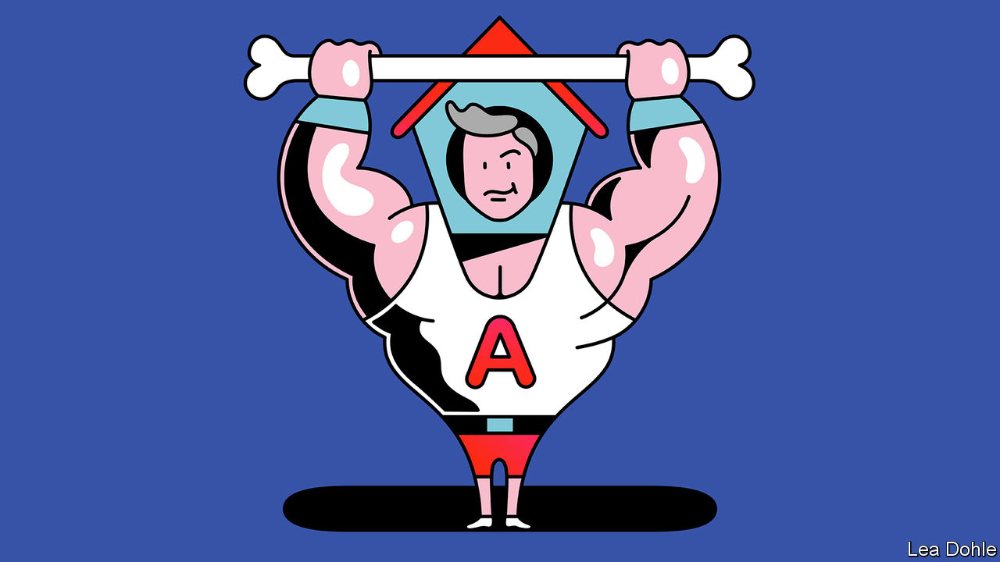

###### Banyan

# Australia emerges from China’s doghouse 

##### Standing up to Chinese bullying works better than capitulating to it 

 

> Nov 24th 2022 

It was the briefest of get-togethers, but when Xi Jinping met Anthony Albanese at the margins of the g20 gathering in Bali, it marked the first time China’s paramount leader had met an Australian prime minister one-on-one since 2016. It also signalled the drawing of a line under two years of extreme Chinese bullying in which Australia was made the butt of the most punitive trade measures that China has launched against any country. In Bali, Mr Xi at least unlocked the doghouse and left the door open for the abused Aussie mutt.

Few in Canberra expect China to rush to lift its embargoes on $20bn-a-year’s worth of Australian barley, beef, coal, lobster, wine and more. But bilateral communications, including military ones, may resume. That is a win. Australia and China are better off talking, said Mr Albanese—a line he has repeated often since coming to office at the head of a centre-left government in May.

For his part, Mr Xi said it was in both sides’ “fundamental interest” to develop their relationship. How true; which was why China’s descent into pique was so extraordinary. Only eight years ago Mr Xi addressed the Parliament in Canberra. A free-trade deal was signed. Mr Xi boasted of having visited every Australian state. Yet soon China was nurturing grievances over Australian actions, including speaking out on Chinese activities in Hong Kong, Xinjiang and the South China Sea and blocking China’s Huawei from critical telecoms infrastructure. When Mr Albanese’s conservative predecessor, Scott Morrison, called for an independent inquiry into the origins of covid-19, pesky little Australia was considered in Beijing to have offended the cosmic order. In November 2020, accompanying its import bans, China produced a list of 14 grievances and demanded that Australia “correct” its behaviour.

Mr Morrison ignored the demand, and took China to the wto over its barley and wine bans. Yet now China has relented. This was consistent with Mr Xi’s broader charm offensive in Bali. And no doubt the advent of Mr Albanese, a less abrasive prime minister, provided cover for the climbdown. At bottom, though, Australia’s refusal to bend meant the Chinese approach was just not working. It is a lesson, says Malcolm Turnbull, Australia’s prime minister from 2015 to 2018, universally applicable to victims of bullying: “Stand your ground.”

Australia has done so and emerged stronger, though China is by far its most important trading partner. It helps that China still depends on Australian iron ore and gas. Indeed, the value of Australian exports to China is higher now than before the bans. At the same time, Australia has spread its export bets by seeking new markets. Once, 42% of its exports went to China, now less than 30% do.

Some have certainly suffered badly. The incomes of Tasmanian fishermen have halved. About 1,000 wine businesses have gone under. But the government managed to persuade businesses that to give in to Chinese demands would mean the bully coming back for more. Most Australians approve of the government’s approach.

Australia is now better informed about Chinese assertiveness and more united in guarding against it, perhaps especially in defence. Stabilising Australia’s relationship with China, the defence minister, Richard Marles, said recently, “does not mean we won’t also maintain a clear-eyed focus on our security.”

Not all of Australia’s experience applies to others facing a spell in the pound (Canada, Japan, Norway and South Korea have all been kennelled at one time or other). It is also too soon to declare this a definitive Australian win. China has not lifted its embargoes yet, and the security situation in Asia remains tense. Still, the Australian example does offer some important lessons. 

Against Chinese coercion, assert international norms. And proceed calmly and consistently. Some of the Morrison government’s anti-China grandstanding was pointlessly inflammatory and alarming to Australia’s ethnic-Chinese citizens. Mr Albanese has been rewarded for his more temperate approach. It made China’s obstreperousness seem all the more unreasonable. “If the other side seems more rushed than you, it’s usually advantageous,” says an Australian official.

Also, remember that trade dependency works both ways. When it comes to self-denying ordinances, China is no committed wearer of the hair-shirt. Before long, Australian lobster may well be back on Beijing’s banqueting tables.■


 (Nov 17th)


