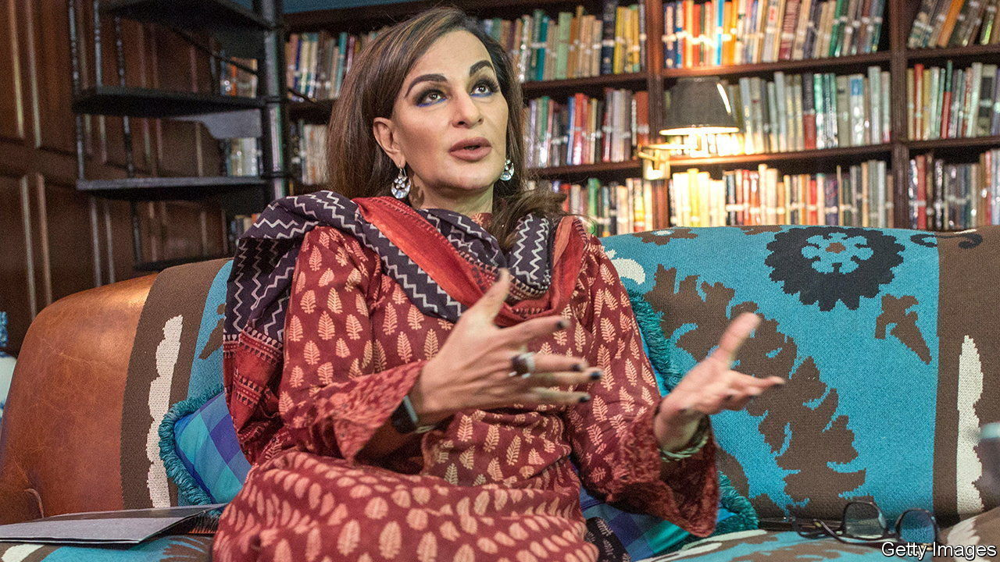
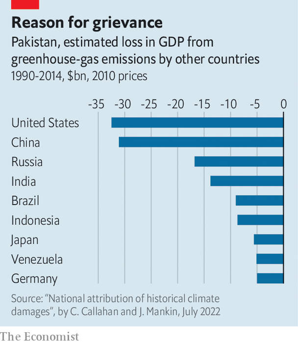

###### Sharm offensive

# How Pakistan emerged as a climate champion 

##### A country not known for leadership at home provides some abroad 

 

> Nov 24th 2022 

Pakistan is not often praised for its leadership. Yet its climate change minister, Sherry Rehman, was one of the star turns at the un climate talks held in Sharm el-Sheikh last week. At the helm of the “g77+China” negotiating group of developing countries, Ms Rehman won plaudits for shepherding a new deal to channel money from rich countries to poor ones that have suffered climate-related disasters. It was the annual climate jamboree’s single main achievement. 

Ms Rehman, a former journalist, information minister and ambassador to America, blends well-heeled glamour and toughness. A rare champion of Pakistani liberalism, the 61-year-old Karachiite is known for her fights against honour killings and the country’s cruel blasphemy laws. They have earned her multiple death threats. She also bears scars from a suicide blast aimed at her friend Benazir Bhutto (the former prime minister survived that jihadist attack, but not one weeks later). By comparison, the talks in Sharm el-Sheikh must have seemed like the holiday camp that the Egyptian town usually is.

 


Yet Ms Rehman was also assisted by the fact that the massive floods Pakistan suffered this year, costing an estimated $30bn in damages, are one of the biggest climate-related disasters on record. They gave moral authority to her argument that poor countries should receive “loss and damage” funds from the rich countries whose emissions have contributed to such calamities. A study attributes the engorged monsoon floods in part to global warming. Yet Pakistan is responsible for less than 1% of the stock of global emissions. 

Pakistani environmental activists, a subset of the country’s embattled liberal campaigners, hope Ms Rehman’s triumph will stir more climate action back home. It had been modestly increasing before the floods—with, for example, a few cases in which activists sued the government for neglecting its environmental commitments. Yet Pakistan’s climate change ministry is vastly underfunded. Just $43m were allocated to it this year from a federal budget of $47bn. A proposed national climate change authority has yet to be formed, five years after a law was passed to facilitate it. Pakistan, which experiences some of the hottest temperatures on Earth, has only just begun serious work on a national adaptation plan. 

The floods helped publicise such shortcomings. Pakistan’s few climate experts were suddenly hot property on the country’s news channels. But will that focus be maintained? As the government scrambles to provide flood relief, it is giving little thought to climate-proofing against future disasters. Before the floods, Ms Rehman was pushing a $11bn-17bn initiative to regenerate the Indus river that supports the livelihoods, indirectly or directly, of over 200m people. But funds that might have been earmarked for the programme are now going on flood relief.

The heightened global attention she has brought to Pakistan’s flood losses could attract a lot more money and relevant expertise. That could make the country a poster child not only for loss-and-damage activism but, more usefully, for long-term planning and climate resilience. There is a precedent for this. After a devastating cyclone in 1970 Bangladesh built one of the world’s best disaster preparedness schemes. A tragic, likelier scenario would see the momentum generated by Pakistan’s calamity and Ms Rehman’s astute diplomacy lost in a protracted relief effort and Pakistan’s usual obsessions with politics and scandal. At least, until the floodwaters rise again.■

