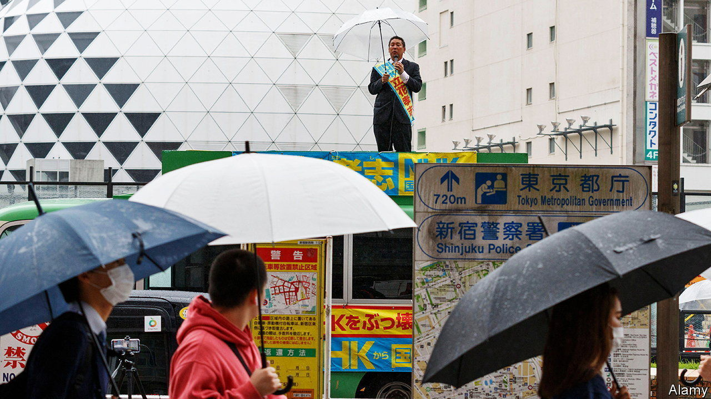

###### A storm in a satellite dish

# Japan’s oddball populists 

##### Boring mainstream politicians are inspiring opportunists 

 

> Nov 24th 2022 

A trembling voice leaks from a white flip phone: “My father passed away and hadn’t paid his nhk bill. What should I do?” Tachibana Takashi, a politician, advises the caller to ignore any requests from the national broadcaster’s notoriously strict bill collectors. After dealing with the call, Mr Tachibana films a video excoriating the broadcaster for his YouTube channel. He concludes, as always, by holding up his fists and shouting his party’s slogan: “nhk! (Destroy nhk!)”

His party, once known as the “Party to Protect the People from the nhk” (now simply the “nhk Party”), is one of several minnows with peculiar agendas to have entered national politics in recent years. Mr Tachibana, who founded the party in 2013, was elected to Japan’s upper house in 2019. In July two other oddball campaigners replicated the feat. One is Higashitani Yoshikazu, known as “GaaSyy”, a YouTuber and celebrity gossip. The other is Kamiya Sohei, whose right-wing Sansei-to party is anti-vax, anti-immigration and a firm advocate of organic vegetables. 

Bashing public television may be the epitome of Japanese populism. “I’ve always hated NHK,” says Kubota Manabu, an NHK Party supporter who helps people trying to dodge the broadcaster’s bills. The country is fortunate to have such footling rabble-rousers. Yet their emergence is not improving the country’s national conversation. During a recent televised debate, in which leaders of several political parties discussed weighty economic and security issues, the representative of the nhk Party, Kurokawa Atsuhiko, kept bursting into song. Ishiwata Tomohiro, a journalist who covers the nhk Party, describes Mr Tachibana’s movement as a bunch of headline-grabbing opportunists. “All they want to do is to create their own little kingdom.”

Japan has a history of such fringe groups. The New Party for Salary Men and the cultish Happiness Realisation Party are among several to have made it into the Diet before flaming out. Yet even if their success is fleeting, it offers a warning to the country’s mainstream parties. 

It is an indictment of how remote, opaque and mind-achingly dull they mostly are. Legislators often doze off during long-winded speeches in the Diet. This sets a low bar for insurgents. “All it takes to be popular is to be a little less boring,” says Axel Klein, a political scientist at the University of Duisburg-Essen. 

The contrast is especially striking on the campaign trail. The tactics of mainstream politicians, who tend to be old and grey, have hardly changed in decades. They generally drive around in a car with a loud speaker distributing pamphlets. Fringe parties make better use of social media. Amazingly, the nhk Party has four times as many subscribers on YouTube as the Liberal Democratic Party, which has ruled Japan almost without interruption since 1955.

That points to a more worrying trend. Japanese voters are deeply disaffected. Turnout in recent national elections has been around 50%. And the younger voters that fringe parties attract are most disillusioned of all. The ldp’s share of voters aged 18-29 fell from 46% in 2017 to 32% at this year’s upper house election. Unless the mainstream parties can reverse that trend, circus acts like the nhk party could turn out to be less an entertainment than an augury of more serious populism.■

