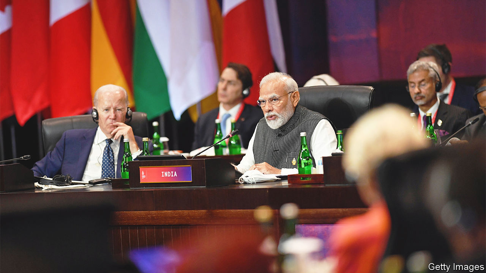

###### Diplomacy à la Modi

# On foreign policy, India is reliably unreliable 

##### The shifting balance of power obscures the continuity in India’s global ambitions 

 

> Nov 24th 2022 

When india formally takes the helm of the g20 on December 1st, it will do so as a prominent, sought-after actor on the world stage. Having refused to condemn Russia’s invasion of Ukraine, it was praised this month for its contribution to a joint declaration of leaders in Bali that did so implicitly. It then helped create a fund at the  in Egypt to compensate developing countries for climate-related damage. This week Jon Finer, America’s deputy national security adviser, described India as “very high” on America’s list of partners that “can truly help move forward a global agenda”.

Supporters of Prime Minister Narendra Modi and his Bharatiya Janata Party often attribute India’s growing stature to a more assertive foreign policy that dispenses with the deference and dithering which, they say, characterised the approach of previous governments. Mr Modi, a charismatic Hindu nationalist who claims to want to be the “world’s guru”, is said to epitomise that change. “In India’s case, nationalism has in fact led to greater internationalism,” said the foreign minister, Subrahmanyam Jaishankar, in a landmark speech on the evolution of Indian foreign policy. Yet setting aside its nationalist rhetoric, the Modi government’s approach and objectives abroad are remarkably similar to its predecessors’.

Ever since India won independence in 1947 its foreign policy has prioritised developing its economy, defending its territory and maintaining influence and stability in its neighbourhood. And it has done so imbued with a profound fear of being dominated by a more powerful country as it was for so long. It was this sentiment that drove India and other newly independent countries to pursue their interests without joining either of the two Cold War blocs, in what became known as non-alignment. “We do not intend to be a plaything of others,” declared Jawaharlal Nehru, who would become India’s first prime minister. 

Closening ties with America, which since the 1990s has viewed India as an important potential counterweight to China, are often said to have put paid to non-alignment. Indian officials in 2013 formally adopted a new guiding principle, strategic autonomy (without spelling out quite what had changed). In 2016 Mr Modi became the first Indian prime minister since 1979 not to attend the annual summit of the 120-country Non-Aligned Movement, which Nehru helped found. Under Mr Modi the closening with America has accelerated. India has expanded defence co-operation with it and sought more American investment. It has joined America, Japan and Australia in forming the Quad, a diplomatic network that seeks to promote, in tacit resistance to China’s growing influence in the region, “a free and open Indo-Pacific”. Mr Modi has described America and India as “natural allies”, a heretical term for non-alignment traditionalists. 

Yet that has not stopped his government maintaining all sorts of policies that America dislikes, especially concerning Russia, India’s biggest arms supplier for decades. This was highlighted by India’s 11 abstentions at the un on motions to criticise Vladimir Putin’s invasion of Ukraine. And also by the alacrity with which it has been stocking up on cut-price Russian oil and fertiliser. Some Indian commentators say Mr Modi has reembraced non-alignment. Indeed the prime minister started attending the non-aligned movement’s annual shindig again during the covid-19 pandemic. Perhaps America’s failures against the virus, including its unwillingness to lift export controls on vaccines while covid-19 raged in India, made him reevaluate his pro-Americanism?

In reality, India’s commitment to non-alignment was never as pure as the traditionalists suppose. As needs arose, it has always got into bed with one power or another. During its border war with China in 1962 it turned to America for arms. After America grew close to Pakistan it veered so far towards the Soviet Union, whose ideology the Nehruvian elite adored, that non-alignment became a euphemism for anti-Americanism. India’s ties to America are not markedly tighter now than its Soviet ties were then.

Its relations with America might indeed be more opportunistic than its ties to the Soviets were, contrary to what some pro-India American policymakers believe. “India is today an aligned state—but based on issues,” the then foreign secretary, Vijay Gokhale, said in 2019. Its accommodation with America, therefore, “is not ideological. That gives us the capacity…to maintain our decisional autonomy.” Underlining the point, Mr Jaishankar has suggested that America’s fading supremacy, of which its anxiety over China’s rise and eager outreach to India are symptomatic, gives India both reason and opportunity to hedge its bets. “India needs to follow an approach of working with multiple partners on different agendas,” he said. The country has pursued that course unusually vigorously under Mr Modi; hence, its recent hyperactivity in world affairs. But the approach is nonetheless squarely consistent with the realism and wariness of encumbrance that, setting aside its pro-Soviet blip, have always guided Indian foreign policy. 

But if its policy has changed less than advertised, how it is received abroad has changed enormously. India’s increased wealth and power mean that multiple partners are keen to work with it. This has helped Mr Modi look statesmanlike, guru-like even. And India’s many suitors are willing to excuse whatever in its behaviour they dislike. That was long true of Russia’s eagerness to sell India arms despite its friendliness with America. It is even more evident in the West’s careful response to its equivocation over the war in Ukraine.

Early in the war America’s State Department was reported to have recalled a stiffly worded missive to its diplomats instructing them to buttonhole their Indian counterparts over the war. “We know India has a relationship with Russia that is distinct from the relationship that we have with Russia,” the State Department’s spokesman said. This American reluctance to criticise India presented Mr Modi with opportunities both to maintain economic ties to Russia, and to win praise for chiding it even slightly.

Thus the plaudits he won after his gnomic semi-rebuke to Mr Putin—“today’s era is not an era of war”—was paraphrased in the Bali declaration. None of his predecessors would have been so praised for so pathetically little. No doubt Indian diplomacy has changed a bit over the past couple of decades. But the geopolitical context has changed more. ■

