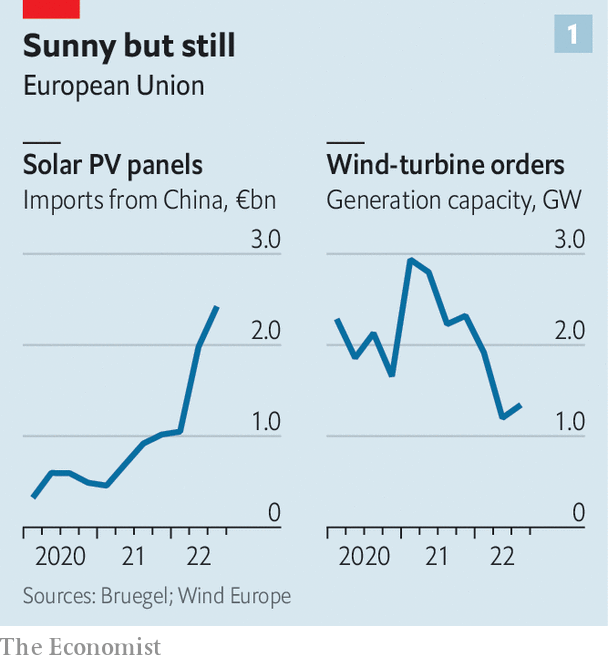
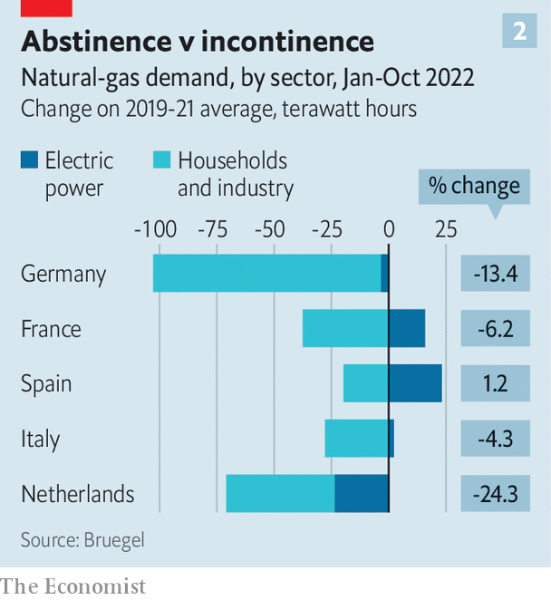
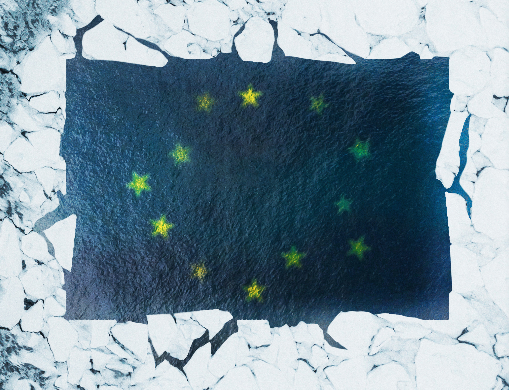

###### Chilling prospects

# The costs and consequences of Europe’s energy crisis are growing 

##### Despite appearances, the worst is yet to come 

 

> Nov 24th 2022 

Just five panicked months ago, with flows of natural gas from Russia plummeting and rationing and economic devastation looming, the European Union approved an edict ordering members to ensure that their gas-storage facilities were at least 80% full by November 1st. In the end, they easily beat the target. Storage is currently 95% full, with more gas waiting to be unloaded from a fleet of tankers idling off Europe’s coasts.

That is not the only indication that Europe is in for a less bitter winter than seemed possible only a few months ago. Natural gas to be delivered in the first quarter of next year is selling for about €125 ($130) per megawatt-hour (MWh), down from over €300 during the summer. Wholesale power prices in Germany, Europe’s biggest economy, have plunged from a peak of more than €800/MWh in August to less than €200 this week. 

As a result, the feared economic meltdown has not materialised. German industrial production ticked up in September and unemployment remained stable at 3%. An early estimate of GDP growth for the EU as a whole in the third quarter compared with the previous one came in at 0.2%–not much, but not a recession either. Employment continued to grow. Retail sales were up, too, hinting at undaunted consumers. Has Europe’s crisis ended before it even started?

The answer, sadly, is no. Europe’s politicians are spending lavishly both to obtain alternative supplies of energy and to shield consumers from high prices. But the energy crisis is far from over and rifts within Europe over how to deal with it are widening. Inflation is accelerating. The massive expense of energy subsidies is creating big fiscal problems. And the frantic scramble to keep the lights on has distracted governments from other pressing business. Europe’s crisis has only just begun. 

Power struggle

Energy is at the heart of the continent’s misfortunes. Although the wholesale gas price has fallen to about €125/MWh, as recently as last year it was below €20. Problems that contributed to the spike in the power price over the summer, including the shutdown of several French nuclear plants for repairs and low water levels due to drought in the rivers and reservoirs feeding Europe’s hydropower plants, persist, despite some improvement. And Russia still sells some gas to countries in southern and eastern Europe, and this week threatened to create yet more havoc in energy markets by cutting off supplies.

Russia used to provide 40-50% of the EU’s imports of gas. After the Russian invasion of Ukraine in February, Europe began trying to wean itself off Russian gas, albeit slowly, as there were no easy substitutes. But Russia abruptly throttled exports in June, and now supplies only about 15% of Europe’s imports. The EU’s plan to do without Russian gas has three main strands. The first has been to secure as much gas as possible from other suppliers, and so to fill storage to the roof in the hope of avoiding physical rationing over the winter. To that end, Germany built its first facility to import liquefied natural gas (lng) in record time; it will start operating in January. Long-planned pipelines from Norway to Poland and from Poland to Slovakia have opened, helping to diffuse gas around the continent. And European buyers have outbid prospective Asian purchasers of lng to build up stocks for the winter.

But no big new additions to global supplies of gas are expected until the middle of 2024. So next year Europe will again have to compete with Asian buyers. Competition may even be fiercer if China’s slump owing to covid-19 abates. And this year Europe imported lots of Russian gas until June; next year it will have a bigger shortfall to make up. That leaves Europe (and Asia) facing high prices for the next 18 months or so. 

Hence the second element of Europe’s strategy: to use less gas to generate electricity. Germany, home to a strong anti-nuclear lobby, belatedly and reluctantly agreed to extend the life of its last three reactors, albeit only until April. A few mothballed coal-fired plants have been cranked back up, despite the pollution that entails. And governments across Europe tried to accelerate the deployment of renewables, using tax cuts in Belgium and France, for instance, and by cutting red tape in the Czech Republic and Italy. Imports of solar panels leapt this summer as Russian gas exports evaporated (see chart 1, left panel).

 


Despite all this, however, the amount of gas-fired power has actually grown, because of the big reductions in nuclear and hydropower generation. EDF, the state-owned operator of France’s nuclear plants, keeps revising down its generation forecasts. Although a wet autumn has refilled reservoirs in the Nordic countries, hydropower remains curtailed in Italy. And it takes time, whatever the incentives, to expand wind-power in particular. Orders of wind turbines, a good indicator of future output growth, dropped sharply in the second quarter of 2022 and barely recovered in the third, according to WindEurope, an industry group (see chart 1, right panel). 

Power cut

The third element of Europe’s response to the supply shock has been to try to curb demand for both gas and power. EU countries have consumed about 10% less gas so far this year, compared with previous ones. Power consumption is also down, though not as much.

 


Some unseasonably warm weather has dampened demand for gas for heating. The high prices of both gas and power are also encouraging parsimony to some degree. The problem is that many European governments are determined to shield consumers from the full effects of the gas shortage, for fear of the economic and political consequences. France, for one, has capped the price of gas at last year’s level and that of power just 4% higher than last year. It intends to increase these caps by only 15% in 2023. Spain has subsidised the use of gas in electricity generation to bring down prices. And Italy, which generates 40% of its electricity from gas, has cut taxes on both power and gas consumption. The inevitable result is that these countries have cut back much less than Europe’s other big economies (see chart 2).

Such disparities in conservation efforts go against another injunction from the EU, that its members cut gas consumption by 15% across the board. Indeed, when it comes to energy policy, Europe seems as short of solidarity as it is of gas. A proposal to issue common EU debt to fund energy subsidies in member-states whose budgets are too stretched to allow them to do so individually was shot down by Germany. This week the EU is arguing over a proposed cap on wholesale gas prices. 

The European Commission has suggested a ceiling of €275/MWh on the benchmark European futures contract, provided global lng prices are at least €58 lower. That is too high for some countries such as France and Spain, which fear the cap may never actually kick in. But a lower one would trouble others, including Germany, in case it leads to shortages, as gas is diverted to other parts of the world. And it is anyway not clear how well the cap would work in practice, given that private sales, as opposed to contracts traded on exchanges, would be exempt.

The bickering reflects diverging interests. German industry depends on gas, and would rather pay swingeing prices than risk rationing. France does not consume much gas, but is importing lots of power to compensate for its nuclear shortfall. It is keen on any measure that might suppress wholesale power prices. Spain has a pipeline to Algeria and ample capacity to import lng, so is unlikely to run short. But the price it pays for some of the gas it imports is tied to the European benchmark, so it has a strong interest in capping the price. And then there are other countries, such as Italy and much of eastern Europe, where the fiscal and economic implications of high gas prices are so grim they are willing to try anything to ease the burden.

These divisions will presumably worsen as the economic outlook gets gloomier. The current strength of the economy is mostly a holdover from the past. Firms sit on a record number of orders left unfulfilled because of the pandemic and subsequent disruptions to supply chains. Households in richer countries still retain savings that accumulated when restrictions on travel and fun made spending money hard.

Moreover, whereas inflation seems to have peaked in America, in Europe it is still accelerating. The share of items in the basket used to calculate inflation whose price has risen by more than 4% over the past year is growing. The delayed impact of higher energy prices thanks to subsidies will drag out the period of high inflation. That, in turn, is more likely to lead to jumps in wages and the price of services, and so prolong the spiral of rising prices. Senior figures at the European Central Bank (ecb) have suggested that a further sharp rise in interest rates will be needed. 

No wonder, then, that surveys suggest that European firms are dreading the next couple of months. The commission’s latest forecast sees a mild recession during the winter and stagnation for the rest of 2023. Goldman Sachs, a bank, reckons that Europe’s economic output will be permanently reduced by 2-3% as a result of higher energy prices.

Power switch

Substitution away from expensive energy could halve that cut in output, Goldman reckons, and some of that substitution is happening. A recent survey by ifo, a German research institute, found that 75% of manufacturing businesses in Germany have cut back on gas without curtailing production. It is the other 25% that are the problem. Basic chemicals, metals and ceramics are struggling to remain competitive. Bosses of such firms have been jumping up and down. Forswearing Russian gas, the CEO of BASF, a big German chemicals firm, said in April, would “destroy our entire national economy”.

The response of the broader public to Europe’s energy crisis has been more muted. There have been some protests at rising prices and strikes over wages that have failed to keep pace. But there has been no continent-wide movement akin to the , protesters who brought parts of France to a standstill in 2018-19 over the cost of living. In fact, the relatively few big protests in recent months have tended to focus on local issues. A demonstration that organisers said brought some 670,000 people onto the streets of Madrid on November 13th was focused on health care, not energy prices. The share of Germans willing to support Ukraine despite high energy prices has remained at 70% or higher since July, according to Forschungsgruppe Wahlen, a pollster.

Another poll, commissioned by the EU over the summer, as energy prices were at their highest, found that 70% of Europeans felt good about the financial situation of their household. Asked about their work, people said their prospects had improved and were likely to keep on doing so. Yet at the same time, two-thirds of Europeans thought the health of their country’s economy was bad—and notably worse than before the war. Although they were aware of the baleful consequences of the energy crunch, in short, few respondents felt it had impacted them much directly. 

This relaxed attitude, however, stems from the lavish subsidies that many EU governments are doling out, which are unlikely to prove affordable in the long run. Since September 2021, €573bn of public money has been allocated to keeping energy prices affordable, according to Bruegel, a think-tank. Nearly every country has given up tax revenue from energy, for example by cutting VAT. There have also been bail-outs of utilities, transfers to poorer families and in many cases, blanket subsidies for all households and industry.

The largesse is distributed unevenly, both within and among European countries. Germany alone accounts for €264bn, while Sweden has spent less than €2bn. The total planned expenditure, which is due to last years in some cases, equates to nearly €3,000 for every European household, almost as much as is devoted each year to education. The European Commission believes that more than two-thirds of all the spending is untargeted.

There has not been much discussion of whether these policies are a good use of public funds or how they will be paid for, although Germany’s scheme, despite being untargeted, does at least preserve an incentive to curb consumption (and Britain did partially unwind a ludicrously generous handout to households earlier this month). The “whatever it takes” strategy adopted during the pandemic, during which governments tried to absorb most of the economic harm done, has been largely replicated. “We are in a situation where companies need our support, in order to protect Germany’s economic fabric,” intoned Robert Habeck, Germany’s economy minister, in September. 

The generous handouts, however, not only blunt Europeans’ incentives to conserve energy, but also weigh on government budgets. Some countries can afford to be generous. The likes of Denmark and the Czech Republic have low government debt and could splurge for years. But southern Europe has far less leeway. Italy, Spain, Greece and France went into the crisis with debt-to-GDP ratios of over 100%. Their energy-support schemes will add 3-6 percentage points to their debts.

Although EU rules imposing caps on public spending on governments with debts of over 60% of GDP have been suspended, the debt burdens built up during the course of the pandemic and the energy crunch will constrain budgets for years to come. What is more, over the coming decade the need to spend more both to combat climate change and to succour an ageing population will weigh on public finances yet more. And the question of how quickly spendthrift governments should reduce their debts is already a fraught topic within the EU.

 


Some policymakers fret that much more debt will make markets jittery. Christine Lagarde, head of the ECB, has warned European finance ministers that a surge in public spending could lead to a more rapid rise in interest rates. Countries with especially towering burdens may need the ECB to help prop up their debts. 

At the very least, the subsidies will squeeze out other spending. On November 20th Italy’s new government, headed by Giorgia Meloni, postponed some of its election programme, including tax cuts. Instead, it will give a further dollop of aid to households and businesses, adding a further €30bn to the €75bn already committed since the start of the crisis. 

Power drain

By the same token, the focus on energy is consuming all European politicians’ time and attention, to the neglect of any other policymaking. With so much concern about getting through the coming month or year, little thought is being given to economic measures that will bear fruit over a longer timeframe. That is nothing new: since covid-19 struck, awkward reforms have been repeatedly postponed. In France, for example, President Emmanuel Macron shelved a contentious overhaul of pensions at the outset of the pandemic. Other countries are trying to worm out of reforms they committed to in order to secure cash from the EU’s post-pandemic recovery fund. 

Policymakers had once hoped that 2022 and 2023 would be a period of economic overhaul of a similar ambition to Mr Macron’s abandoned pension reform. Unemployment was at record lows, in part thanks to covid-era stimulus policies, which might have made painful changes seem more endurable. “The public had seen how generous the state had been [during the pandemic], and maybe would have understood if they had been asked to make efforts, for example on retirement ages,” says a European official. With both French and German elections out of the way, the electoral cycle also posed fewer impediments than usual. 

But that opportunity for reform, if it ever existed, has been obliterated by Mr Putin’s energy crisis. Plans to increase Europe’s competitiveness have been deferred once again. Money that could have been spent helping those harmed by economic restructuring has gone on energy subsidies instead. The most painful injury inflicted by the gas shortage, in other words, has yet to be felt. ■

