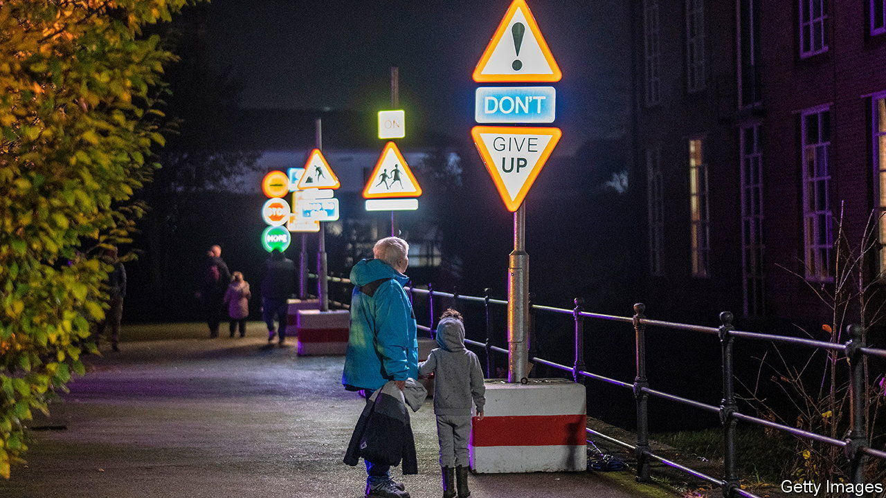
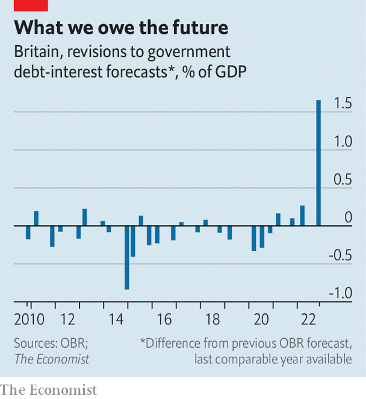

###### The downturn

# Britain’s economic outlook is very gloomy 

##### Are there any glimmers of hope? 

 

> Nov 24th 2022 

As the festive season approaches, economic cheer is thin on the ground. Household incomes are being pummelled by soaring energy bills. Rising interest rates are squeezing mortgagors and throttling the government’s finances. Taxes are rising. The Office for Budget Responsibility (obr), a fiscal watchdog, is predicting the steepest drop in living standards on record. On November 22nd the oecd, a club of mostly rich countries, predicted that over the next two years only the Russian economy would fare worse among G20 countries. The Bank of England reckons the recession . Could anything brighten the gloom? 

 


One hope is that interest rates rise more slowly than previously feared. When the OBR and the bank made their forecasts, both assumed that rates would follow the path investors were betting on—in the obr’s case, rising to 5% in 2023. Interest-rate expectations shot up globally during the autumn (and in Britain were briefly propelled above 6% by a disastrous ). Plugged into economic models, high rates produce awful results. The obr’s forecast, released on November 17th, marked up projected debt-interest spending by more than ever before (see chart). The Bank of England projected the recession would cause inflation to crash beneath its 2% target by 2024.

Yet it is the bank, not investors, that sets rates. Its forecast was a signal that markets were too hawkish. Sure enough, the expected peak rate has since fallen to 4.6%. Lower rates mean cheaper borrowing and more growth. Had the OBR measured expectations closer to when its forecast was released, the government’s finances would look £10bn better in the 2027-28 fiscal year, an improvement of 0.3% of gdp. The OBR’s rule of thumb is that a one percentage point fall in long- and short-term interest rates would raise gdp by 0.4%. 

Imogen Bachra of NatWest, a bank, warns that so far this year investors have largely been vindicated in their expectations of sharply rising rates. Their projections are partly based on the observation that the labour market has been pretty resilient to interest-rate rises so far, and so monetary policy will need to be aggressive to stamp out inflation. If rates do not rise as quickly as investors expect, that is not necessarily good news. Kamakshya Trivedi of Goldman Sachs, another bank, points out that such a scenario would probably involve weaker-than-expected demand. 

The best sort of surprise would be one that reduced inflation while allowing the economy to produce more. An easier trade relationship with the eu or lower global energy prices could achieve that. The latter, which seems likelier, would reduce pressure on household incomes and help the public finances by reducing the cost of government support. It would also boost growth. The obr reckons that for each 10% fall in energy input prices, potential output could be lifted by 0.2%. Optimists should study energy markets carefully, then. And try to forget that what can go down can also go up. ■


