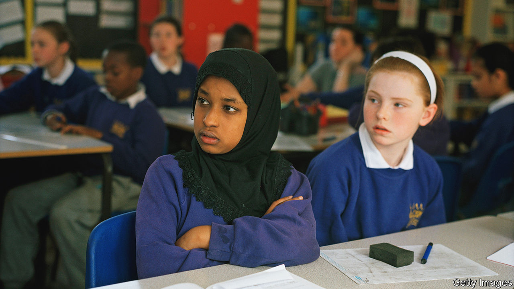
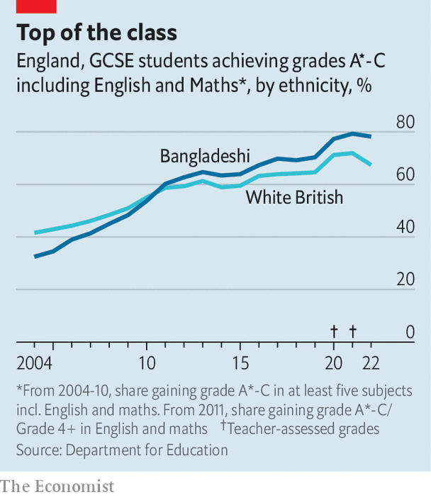

###### Ethnicity and success

# British Bangladeshis are doing astonishingly well at school 

##### Good jobs and household riches remain out of reach 

 

> Nov 24th 2022 

In 1985 two articles about the Bangladeshi population of east London appeared—one in an academic journal, the other in an education report. Both were despondent. Bangladeshi children were “seriously underachieving” at school, said the education study. The academic paper described knots of unemployed men hanging around the streets, and forecast even worse for Bangladeshis as London deindustrialised. Barring a major intervention, the authors wrote, “they will become more marginalised than at present.”

 


Happily, something has happened to a group that accounts for about one percent of the population of England and Wales. Over the past two decades Bangladeshis in England have gone from performing worse than white Britons in the gcse exams  to performing considerably better (see chart). No other  has improved as much. Bangladeshis now compete for top university places and good jobs. Their progress suggests several things about success in Britain. 

Bangladeshi immigration began in earnest in the early 1970s. Many migrants settled in the inner East End of London, close to the financial district. They were penned there by local councils operating discriminatory housing policies, and by racists who attacked those venturing farther into the East End (and sometimes also those who did not). They often went into the rag trade and restaurants. 

Education results were indifferent, especially among girls. “My girls didn’t tend to go to university,” remembers Vanessa Ogden, who became head teacher of Mulberry School for Girls, a largely Bangladeshi school in east London, in 2006. Many were expected to marry, then toil at home. Some resented that. “When we marry and have daughters we will treat them differently,” a Bangladeshi pupil somewhere in England told a schools inspector in 2004. 

She seems to have kept her word. At Mulberry School for Girls, four-fifths of sixth-formers secured university places this year. In England, the share of Bangladeshi 15-year-olds who go on to enrol in the most competitive universities has jumped from 5% to 16% since 2009-10, while the rate for white Britons has risen only from 8% to 10%. Mulberry girls tend to attend London universities and live at home, although that may change as parents grow bolder. Ms Ogden recently organised a trip to Cambridge, where parents were happy to learn that colleges have porters to keep students safe—something that the upper middle classes have long known. 

One conclusion from this success story concerns policy and patience. Heidi Mirza, who was appointed to an education task force by the Labour government in 1997, argues that the extra funding and attention lavished on poor inner-city schools then are bearing fruit now. Recently, under Conservative governments, those things have moved elsewhere. The “levelling up” strategy published in February identifies 55 education investment areas, none in London. That might harm Bangladeshis’ prospects, but probably not for years. 

Another conclusion is that it helps to be a Londoner. The city’s fortunes began to revive in the mid-1980s, thanks partly to financial services deregulation. As the most London-centric of all ethnic groups—in 2019, 55% of all Bangladeshis were estimated to live in the capital—they have been hitched to an economic rocket. Two American academics, Ran Abramitzky and Leah Boustan, recently argued that much immigrant success in that country can be explained by the fact that they tend to land in places with strong economies. 

The final conclusion is that the road to true prosperity is very long. Some 24% of Bangladeshis receive income-related benefits, compared with a national average of 16%. The Office for National Statistics estimates that the median Bangladeshi household has about one-fifth as much wealth as the median white British one.

Fewer than half of Bangladeshi women aged 16-64 are economically active, compared with about three-quarters of white, black and Indian women. Combined with low wages, that crushes household incomes. Still, the proportion is creeping up. Syeda Khatun of the Bangladeshi Women’s Association, a West Midlands outfit, says early immigrants almost never worked outside the home. These days even mothers do. “You can’t get a mortgage on one person’s income”, she says. 

Although it helps a lot, educational prowess does not automatically lead to good jobs; British Bangladeshis fare worse in the job market than they should, given their qualifications. And good jobs do not lead quickly to wealth that can be transmitted from generation to generation. Bangladeshis have done extraordinarily well. They will have to do even better in future.■


