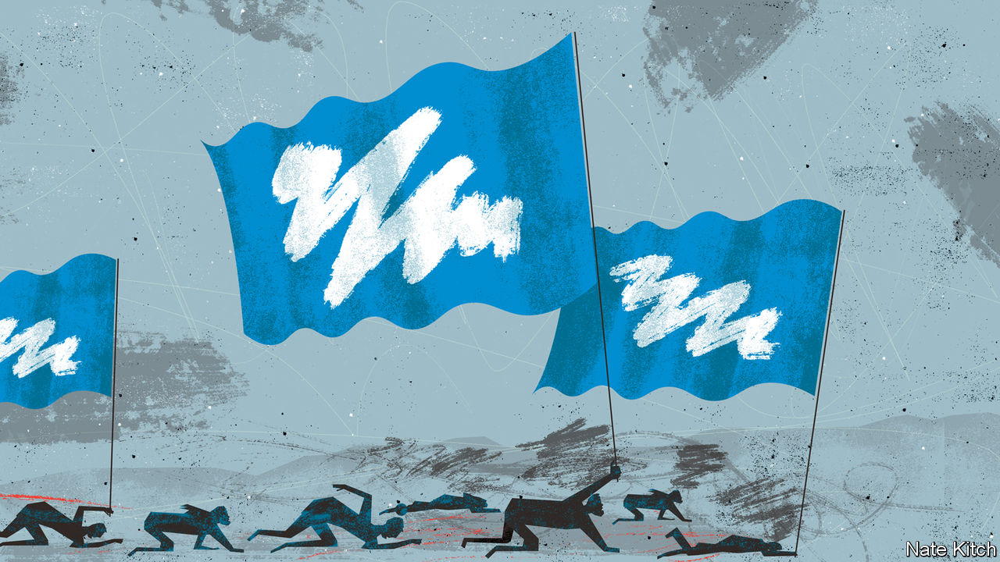

###### Bagehot

# It is easier to imagine the end of the world than the end of Tory rule 

##### After 12 years of Conservative government, Britain has a limited political imagination 

 

> Nov 24th 2022 

The best guide to British politics today was written 13 years ago and features the Marxist analysis of Slavoj Zizek applied to the Disney film “Wall-E”. “Capitalist Realism”, a short and eclectic book by Mark Fisher, a leftie cultural theorist, became an unlikely bestseller after it was published in the wake of the global financial crisis. Its main argument was that an alternative to capitalism was not just impossible but incomprehensible. It was, in the book’s punchy refrain, easier to imagine the end of the world than the end of capitalism.

A similar sensation overcomes anyone observing British politics. Conservative realism has become embedded in Britain. Capitalist realism created “a pervasive atmosphere,” wrote Fisher, “acting as a kind of invisible barrier constraining thought and action”. So too does its Conservative cousin. The breadth of British politics stretches from one end of the Conservative manifesto to the end, and no further. The Conservatives may be struggling in the polls, potentially facing a landslide defeat. But Conservative realism will continue long after the party from which it takes its name leaves power. 

After 12 years of Conservative rule, Britain has a limited political imagination. When a government source suggested closer ties with the eu, a weeklong bloodletting followed, with anonymous briefings shutting down the idea. That a clear majority of Britons now think leaving the eu was a mistake barely influences the debate. So both the Conservatives and the Labour Party, which promises a similarly detached relationship with Brussels, plough on with an argument in which public opinion is an irrelevance.

It is the same with immigration. The sainted nhs and the unsainted cbi are crying out for more workers. Polls indicate that Britons, on the whole, are happy for immigration to go up if needed. Yet talk of looser immigration rules are pooh-poohed by government ministers. Labour discusses the topic with the caution of a hostage negotiator dealing with a suicide-bomber. That certain topics, such as planning reform, are politically is due to the constraints of conservatism, rather than some law of physics. 

Jeremy Hunt, the new chancellor, set out a budget on November 17th that was steeped in Conservative realism. The spending cuts are not on the same level as those under George Osborne, the Tory chancellor from 2010 until 2016. But the philosophy is the same. Deep spending reductions will come at some point in the future, while capital investment will be squeezed. Labour tuts from opposition but accepts the parameters set by its opponents. 

In a world of Conservative realism, only certain voters count. Invariably these are immigration-sceptic, Leave-voters generally in the Midlands or the north—a proverbial voter that dominates the thoughts of people who rarely leave Westminster. The wishes of, say, a well-off liberal in Surrey who would have happily voted for the Conservatives in a previous guise are dismissed, in the same way as those of a toddler or a dog might be.

Younger voters are forgotten, too. “What happens if the young are no longer capable of producing surprises?” asked Fisher. He pointed to a stagnant culture, despairing at pop bands that sounded like lame 1960s throwbacks. A similar problem afflicts British politics: what happens when the young are incapable of effecting political change? The answer is a stagnant economy. Where pensioners are spread across the country, making them crucial in every constituency, younger voters are piled up in cities, weakening their electoral clout. Britain is ruled in the interests of the elderly, for whom economic growth feels like an inconvenience rather than a necessity. 

Labour has a solid lead of over 20 points in the polls, putting it on course for a comfortable or even rather large majority. But this demonstrates the triumph of Conservative realism, rather than a challenge to it. Sir Keir Starmer won the Labour leadership promising to continue the programme of Jeremy Corbyn, his left-wing predecessor. But Sir Keir intends to win the next election on a platform of Conservative realism. Unless the party changes course in office, Labour will govern within the Tory parameters of low immigration, tight spending and a distant relationship with the eu. 

The strategy is understandable. Challenges to Conservative realism rarely end well. Mr Corbyn’s project dragged Labour to its worst performance since 1935. Liz Truss, Britain’s short-lived prime minister, challenged the orthodoxy from the other end. Britain was to be hellbent on growth. Unfortunately the anti-growth coalition that she promised to attack was found largely in her own party. Conservative realism reasserted itself; Ms Truss became an answer in a pub quiz. 

Pity poor Albion 

People have begun to notice that things are not working well. They will get worse. The country is about to suffer its biggest drop in real incomes since records began, with a 7% fall over the next two years. Taxes will rise. Earnings will dip to where they were in 2013, when Britain was in another period of stagnation. Voters have realised that Conservative realism has not produced good results, even if neither party has quite caught up. Those who realise radical change is needed are still in a minority in both the Conservatives and Labour. There is no alternative, for now. 

And so the Conservatives hope to replay the 2010 and 2015 elections, when the party was far from liked but still elected. Taking difficult decisions now, such as whacking middle-class voters with higher taxes on income, will be grudgingly rewarded by voters, who see economic pain as a proxy for competence, runs the argument. Fisher ended his text on a hopeful note: “The tiniest event can tear a hole in the grey curtain of reaction which has marked the horizons of possibility.” Sadly for Fisher (although happily for this newspaper), capitalism did not crumble. Capitalist realism survived. Its Conservative cousin will too. ■


