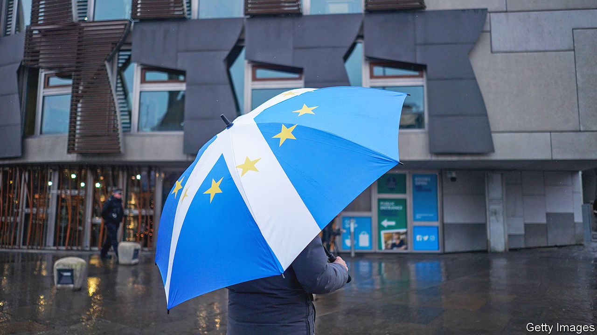

###### A long road

# Scotland’s independence movement suffers a setback at the Supreme Court 

##### One route to an independence referendum is blocked. Nicola Sturgeon seeks another 

 

> Nov 23rd 2022 

“It’s up to this place now,” said Finlay Royle, gesturing towards the Houses of Parliament. He was leading a demonstration, clutching Saltires and eu flags, outside the Supreme Court on November 23rd. Mr Royle seemed rather chirpy for one whose campaign had just been dealt a blow; but breaking up a country is not for the faint of heart. 

Hours earlier, Lord Reed of Allermuir, the president of the court and a Scot, had delivered a judgment that reshapes Britain’s constitution. The Scottish government had asked whether the devolved parliament in Edinburgh has the power to legislate for  on independence without the agreement of the Westminster Parliament. It does not, said Lord Reed. The court could have ducked the issue; the “boldness and clarity” of its decision was a surprise, says Richard Parry of the University of Edinburgh. 

The Scottish government had argued that a referendum would have no immediate legal effect, and would therefore be within its remit. Yet Lord Reed and his four colleagues unanimously decided that it would have a significant political effect by helping to undermine the union—that was the point, after all. It was therefore beyond the Scottish Parliament’s limited scope. They brushed aside a submission from the Scottish National Party (snp) claiming a right to self-determination under international law. Such concepts apply to colonies and to victims of foreign military rule, not to Scots, the judges said. An artful ambiguity has been ripped from the constitution. It is now beyond doubt that Scotland cannot unilaterally leave the union. It takes two to divorce. 

This blocks the road for , Scotland’s first minister and leader of the snp, at least for a while. She wanted to hold a referendum on October 19th, 2023—a fresh shot at separation after Scots voted in a referendum in 2014 to stay in the United Kingdom. But she insists that to be credible it must be lawful. She is unable to organise one herself; the British government won’t organise one for her. Her strategy now is to denounce the United Kingdom as a prison. “This ruling confirms that the notion of the uk as a voluntary partnership of nations is no longer,” said Ms Sturgeon. The next British general election, expected in 2024, will be a “de facto” referendum on independence, she said.

Quite what that means is unclear. The snp will decide how to proceed at a special party meeting in the new year. Trying to turn an election into a referendum looks like a gambit to hold together a nationalist movement that has been pushing Ms Sturgeon to deliver results and is running out of patience: one more election, one last heave. This is a high-risk strategy. Scotland’s other parties are free to ignore Ms Sturgeon and say that the election is really about the economy, health care or the upkeep of the pavements. The snp has failed to stir more than half of Scots to support independence and only 39% of Scots think a general election could serve as a proxy referendum, according to Ipsos, a pollster. Ms Sturgeon’s denunciations of Britain’s democratic deficit will fire up her base. But they will probably do little to widen support for independence among undecided Scots who are wary of its costs.

In principle, the Supreme Court’s decision gives the British government the legal cover to pursue a hard unionist strategy, declaring independence to be impossible forever. That would be unwise. Rishi Sunak, the prime minister, so far appears to be pursuing a softly-softly approach, stressing co-operation. 

Yet regardless of what the court ruled, the nationalist movement is more dependent on the British government than it likes to admit. “Any viable path to independence depends on co-operation between the Scottish and uk governments at every stage,” remarked Anthony Salamone, a Scottish political analyst, in a recent lecture. Treaties would need to be written; assets and debts divided; border posts built; nuclear submarines moved. It would be a titanic joint endeavour, in which the British government would hold many of the cards. Getting a referendum has become a distant prospect, and it is just the start. ■


