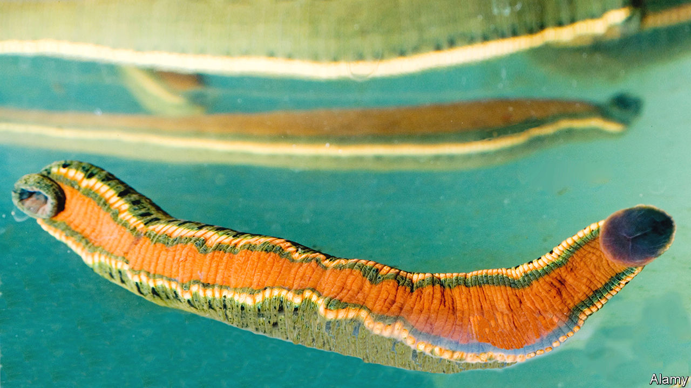

###### Biotechnology

# Wales’s trade in leeches and maggots 

##### It produces fly larvae and bloodsucking worms for use in hospitals 

 

> Nov 24th 2022 

The bite of a worm with several hundred teeth leaves a distinctive mark, as Victorian leech collectors knew well. Wading bare-legged through Britain’s bogs they enticed leeches to sell to doctors for a penny each. Around 42m a year are thought to have been used in the early 19th century to treat conditions from colds to dysentery. The marshes of Cumbria, Kent and Somerset were prime territories for the annelid. But the mudflats of south Wales became home to the biggest operations. Welsh leeches contributed a quarter of Britain’s leech profits, around £250,000 per year during the Victorian era (£24m in today’s money).

The use of leeches in medicine originated with an old belief that illness was a result of an imbalance of the “humours”, which required bloodletting. Today, leeches’ bloodsucking is used to aid the rejoining of tiny blood vessels. The anticoagulants in the worms’ saliva can help to kick-start blood flow to a reattached appendage. And Wales once more has a near-monopoly on the trade. In the rural village of Hendy in south Wales, Biopharm Leeches, Britain’s only such production company, supplies up to 70% of leeches used in health care worldwide. It keeps them in tanks of water and feeds them on black pudding of sheep’s blood in sausage skin. 

Travel 48 kilometres south-east, meanwhile, to the town of Bridgend, to find the only other living animal approved as a medical device by America’s Food and Drug Administration: the medicinal maggot. BioMonde, a European wound-care business, supplies thousands of maggots to the nhs. BioMonde feeds green bottle blowflies on a mixture of protein, sugar and water and hatches its larvae in specialised, highly sterile labs. Maggots can be used to treat chronic wounds. They secrete enzymes that break down dead tissue, before hoovering it up to eat. 

Like leeches, maggots have a long history in treating wounds. They are thought to have been used by the Mayan tribes of Central America and Aboriginal Australians. Their first recorded use by a doctor was during the American civil war. But today, almost 10% of people would rather have a limb amputated than maggots applied to it, according to a survey by Yamni Nigam, an entomologist at Swansea University. 

Ms Nigam runs Swansea University’s “Love a Maggot” campaign to reduce the “yuck factor” of larval therapy. She has worked with the producers of “Casualty” to get maggots into the medical tv drama. Dr Nigam says the worms’ “really superb antimicrobial mechanisms”, developed over 250 million years, mean they will become increasingly useful in the fight against antibiotic resistance. 

Why is business booming in Wales? Ms Nigam reckons “openness of the people” plays a part. For Carl Peters-Bond, a leech farmer at Biopharm Leeches, it is about the water, which is “absolutely outstanding”. His leeches, he says, are “really picky”.


