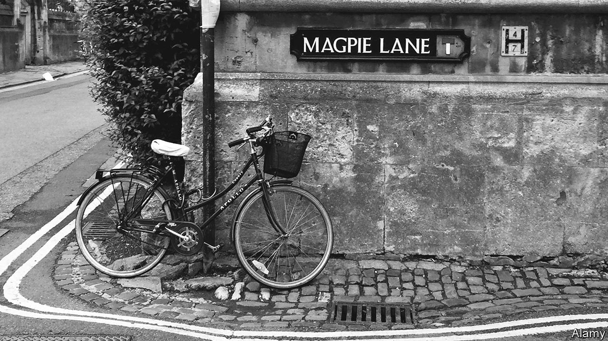

###### Memory Lane

# What do street names tell you about Britain? 

##### It is more monarchist but less sexist than you might think, and still changing 

 

> Nov 24th 2022 

England’s Gropecunt Lanes are unusual. Not because of their name: in the earthy medieval era, streets were often named after professions—after butchers and bakers and candlewick-makers—so it is unsurprising that the supposedly oldest profession had several streets commemorating it. In Oxford, it squeezed cosily between University College and Oriel; in Shrewsbury, it ran into Fish Street. In London, naturally, there were several. 

But what is unusual about these streets is that they have gone. In Oxford, citizens now walk down the more decorous Magpie Lane; in Shrewsbury, one might still enjoy Grope Lane—but on the whole smuttier street names have vanished; Britain has been cleansed of its old-fashioned filth. 

Street names are telling. Run your eye down a list of British streets and it quickly becomes clear that, among the Jesus Lanes and Queen’s Streets, the Trafalgar Squares and Empire Roads, lie not merely streets and alleys but ideals: a cartography of ideology and aspiration. So it is significant that Cambridge University has announced that next year it will name new streets after black alumni and abolitionists after its research found it had been “implicated in enslavement in a number of ways”. 

People rarely consider , says Maoz Azaryahu, professor of cultural geography at the University of Haifa, but that does not mean that they do not matter. On the contrary: “It only means that they are successful.” Their job is to introduce “official ideology into aspects of everyday life.” That they do so subconsciously is far from a weakness. “This is their real power: that we don’t pay attention to them.” 

Politicians have long understood this. In Berlin in 1945, at the end of the war, the Russian-dominated city hall met for the first time. “The city was in ruins, bodies in the canals,” says Mr Azaryahu, yet they discussed “what to do with Nazi street names.” Walk through Europe and you walk through streets whose names have been overwritten so often they are part place, part palimpsest. In Paris, the Place Royale became a Place de la République; in Germany, Adolf Hitler Platzes spread—then vanished; in Berlin, streets ran towards the Berlin Wall with one name, and emerged on the other side with another. 

When academics analysed 4,932 street names in four cities (London, New York, Paris and Vienna) last year, certain national traits became clear. While bohemian Parisians might stroll along Avenue Victor Hugo (artists are Paris’s most commemorated profession), London’s streets tend to toady to the monarchy and the military. London is also inward looking: in cosmopolitan Vienna, nearly half of street signs commemorate foreigners; in insular London, only 15% do; though in melting pot New York it is merely 3%. 

Not all names are political. Many, like gravestones, simply commemorate what lies dead underneath: the Meadow Streets and Grove Roads. Others are pure whimsy: in north London a burst of classical enthusiasm has led to residents living on Achilles Road, Ajax Road and the surely inauspicious Agamemnon Road. Others were proudly imperial: Rudyard Kipling named London’s Empire Way; in south London you can pass from Khyber Road to Cabul Road or walk along Jamaica Road. 

But mostly what marks Britain’s streets is stasis: many of London’s street names date back to 1600. This doesn’t mean that nothing has changed. By the 1980s, 40% of London’s streets were being named after women—all of them, not merely a body part. But changes tend to happen by accretion, not revolution: layer upon linguistic layer is added, each layer almost imperceptibly burying the last; an undisturbed archaeology of ideals. And next year in Cambridge, a new layer will be put down.■


