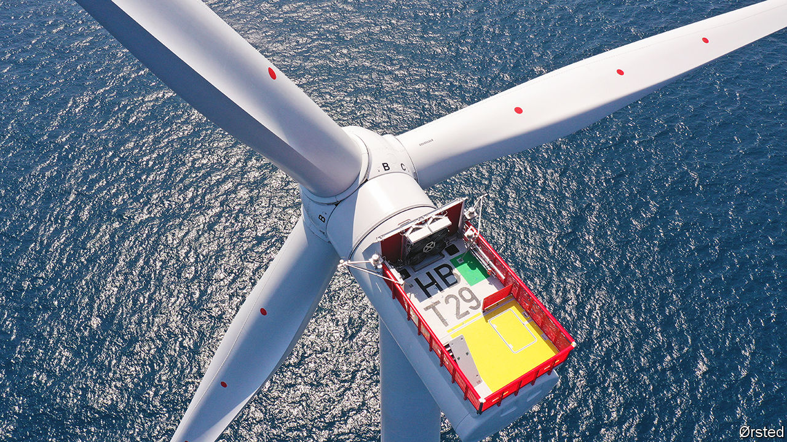
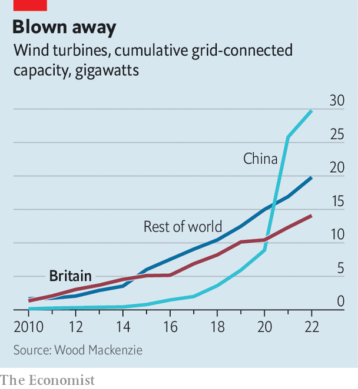

###### Renewable energy

# Why Britain is a world leader in offshore wind 

##### Its wind farms are key to the country’s net-zero hopes 

 

> Nov 24th 2022 

One turn of an “sg 8.0-167 dd” turbine generates enough electricity to run a British home for a day and a night. sg stands for Siemens Gamesa, a subsidiary of the German industrial giant, which makes the machines in Hull. The 8.0 is the turbine’s maximum output in megawatts (mw). The 167 is the diameter of its rotor in metres: it sweeps out in a circle equivalent in area to about three football pitches. And the dd stands for direct drive, an electricity-generation technology with no fiddly gears to wear out. At Hornsea 2, a wind farm located off the Yorkshire coast, 165 of these vast turbines form a field of steel stretching farther than the eye can see. Hornsea 2, which became fully functional in August, is now the largest wind farm in the world. When the wind really blows it can power 1.4m homes.

 


The development of its is one of Britain’s biggest infrastructural successes. The first farms, installed in the early 2000s, amounted to little more than a cottage industry, repurposing tiny onshore turbines for the sea, with outputs of just two megawatts. Since then, the sector has boomed. By 2010 there were 1.3 gigawatts (gw) of wind power in British waters. Today there are 14gw. Until 2021, when it was overtaken by China (see chart), Britain had installed more offshore wind capacity than any other country in the world. About 36% of British electricity now comes from wind, the majority of it offshore. Duncan Clark, the boss of the British arm of Orsted, which developed Hornsea 2, says offshore wind could be producing half of Britain’s electricity by 2030. “What has happened is quite beyond almost everyone’s expectations,” he says. In the process, the cost has fallen sharply. In 2015 new offshore wind cost £120 ($155) per megawatt hour; today it costs well below £40.

Britain’s success in wind-farming is partly down to government policy. Contracts for building and running wind farms come with strict progress deadlines (and the risk, if they are not met, of cancellation). The contracts are offered through a competitive auction process which has helped drive down prices. Geography also plays a big part. Britain’s coastline runs along the western shore of the North Sea, one of the windiest places on earth. It is relatively shallow, which makes constructing wind farms easier. All this has attracted myriad companies, supplying services and equipment, that developers can call upon to help build farms in British waters. “It’s one of the best places in the world to build offshore wind,” says Soeren Lassen, head of offshore-wind research at Wood Mackenzie, a consultancy.

It has not all been plain sailing. The government’s ambition to bring as much of the industry as possible on to British soil has had mixed success. A turbine factory that General Electric was planning to build in Teesside fell through, “due to a lack of volume”, the firm says. Industry insiders said the developer it was supplying failed to secure enough contracts. It now ships turbines into British wind farms from France. No companies that make and install monopiles—the vast piles of steel rebar and concrete that fix the tower of the turbine to the floor of the sea—are yet operational in Britain, though a South Korean outfit, seah, has just started building a £400m factory in Teesside. Orsted has signed a contract with the firm to build its next wind farm, Hornsea 3. It will produce twice as much electricity as Hornsea 2.

More growth lies ahead. Rishi Sunak, the prime minister, has promised to build 50gw of offshore wind by 2030. In his autumn statement on November 17th Jeremy Hunt, the chancellor, mentioned offshore wind repeatedly as a cure for fossil-fuel dependency. Sir Keir Starmer, leader of the Labour Party, pledged more of it in his speech to the Confederation of British Industry on November 22nd. The growth will come through new farms. North of Hornsea a consortium is building a huge wind farm at Dogger Bank. Off Scotland’s coast, Berwick Bank, the largest of a series of enormous wind farms will generate more electricity than Hinkley Point C, Britain’s newest nuclear power station. Some farms will be , rather than fixed to the sea floor, a new technology which will allow even more electricity to be generated off Britain’s coastline. 

In the short term, the biggest obstacle to Britain meeting its 50gw goal is the success of offshore wind elsewhere: competition for parts and skills is growing. And lean supply chains, a result of the fierce price competition driven by Britain’s contract auction scheme, can also cause delays. “The days when the most important thing was shaving 50p off the cost of production are over. What we need now is speed of deployment,” says Mr Clark. 

Britain’s electricity grid must also keep pace, building substations and transformers along the east coast. Existing grid infrastructure was built to cater to coal plants, which tended to be built next to water sources for cooling. While most of the planned future wind farms have already secured their grid connection slots, some have not. This can be a slow process, one the government could speed up by simplifying the planning process and reforming grid designs made for a fossil-fuel world. All offshore wind-generated electricity should eventually come ashore through one of 15 big onshore interconnectors, with their own dedicated offshore grids. Fossil-fuel power, by contrast, tended to be plugged in plant-by-plant. The government could also encourage businesses which do not currently run on electricity, like transport, heat and heavy industry, to make the switch. Longer-term, the offshore wind industry will run into a wall of stagnant demand unless these big chunks of economic activity are electrified. 

The rewards will exceed large amounts of clean electricity. Offshore wind employs around 20,000 people in Britain, many of them in maintenance. By 2030, more than 61,000 workers could be employed in the sector, according to the Offshore Wind Industry Council. Many of those jobs will be in places like Grimsby, Hull and Teesside, where the government wants to boost the economy. To get there, the government needs to stay the course and create a stable environment for more companies to set up shop in Britain. ■


